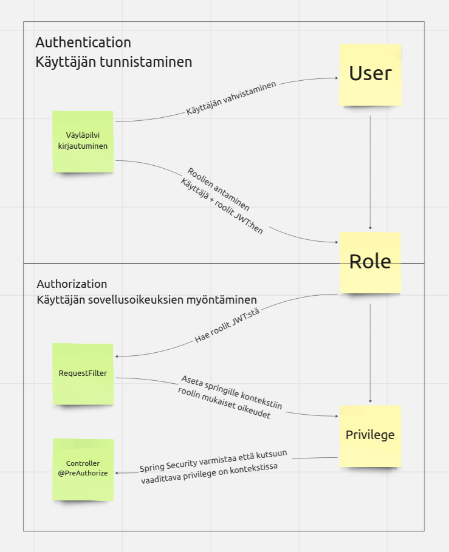
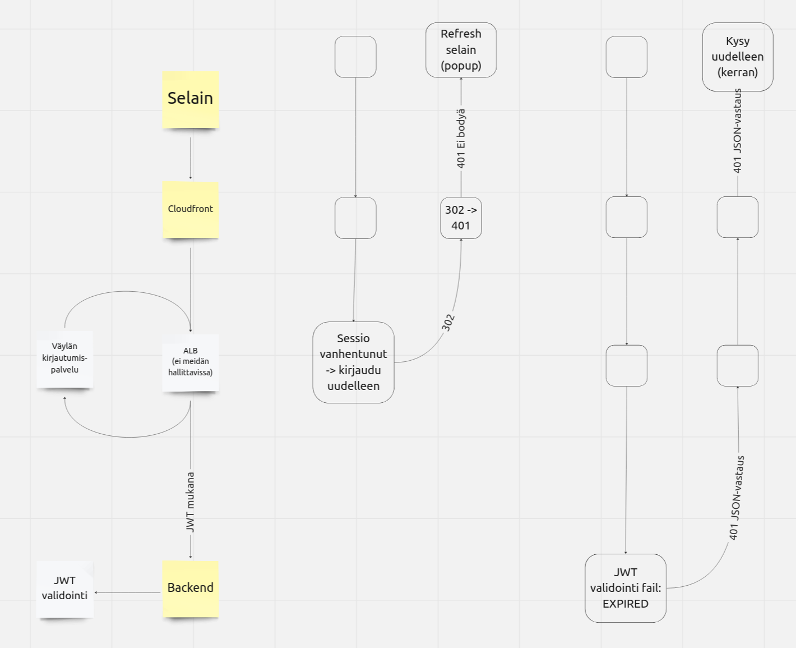
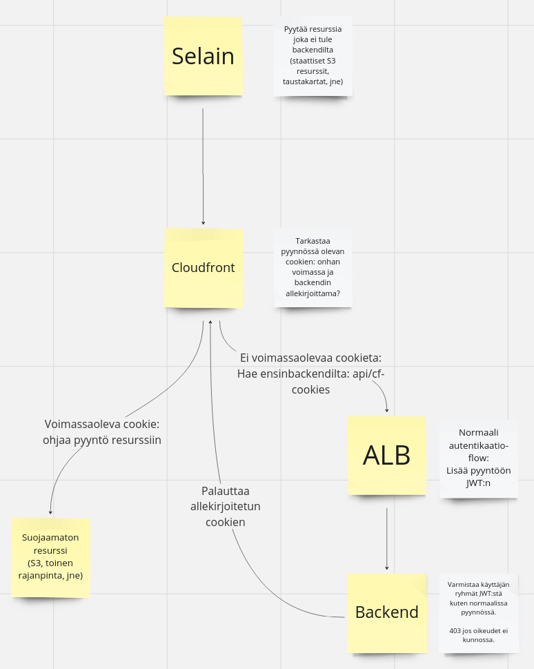

## Vastuut ja käsitteet

Autentikaatio hoidetaan integroitumalla väylän autentikaatiopalveluun. Geoviite itse ei siis sisällä mitään kirjautumislomaketta, käyttäjien tietoja, salasanoja, jne.

Autorisaatio puolestaan tapahtuu Geoviitteen backendissa. Tätä varten määritellään rooleja, joihin sidotaan sovelluksen vaatimusten mukaisesti oikeuksia. Oikeuksien hallinta voidaan näin antaa Väyläpilven ylläpitäjille (väylän käyttäjänhallintaan) roolipohjaisesti: kirjautuneen käyttäjän tiedoissa tulee väylän käyttäjänhallinnassa määritellyt roolit ja geoviite antaa niiden mukaan käyttäjälle tarvittavat oikeudet.

## Flow

Itse kirjautumisflow tapahtuu Väyläpilvessä network-tilin (ei meidän hallittavissa) ALB:llä, jonka kautta pyynnöt ohjataan meidän backendille.

1. Cloudfront varmistaa että pyynnössä on sessio cookiet ja ohjaa liikenteen Väylän kirjautumiseen jos ei ole
2. Kirjautumisen ollessa kunnossa, ALB liittää pyyntöön mukaan kirjautumisesta saadut tiedot JWT tokenina
3. Backend kaivaa JWT:stä käyttäjien roolien nimet ja hakee geoviitteen kannasta niitä vastaavat oikeudet. Nämä liitetään (RequestFilter.kt) Springin SecurityContextiin
4. Controllereiden kutsuissa varmistetaan riittävät oikeudet Springin PreAuthorize annotaatioilla, jotka varmistavat että SecurityContextissa on vaadittu oikeus mukana

## Muiden kuin backend-resurssien suojaaminen

Cloudfrontilta voidaan ohjata tietyt pyynnöt suoraan resursseihin jotka eivät ole backendin takana, tai kakuttaa osa vastauksista cloudfrontilla. Tällöin backend ei voi tietenkään tehdä autentikaatio-flow:n mukaista JWT:n/oikeuksien tarkastusta ilman lisäkiemuroita.

Huom. kaikkia resursseja ei välttämättä ole tarvetta suojata: esim frontend koodi on kaikki avointa, joten niistä buildatun bundlen suojaaminen S3:ssa ei ole myöskään tarpeen. Backend kutsuissa ei tarvitse cookiesta välittää, koska backend tarkastaa joka tapauksessa käyttäjän oikeudet pyynnön JWT-tokenin avulla. Nykyisellään ainoa tällä cookiella suojattu resurssi on taustakartta (MML:n karttapalvelu-kutsut), sillä ilman suojausta tuota rajapintaa voitaisiin pommittaa geoviitteen "nimissä" (geoviitteen API-avaimella) ilman käyttöoikeuksia.

### Konfiguraatio

1. Secret managerissa on backendin allekirjoitukseen käyttämä avainpari
2. Cloudfrontilla on avainparin julkinen avain omassa konfiguraatiossaan (key management → public keys), sillä cloudfrontilla ei ole pääsyä itse secretiin
3. Cloudfrontilla on avainryhmä (key management → key groups) johon julkinen avain on liitetty ja jolla itse ohjaukset (behavior: restricted viewer access → trusted keygroup) on rajattu
4. Parameter storessa on cloudfrontin julkisen avaimen ID, jotta backend voi liittää sen keksin tietoihin keksiä luodessaan
   1. Cloudfront tarvitsee tämän tietääkseen millä julkisella avaimella keksin allekirjoitus tarkastetaan
5. Avaimet täytyy aika-ajoin kierrättää. Tätä varten on valmiit scriptit support-kansiossa.

### Flow
1. Jos cloudfrontille tulevassa pyynnössä ei ole keksiä, se ohjataan cf-cookies rajapintaan
    1. Koska pyyntö tulee backendiin, normaali autentikaatioflow käyttäjäryhmien tarkastuksineen toimii. Tunnistamaton käyttäjä (tai käyttäjä jolla oikeudet ei riitä) saa virheen
    2. Nykyisellään tämä vaatii vain read-oikeudet. Jos eri API:t tarvitsee hienojakoisempaa jaottelua, cf-cookies pitää jakaa useammaksi rajapinnaksi
    3. Backend generoi keksin joka on voimassa rajatun ajan. Keksi allekirjoitetaan yksityisellä avaimella (secret managerista) ja siihen liitetään cloudfrontin avaimen ID (parameter storesta)
2. Cloudfront varmistaa keksin allekirjoituksen
    1. Julkinen avain johon verrataan haetaan keygroupista pyynnössä tulevalla ID:llä

