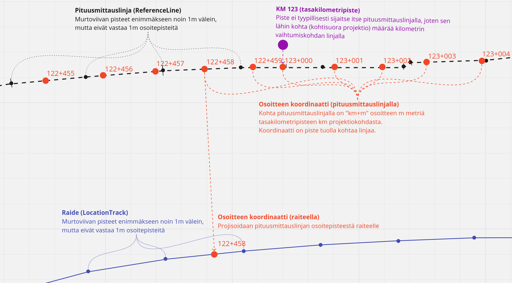
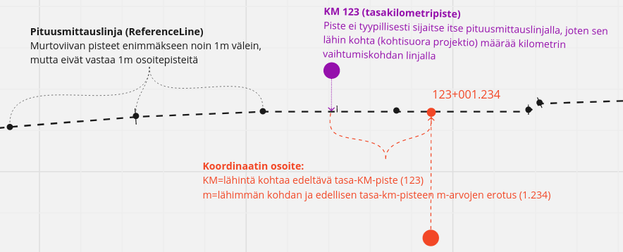
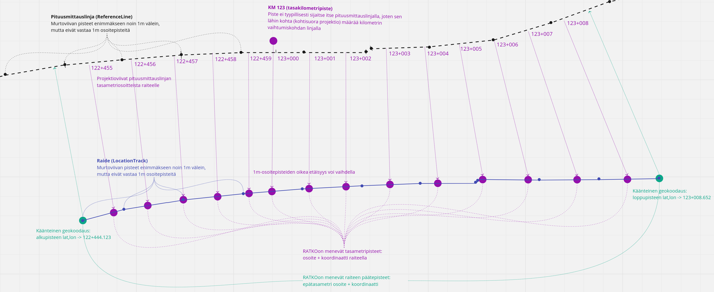

# Geokoodaus ja käänteinen geokoodaus

Geoviitteessä käsitellään sijainteja sekä koordinaatteina että niinsanottuina rataosoitteina. Näille on
molemminsuuntaiset muunnokset: geokoodaus (osoitteesta koordinaateiksi) ja käänteinen
geokoodaus (koordinaateista osoitteeksi).

Osoitteet lasketaan aina ratanumeron pituusmittauslinjaa (pituusmittausraidetta) pitkin. Koska osoitteen saava kohde
(sijainti) ei aina ole pituusmittauslinjalla, sen osoite tulee siitä pituusmittauslinjan kohdasta, jota se on lähimpänä
(kohtisuora projektio pituusmittauslinjalle). Näin ollen, koordinaatin käänteinen geokoodaus ja sen takaisin geokoodaus
ei palaa aina samaksi koordinaatiksi, josta lähdettiin, eli muunnokset eivät ole häviöttömiä.

## Rataosoitteet

Rataosoitteet perustuu RATO-ohjeistuksen mukaiseen rataosoitejärjestelmään. Oleellista on huomata että rataosoitteista
puhutaan kilometreina ja metreinä, mutta ne eivät tarkoita pituuksia vaan ovat ihmisen ymmärrettäviä osoitteita.
Aiheesta voi lukea tarkemmin RATO 2 ohjeesta (luku 2.11):
https://ava.vaylapilvi.fi/ava/Julkaisut/Vaylavirasto/vo_2021-22_rato2_web.pdf

Oleellisia huomioita:

- Ratakilometri ei ole aina kilometrin pituinen
- Kaikkia kilometreja ei aina ole olemassa vaan joskus luvut voivat hypätä
- Joskus samalla numerolla on useampi ratakilometri, jolloin sen numeroon lisätään kirjaimia (esim. 123A, 123B)
- Ratametrit ovat metrin mittaisia pituusmittauslinjaa pitkin, mutta koska raiteet eivät kulje täysin samaa linjaa ja
  samaan suuntaan, raiteen metripisteet eivät ole aina metrin välein
- Koska tasakilometripisteet ikäänkuin resetoivat osoitteiden laskennan, muutokset rataverkossa vaikuttavat osoitteisiin
  ainoastaan kyseisellä kilometrilla

## Geokoodauskonteksti (GeocodingContext)

Osoitteet muodostetaan ratanumeroon (TrackNumber) liittyvän pituusmittauslinjan (ReferenceLine) ja
tasakilometripisteiden (KmPost) avulla. Nämä käsitteet kootaan laskentaa varten kokonaisuudeksi nimeltä
geokoodauskonteksti. Koska jokainen noista käsitteistä voi päivittyä itsenäisesti, geokoodauskontekstin haku on sidottu
avaimeen (GeocodingContextCacheKey), joka sisältää kaikkien käsitteiden versiot (RowVersion). Näin kontekstit voidaan
cachettaa tuolla avaimella, jolloin sitä ei tarvitse muodostaa aina uudelleen.

## Geokoodaus (osoitteesta pituusmittauslinjan koordinaateiksi)

Rataosoitteesta voidaan laskea koordinaatti tietyssä geokoodauskontekstissa, eli tietylle ratanumerolle. Osoite on
tällöin piste pituusmittauslinjalla. Koska osoite on sama myös kaikille koordinaateille jotka ovat tuon kohdan sivuilla
kohtisuoraan, käänteisen geokoodauksen ja geokoodauksen yhdistelmä ei aina tuota samaa koordinaattia josta aloitettiin.

Osoitteen koordinaatti haetaan seuraavasti:

- Etsitään osoitteen kilometrilukua vastaava tasakilometripiste (KmPost) ja haetaan pituusmittauslinjan lähin kohta
  tuolle pisteelle
- Lisätään saadun pisteen m-arvoon (matka pituusmittauslinjaa pitkin) osoitteen metrit jolloin saadaan kohde-kohdan
  m-arvo
- Haetaan pituusmittauslinjan koordinaatit tuolle m-arvolle

### Geokoodaus raiteelle (osoitteesta raiteen koordinaateiksi)

Geokoodaus voidaan tehdä myös niin että koordinaatti poimitaan tietyltä raiteelta, eikä pituusmittauslinjalta. Tämä
tapahtuu muuten kuten tavallinen geokoodaus, mutta pituusmittauslinjan koordinaattia ei käytetä sellaisenaan, vaan
tuosta kohdasta projisoidaan kohtisuora viiva raiteelle ja koordinaatti poimitaan projektioviivan ja raiteen
kohtauspisteestä.

## Käänteinen geokoodaus (koordinaateista osoitteeksi)

Mielivaltaiselle koordinaatille voidaan laskea osoite tietyssä geokoodauskontekstissa, eli tietylle ratanumerolle.
Toimiakseen, tämä edellyttää että pituusmittauslinja jatkuu kyseisen kohdan yli. Poikkeamaa voi olla sivusuunnassa
(kohtisuoraan raiteelta), mutta jos koitetaan tehdä käänteinen geokoodaus koordinaatille, joka on ennen raiteen alkua
tai sen lopun jälkeen, osoite ei ole määritelty.

Alla oleva kuva havainnollistaa koordinaatin osoitteen laskentaa. Algoritmi toimii ylätasolla seuraavasti:

- Haetaan pituusmittauslinjalta kohdepistettä lähin kohta (= kohtisuora projektio)
- Haetaan kyseisen kohdan m-arvolla lähin tasakilometripiste (KmPost)
- Lisätään osoitteen m-arvoksi kohdepisteen m-arvon ja tasakilometripisteen m-arvon erotus

## Raiteen osoitepisteiden tuottaminen (RATKOn malli)

RATKOn mallissa raiteen pisteet kuvataan osoitepisteinä, joissa on tasametri-osoitteet yhdistettynä niitä vastaaviin
raiteen koordinaatteihin. Siksi Geoviitteen täytyy laskea nuo tasametripisteet kun raiteen geometria välitetään ratkoon.
Huomattavaa on, että RATKO haluaa nimenomaa tasametripisteet, eli pisteet joiden osoitteet ovat tasalukuja, ei pisteitä
metrin välein itse raiteelta. Pisteet tuotetaan projisoimalla ne pituusmittauslinjalta raidetta kohden, vastaavasti kuin
yllä kohdassa Geokoodaus raiteelle.

Allaoleva kuva esittää miten paikannuspohjan pisteviiva-muotoisesta raiteesta ja pituusmittauslinjasta muodostuu RATKOn
tasametri-osoitteisto. Algoritmi toimii ylätasolla seuraavasti:

- Haetaan raiteen alku- ja loppupisteille osoitteet käänteisellä geokoodauksella
- Käydään läpi kaikki kontekstin ratakilometrit ja niiden metrit, siltä osin kun ne ovat alku- ja loppupisteen välillä
    - Metrit tuotetaan käymällä pituusmittauslinjaa 1m kerrallaan eteenpäin kunnes saavutetaan uusi tasakilometripiste
    - Projisoidaan kohtisuora viiva pituusmittauslinjalta kunkin metrin kohdalla
    - Osoitetta vastaava koordinaatti on projektioviivan ja raiteen törmäyspiste

