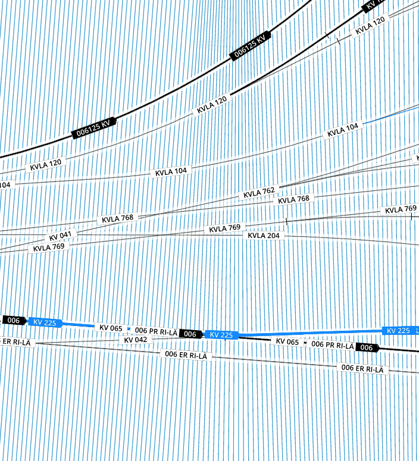
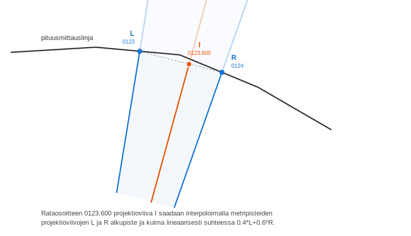
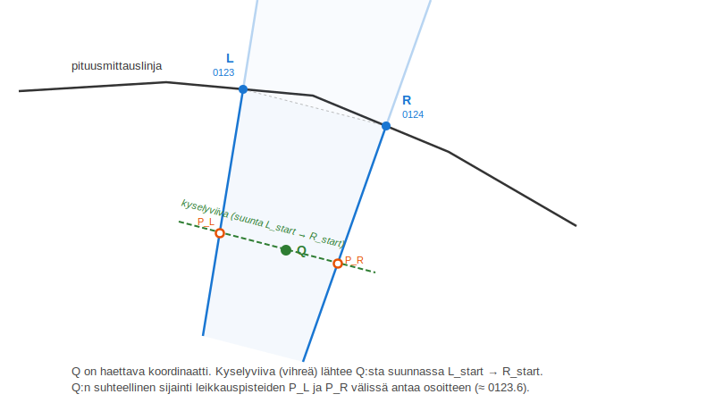
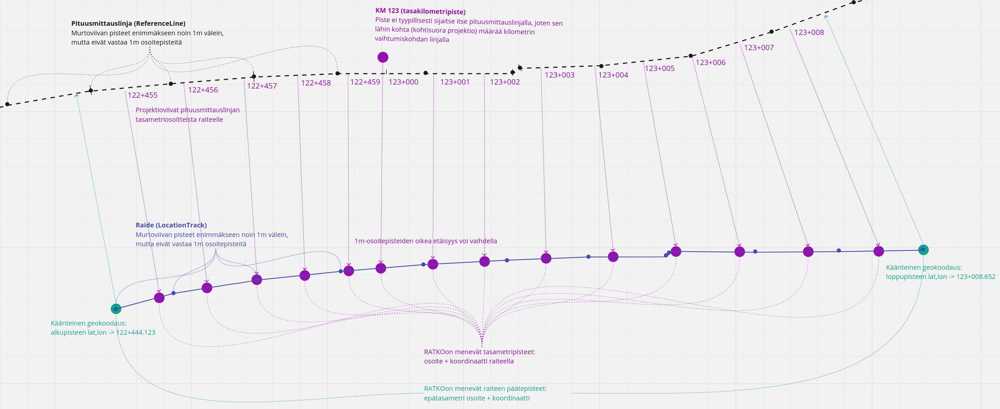

# Geokoodaus ja käänteinen geokoodaus

Geoviitteessä käsitellään sijainteja sekä koordinaatteina että niinsanottuina rataosoitteina. Näille on
molemminsuuntaiset muunnokset: geokoodaus (osoitteesta koordinaateiksi) ja käänteinen
geokoodaus (koordinaateista osoitteeksi).

Osoitteet lasketaan aina ratanumeron pituusmittauslinjaa (pituusmittausraidetta) pitkin. Koska osoitteen saava kohde
(sijainti) ei aina ole pituusmittauslinjalla, sen osoite tulee siitä pituusmittauslinjan kohdasta, jota se on lähimpänä
(kohtisuora projektio pituusmittauslinjalle). Näin ollen, koordinaatin käänteinen geokoodaus ja sen takaisin geokoodaus
ei palaa aina samaksi koordinaatiksi, josta lähdettiin, eli muunnokset eivät ole häviöttömiä.

## Rataosoitteet

Rataosoitteet perustuu RATO-ohjeistuksen mukaiseen rataosoitejärjestelmään. Oleellista on huomata että rataosoitteista
puhutaan kilometreina ja metreinä, mutta ne eivät tarkoita pituuksia vaan ovat ihmisen ymmärrettäviä osoitteita.
Aiheesta voi lukea tarkemmin RATO 2 ohjeesta (luku 2.11):
https://ava.vaylapilvi.fi/ava/Julkaisut/Vaylavirasto/vo_2021-22_rato2_web.pdf

Oleellisia huomioita:

- Ratakilometri ei ole aina kilometrin pituinen
- Kaikkia kilometreja ei aina ole olemassa vaan joskus luvut voivat hypätä
- Joskus samalla numerolla on useampi ratakilometri, jolloin sen numeroon lisätään kirjaimia (esim. 123A, 123B)
- Ratametrit ovat metrin mittaisia pituusmittauslinjaa pitkin, mutta koska raiteet eivät kulje täysin samaa linjaa ja
  samaan suuntaan, raiteen metripisteet eivät ole aina metrin välein
- Koska tasakilometripisteet ikäänkuin resetoivat osoitteiden laskennan, muutokset rataverkossa vaikuttavat osoitteisiin
  ainoastaan kyseisellä kilometrilla

## Geokoodauskonteksti (GeocodingContext)

Osoitteet muodostetaan ratanumeroon (TrackNumber) liittyvän pituusmittauslinjan (ReferenceLine) ja
tasakilometripisteiden (KmPost) avulla. Nämä käsitteet kootaan laskentaa varten kokonaisuudeksi nimeltä
geokoodauskonteksti. Koska jokainen noista käsitteistä voi päivittyä itsenäisesti, geokoodauskontekstin haku on sidottu
avaimeen (GeocodingContextCacheKey), joka sisältää kaikkien käsitteiden versiot (LayoutRowVersion). Näin kontekstit
voidaan cachettaa tuolla avaimella, jolloin sitä ei tarvitse muodostaa aina uudelleen.

## Geokoodaus (osoitteesta pituusmittauslinjan koordinaateiksi)

Rataosoitteesta voidaan laskea koordinaatti tietyssä geokoodauskontekstissa, eli tietylle ratanumerolle. Osoite on
tällöin piste pituusmittauslinjalla. Koska osoite on sama myös kaikille koordinaateille jotka ovat tuon kohdan sivuilla
kohtisuoraan, ja koska osoitteen muodostuksessa tapahtuu pyöristyksiä, käänteisen geokoodauksen ja geokoodauksen
yhdistelmä ei aina tuota samaa koordinaattia josta aloitettiin.

Osoitteen koordinaatti haetaan seuraavasti:

- Etsitään osoitteen kilometrilukua vastaava tasakilometripiste (KmPost) ja haetaan pituusmittauslinjan lähin kohta
  tuolle pisteelle
- Lisätään saadun pisteen m-arvoon (matka pituusmittauslinjaa pitkin) osoitteen metrit jolloin saadaan kohde-kohdan
  m-arvo
- Haetaan pituusmittauslinjan koordinaatit tuolle m-arvolle

## Varsinainen geokoodaus yleensä

Jos ollaan hakemassa muuta tietoa kuin muunnosta osoitteesta pituusmittauslinjan koordinaateiksi, pitää käyttää
projektioviivoja. Projektioviivoja lähtee pituusmittauslinjalta:

- Tasametripisteiltä
- Pituusmittauslinjan alku- ja loppupisteeltä, jos ne ovat riittävän kaukana lähimmästä tasametripisteestä
- Kohdilta metrin ennen pituusmittauslinjan alkua ja jälkeen sen loppua

Esimerkki projektioviivoista (pituusmittauslinjalla KV 225). Linja kääntyy pohjoiseen, joten mutkan koveralla puolella
projektioviivat yhdentyvät, kun taas kuperalla puolella ne loittonevat:

Kullakin projektioviivalla on rataosoite. (Ekstrapoloiduilla ennen linjaa ja sen jälkeen tulevilla pisteillä on
osoitteina pituusmittauslinjan alku- ja loppuosoite; ne ovat olemassa sitä varten, että käänteinen geokoodaus
pystyy armahtamaan pienet laskentojen pyöristykset pituusmittauslinjan alku- ja loppupäissä.)

Geokoodaus kumpaan tahansa suuntaan toimii konseptitasolla niin, että haetaan se vierekkäisten projektioviivojen väli,
jolla geokoodattava asia on, ja interpoloidaan tältä väliltä projektioviiva, joka osoittaa varsinaiseen geokoodattavaan
asiaan. Projektioviivavälin voi käsittää viuhkamaisena muotona, jossa jos ollaan vaikkapa kohdassa 0.6, niin
interpoloitu viiva kullekin kohdalle saadaan interpoloimalla lineaarisesti erikseen lähtöpiste (alun ja lopun
projektioviivojen alkujen välisellä janalla), viivan kulma, ja osoite.:

- Lähtee interpoloidulta pisteeltä 0.4 x välin alkuprojektion lähtöpiste, 0.6 x loppuprojektion lähtöpiste. Lähtöpisteet
  ovat pituusmittauslinjalla, mutta nämä interpoloidut pisteet eivät välttämättä ole.
- Menee kulmassa 0.4 x alkuprojektion kulma, 0.6 x loppuprojektion kulma. Kulmien yhdistely olettaa, että
  vierekkäisten projektioviivojen kulmien ero on pieni.
- Saa osoitteekseen alkupisteen osoite + 0.6 x projektioviivojen etäisyys.

Projektioviivavälit määrittävät tällä tavalla yksiselitteisesti osoitteen jokaiselle pisteelle, joka on mahdollista
geokoodata pituusmittauslinjalle.

### Geokoodaus raiteelle (osoitteesta raiteen koordinaateiksi)

Kun lähtötieto on rataosoite, haetaan ensiksi tätä osoitetta vastaava projektioviiva. Tasametriosoitteilla tämä on
tasametripisteen projektioviiva, tarkemmilla osoitteilla interpoloitu projektioviiva. Koordinaatti raiteella on sitten
projektioviivan alkukohtaa lähin piste, jossa se leikkaa raiteen.

### Käänteinen geokoodaus (koordinaateista osoitteeksi)

Kun lähtötieto on koordinaatti, haetaan ensiksi koordinaatin sisältävä projektioviivaväli. Teoriassa tämä löytyy
yksinkertaisesti hakemalla haettavaa koordinaattia lähimmän pituusmittauslinjan pisteen; käytännössä, koska laskennassa
on pakosta pyöristyksiä, ja koska pituusmittauslinja itsessään esitetään murtoviivana, tässä on toteutuksessa
välivaihe, joka askeltaa projektioviivavälejä pitkin etsiessään varsinaisesti haettavan koordinaatin sisältävää väliä
(ProjectionLineSearch).

Kun oikea projektioviivaväli tiedetään, oikean interpoloidun projektioviivan osoite (eli käänteisen geokoodauksen
tulos) löydetään hakemalla suora, jonka kulma on sama kuin projektioviivojen alkupisteiden välinen kulma, ja jolla
haettava piste on: Tämä suora sitten leikkaa alku- ja loppuprojektioviivan, ja pisteen interpolaatioarvo on se kohta,
millä etäisyydellä se on näiden leikkauspisteiden välillä.

## Raiteen osoitepisteiden tuottaminen (RATKOn malli)

RATKOn mallissa raiteen pisteet kuvataan osoitepisteinä, joissa on tasametri-osoitteet yhdistettynä niitä vastaaviin
raiteen koordinaatteihin. Siksi Geoviitteen täytyy laskea nuo tasametripisteet kun raiteen geometria välitetään Ratkoon.
Huomattavaa on, että RATKO haluaa nimenomaa tasametripisteet, eli pisteet joiden osoitteet ovat tasalukuja, ei pisteitä
metrin välein itse raiteelta. Pisteet tuotetaan projisoimalla ne pituusmittauslinjalta raidetta kohden, vastaavasti kuin
yllä kohdassa Geokoodaus raiteelle.

Allaoleva kuva esittää miten paikannuspohjan pisteviiva-muotoisesta raiteesta ja pituusmittauslinjasta muodostuu RATKOn
tasametri-osoitteisto. Algoritmi toimii ylätasolla seuraavasti:

- Haetaan raiteen alku- ja loppupisteille osoitteet käänteisellä geokoodauksella
- Käydään läpi kaikki kontekstin ratakilometrit ja niiden metrit, siltä osin kun ne ovat alku- ja loppupisteen välillä
    - Metrit tuotetaan käymällä pituusmittauslinjaa 1m kerrallaan eteenpäin kunnes saavutetaan uusi tasakilometripiste
    - Projisoidaan kohtisuora viiva pituusmittauslinjalta kunkin metrin kohdalla
    - Osoitetta vastaava koordinaatti on projektioviivan ja raiteen törmäyspiste

