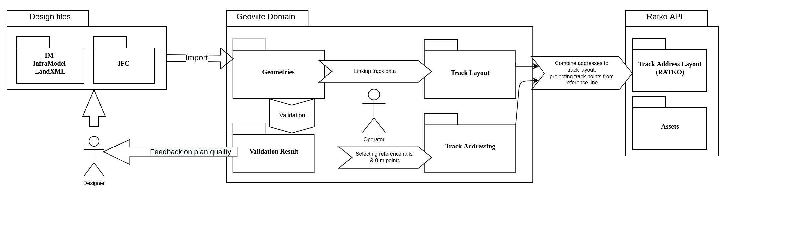
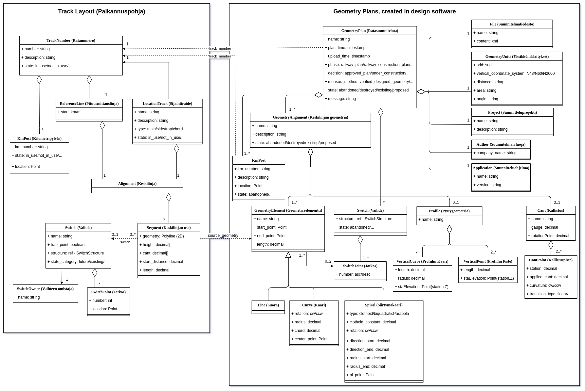

Tässä kuvassa esitetään geoviitteen peruskäsitteet ja miten ne liittyvät toisiinsa. Käsitteistöä on tarkoituksella yksinkertaistettu ollakseen havainnollisempi ja luokkahierarkiat eivät vastaa 1-1 tietokantatauluja (nämä tarkemmin nähtävissä täältä: Tietokanta) tai koodin rakennetta vaan ennenkaikkea geoviitteen kannalta oleellista osaa niiden tietosisällöstä.

## Tarkat geometriat

Ratatieto saapuu järjestelmään pääasiassa tarkkoina 3D geometrioina (kuvassa oikealla), jotka on piirretty suunnitteluohjelmissa. Nämä kuvastavat tiettyä rataverkon osaa tietyn suunnitelman tai toteuman hetkellä, osat ovat päällekäisiä tai niiden välistä voi puuttua pätkiä. Lisäksi ne voivat olla määritelty eri koordinaatistoissa, joiden muunnos ei ole häviötöntä. Niistä ei siis voi yksiselitteisesti koostaa koko rataverkkoa. Geometrioiden tietomalli noudattaa läheisesti lähdeaineiston (LandXML) käsitteistöä.

## Paikannuspohja

Geoviitteen toinen esitysmuoto on paikannuspohja (kuvassa vasemmalla), joka on koko rataverkon kartalla esitettävä muoto. Paikannuspohjaa ylläpidetään geoviitteessä ja tarkat geometriat toimivat yhtenä sen pohjatiedon lähteenä. Tässä esitysmuodossa kukin raide on mukana on kerran ja kokonaisuutena (poikkeuksena duplikaattiraiteet) ja ne kaikki on tuotu samaan koordinaatistoon yhtenäistä esitystä varten. Muunnoksista johtuen, paikannuspohjan tarkkuus ei ole yhtä hyvä kuin alkuperäisissä geometrioissa.

Paikannuspohjaan sisältyy myös rataosoitteiston viitekehys, eli sen avulla voidaan laskea sijainnille tai kohteelle rataosoite (rata, km, metrit) ja mikä tahansa rataosoite voidaan kääntäen laskea tiettyy sijaintiin (koordinaatti).

## Käsitteiden 3 esitystapaa
| Käsite         | Geometria | Paikannuspohja | Osoitepisteet                                                                                                                                                                                                                                                                                                          |
|----------------|-----------|----------------|------------------------------------------------------------------------------------------------------------------------------------------------------------------------------------------------------------------------------------------------------------------------------------------------------------------------|
| Yleiskuva      | Tarkat suunnitelluohjelmissa tuotetut matemaattisesti kuvatut geometriat. Toisistaan riippumattomia, eri koordinaatistoissa olevia lähtötietoja, jotka ovat osin päällekäisiä ja eivät kuvaa kaikkia alueita lainkaan.  | Koko rataverkko, tuotuna yhtenäiseen koordiinaatistoon, helposti kartalla esitettävässä muodossa.        | RATKO:n esitysmuoto. Koostuu tasametripisteistä jotka on valittu projisoimalla pituusmittauslinjalta, ja johon on siten sisällytetty rataosoitejärjestelmä. Tasametrien lisäksi sisältää myös epätasamatripisteinä tärkeät raiteella olevat kohdat, kuten alku- ja loppupisteen sekä mahdolliset vaihteiden jatkospisteet. |
| Vaakageometria | Keskilinja koostuu elementeistä Kukin elementti kuvattu reunapisteinä sekä matemaattisen funktion parametreina: suora, kaari, spiraali (siirtymäkaari) | Keskilinja koostuu segmenteistä, joista kukin on polyline (pisteviiva) joka on laskettu matemaattisista geometrioista halutulla resoluutiolla. |                                                                                                                                                                                                                                                                                                                       Keskilinja koostuu tasametripisteistä jotka on valittu projisoimalla pituusmittauslinjalta. |
| Pystygeometria | Koostuu kaarista joiden X on pituutta rataa pitkin ja Y korkeus ko. kohdassa. Kaarten väliin oletetaan suoraa. | Kullekin vaakageometrian pisteelle (pisteviivan käännöskohdat) annettu desimaaliarvo: korkeus metreinä | Ei mukana |
| Kallistuskulmat | Koostuu pistemäisistä kallistusarvoista (ja suunnista) per pituusyksikkö rataa pitkin. Pisteiden välissä kulman oletetaan kasvavan/pienenevän lineaarisesti. | Kullekin vaakageometrian pisteelle (pisteviivan käännöskohdat) annettu desimaaliarvo: <0 vasemmalle, >0 oikealle | Ei mukana |
| Vaihteet | Vaihteiden perustiedot ovat mukana jokaisessa vaakageometrian elementissä, johon se liittyy. Lisäksi mukana on tieto "Switch Joint" numerosta, joka kuvaa (tyyppikohtaisesti) mikä kohta vaihdetta liittyy ko. geometriaelementtiin. | Vaihteen perustiedot ovat mallissa kerran ja siihen kytkeytyy tunnetut vaihdepisteet, kukin kerran. Sijaintiraiteiden segmentit kytkeytyy vaihteisiin ja niiden pisteisiin päistä. Koordinaattisijainnit ovat vain vaihdepisteillä. | Vaihdepisteet lasketun osoitteen kera per-raide. Yksi piste voi siis olla monta kertaa, kerran kullekin raiteelle johon se kytkeytyy, osoite ja ko. raiteen mukaisesti. Saman pisteen sijainti eri raiteilla ei välttämättä ole tarkalleen sama, ja johtuen eri pituusmittauslinjoista, myös osoite saattaa erota. |
