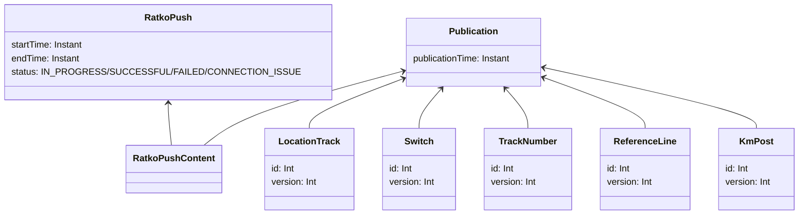

# Julkaisu

Kuten osiossa [Paikannuspohjan kontekstit](paikannuspohjan_kontekstit.md) on kuvattu, paikannuspohjan muutokset
siirtyvät luonnosmuutoksista virallisiksi julkaisun kautta (tai ne perutaan poistamalla luonnos).

Julkaisutoiminto vie muutokset koostettuina paketteina, julkaisuina (Publication). Jokainen julkaisu vie virallisen
paikannuspohjan yhdestä eheästä tilasta toiseen eheään tilaan, mikä varmistetaan julkaisuvalidoinnilla. Myös muutosten
ratkoviennin etenemistä tarkastellaan käyttölittymässä julkaisutasolla.

## Julkaisun ja ratkoviennin tietomalli

Tämä on yksinkertaistettu malli julkaisun ja ratkoviennin käsitteistöstä. Todellisuudessa mukana on vielä kohtuullinen
määrä valmiiksi laskettua dataa julkaisuhistorian esittämistä varten. Käsitteellisesti mallin voi kuitenkin mieltää
koostuvan julkaisusta johon sisältyy tarkat versiokiinnitykset sen muuttamille käsitteille sekä ratkoviennistä, joka
seuraa tietyn datajoukon viennin tilaa. Varsinainen datasisältö, joka julkaisussa muuttui, voidaan hakea paikannuspohjan
versiotauluista kiinnitetyillä versioilla tai julkaisun aikaleimalla.

## Julkaisun lukitus ja versioiden kiinnitys

Julkaisut itsessään lukitaan tapahtumaan yksi kerrallaan tietokantalukolla. Kaikkia luonnosmaailmaan vaikuttavia
muutoksia ei kuitenkaan ole rajattu tapahtumaan saman lukon takana. Julkaisun aluksi kiinnitetään ne tarkat riviversiot
joista julkaisu tullaan tekemään ja validointi suoritetaan niiden avulla. Kun validointi on mennyt läpi, juuri nuo
riviversiot päädytään tallentamaan viralliseen paikannuspohjaan. Jos siis jostain syystä julkaisuprosessin vierestä
päätyy tapahtumaan muutoksia johonkin julkaistavan olioon samaan aikaan, nuo muutokset häviää julkaisun yhteydessä.

## Validointi

Julkaisuvalidoinnissa varmistetaan että julkaistavat luonnosmuutokset vie virallisen paikannuspohjan ehjään tilaan.
Tässä keskeisiä kohtia varmistaa on mm:

- Käsitteiden eheys
    - Kaikilla käsitteillä on kaikki vaaditut kentät määritelty ja valideja (luonnosten välitilat ei enää käy)
- Viite-eheys
    - Olemassaolevat käsitteet eivät viittaa poistettuihin käsitteisiin
    - Virallisesta paikannuspohjasta ei voi viitata "vain luonnos" -olioihin
- Rataverkon eheys
    - Vaihteen linjoihin on kytkettynä riittävät raiteet
    - Vaihteet ja raiteet ovat samaa mieltä liityntäpisteiden koordinaateista
- Osoitteiston eheys (yhteensopivuus pituusmittauslinjaan)
    - Kaikille raiteille on mahdollista laskea osoitteet koko matkalta
    - Osoitteet ovat jatkuvia, kaikki raiteen metrit voidaan laskea ja metrit eivät ole liian pitkiä/lyhyitä
    - Tuotetut osoitteet ovat valideja (eli ylipitkiä kilometreja)

## Ratkovienti ja julkaisuiden koostaminen

Ratkovienti tapahtuu erillisellä asynkronisella prosessilla. Ylätasolla se tapahtuu seuraavasti:

- Haetaan kaikki julkaisut joita ei vielä ole viety ratkoon
- Yhdistetään julkaisujen muutokset, jotta saadaan erotus ratkon ja geoviitteen nykytilan välillä
- Viedään tähän liittyvät käsitteet käsite kerrallaan ratkoon (ratanumerot, raiteet, vaihteet)

Julkaisujen yhdistäminen tehdään, jotta virhetilanteissa on mahdollista korjata tilannetta toisella julkaisulla.
Yhteysvirheiden tapauksessa julkaisua yritetään automaattisesti uudelleen seuraavalla ajolla, mutta muissa virheissä ei
ole syytä olettaa että tilanne korjaantuisi automaattisesti. Tällöin virhe voidaan korjata joko ratkon puolella tai
muuttamalla vietävää datajoukkoa uudella julkaisulla, jolloin datan koostamisen ansiosta virheellistä välitilaa ei
tarvitse saada menemään läpi.
