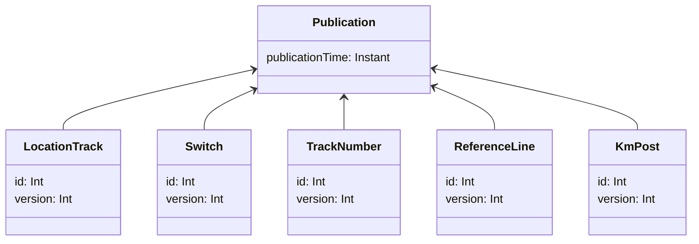

# Julkaisu

Kuten osiossa [Paikannuspohjan kontekstit](paikannuspohjan_kontekstit.md) on kuvattu, paikannuspohjan muutokset
siirtyvät luonnosmuutoksista virallisiksi julkaisun kautta (tai ne perutaan poistamalla luonnos).

Julkaisutoiminto vie muutokset koostettuina paketteina, julkaisuina (Publication). Jokainen julkaisu vie virallisen
paikannuspohjan yhdestä eheästä tilasta toiseen eheään tilaan, mikä varmistetaan julkaisuvalidoinnilla. Julkaistut
muutokset menevät välittömästi Geoviitteen viralliseen paikannuspohjaan. Tämän jälkeen ne viedään Ratkoon asynkronisella
tausta-ajolla, jonka tilaa tarkastellaan käyttölittymässä julkaisutasolla.

## Julkaisun tietomalli

Tämä on yksinkertaistettu malli julkaisun käsitteistöstä. Todellisuudessa mukana on vielä kohtuullinen
määrä valmiiksi laskettua dataa julkaisuhistorian esittämistä varten. Käsitteellisesti mallin voi kuitenkin mieltää
koostuvan julkaisusta johon sisältyy tarkat versiokiinnitykset sen muuttamille käsitteille. Varsinainen datasisältö,
joka julkaisussa muuttui, voidaan hakea paikannuspohjan
versiotauluista kiinnitetyillä versioilla tai julkaisun aikaleimalla.

## Julkaisun lukitus ja versioiden kiinnitys

Julkaisut itsessään lukitaan tapahtumaan yksi kerrallaan tietokantalukolla. Kaikkia luonnosmaailmaan vaikuttavia
muutoksia ei kuitenkaan ole rajattu tapahtumaan saman lukon takana. Julkaisun aluksi kiinnitetään ne tarkat riviversiot
joista julkaisu tullaan tekemään ja validointi suoritetaan niiden avulla. Kun validointi on mennyt läpi, juuri nuo
riviversiot päädytään tallentamaan viralliseen paikannuspohjaan. Jos siis jostain syystä julkaisuprosessin vierestä
päätyy tapahtumaan muutoksia johonkin julkaistavan olioon samaan aikaan, niin nämä muutokset häviävät julkaisun
yhteydessä.

## Validointi

Julkaisuvalidoinnissa varmistetaan että julkaistavat luonnosmuutokset vie virallisen paikannuspohjan ehjään tilaan.
Tässä keskeisiä kohtia varmistaa on mm:

- Käsitteiden eheys
    - Kaikilla käsitteillä on kaikki vaaditut kentät määritelty ja valideja (luonnosten välitilat eivät enää käy)
- Viite-eheys
    - Olemassaolevat käsitteet eivät viittaa poistettuihin käsitteisiin
    - Virallisesta paikannuspohjasta ei voi viitata "vain luonnos" -olioihin
- Rataverkon eheys
    - Vaihteen linjoihin on kytkettynä riittävät raiteet
    - Vaihteet ja raiteet ovat samaa mieltä liityntäpisteiden koordinaateista
- Osoitteiston eheys (yhteensopivuus pituusmittauslinjaan)
    - Kaikille raiteille on mahdollista laskea osoitteet koko matkalta
    - Osoitteet ovat jatkuvia, kaikki raiteen metrit voidaan laskea ja metrit eivät ole liian pitkiä/lyhyitä
    - Tuotetut osoitteet ovat valideja (eli ylipitkiä kilometreja)

## Julkaisut suunnitelmissa

Suunnitelmiin liittyy erityyppisiä julkaisuja:

### Suunnitelman normaali julkaisu

Kun design-draft -muutoksia julkaistaan design-official -tilaan:

- Suoritetaan normaali julkaisuvalidointi
- Luonnoskontekstin muutokset siirretään viralliseen suunnitelmaan
- Julkaisu tallennetaan publication-tauluun linkitettynä suunnitelmaan

### Tyhjä julkaisu suunnitelman muutoksesta

Kun suunnitelman metatietoja (nimi, valmistumispäivä) muutetaan ja suunnitelma on jo julkaistu:

- Tehdään tyhjä julkaisu (PublicationCause.LAYOUT_DESIGN_CHANGE)
- Ei sisällä paikannuspohjan muutoksia

### Tyhjä julkaisu suunnitelman poistosta

Kun suunnitelma poistetaan, tehdään kaksi julkaisua:

- Tyhjä julkaisu (PublicationCause.LAYOUT_DESIGN_DELETE)
- Peruutusjulkaisu kaikille suunnitelman kohteille (PublicationCause.LAYOUT_DESIGN_CANCELLATION), joka sisältää
  peruutetut kohteet CANCELLED-tilassa

### Laskennalliset muutokset suunnitelmissa

Kun virallinen paikannuspohja muuttuu tavalla joka vaikuttaa suunnitelmiin:

- Tehdään kuhunkin suunnitelmaan, jonka sisältöön muutos vaikuttaa, laskennallinen julkaisu
  (PublicationCause.CALCULATED_CHANGE)
- Julkaisu sisältää kaikki suunnitelman kohteet, joihin virallisen paikannuspohjan julkaisu vaikuttaa
