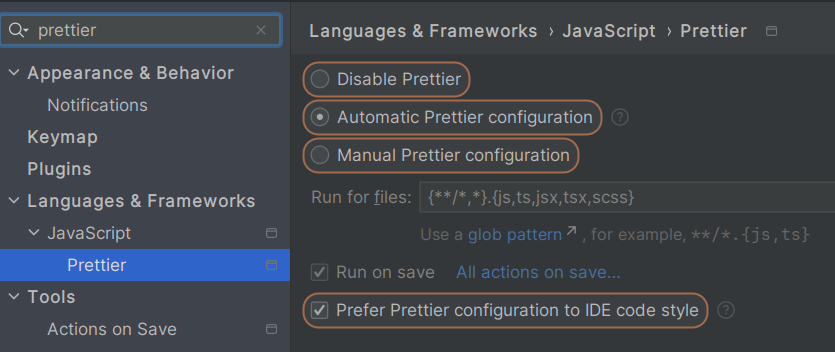
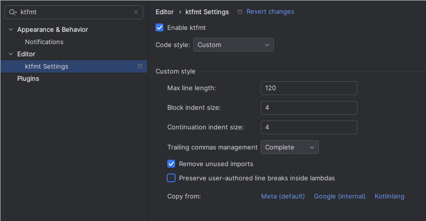
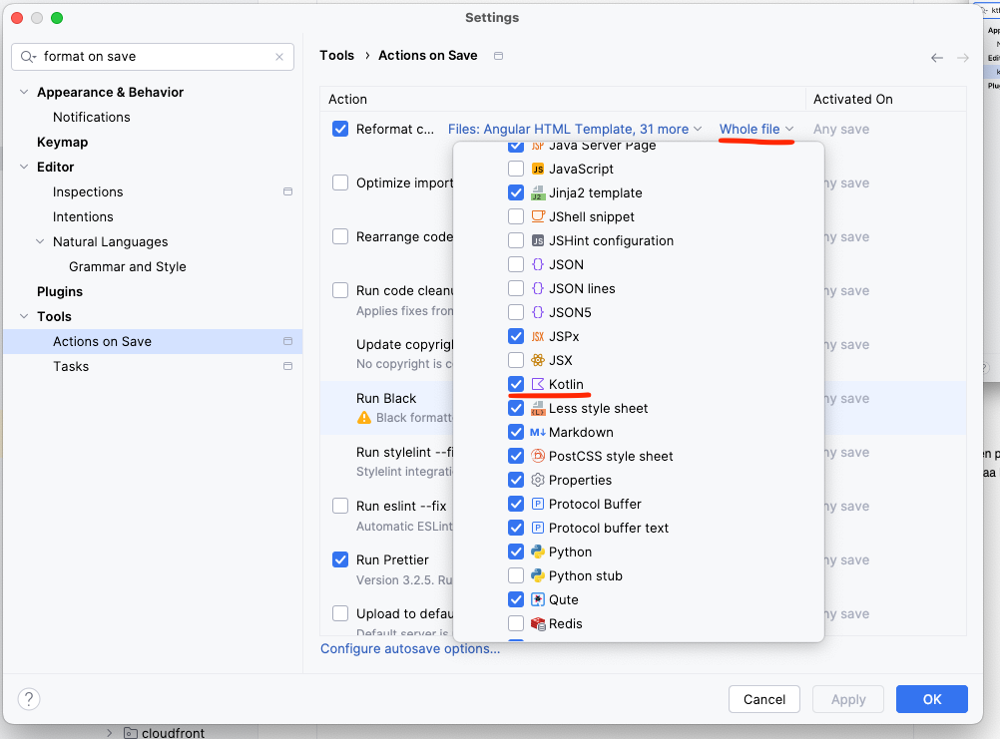

# Koodin automaattinen formatointi

Formattereiden ajoa ei ole toistaiseksi mitenkään pakotettu (esim. ajamalla niitä CI-putkessa, commit-hookissa jne).
Tahtotila kuitenkin on, että kaikki commitoitu koodi olisi aina projektin tyylisääntöjen sääntöjen mukaista, joten
formatterit konfiguroidaan ajettavaksi aina tiedoston tallennuksen yhteydessä.

## Frontend: Prettier

Frontend-puolella on käytössä autoformatterina Prettier-työkalu (https://prettier.io/). Se asentuun NPM:n kautta ja
sitä hyödyntävä Idea-plugarikin on bundlattuna Idean normaalissa asennuksessa. Jos frontin koodia käsittelee jossain
muussa editorissa, prettierin automaattiseen ajoon löytynee helposti keinot, sillä se on hyvin yleisesti käytetty.

### Konfigurointi

Prettierin konfiguraatio löytyy projektin juuresta, työkalun standardimuotoisesta konfiguraatiotiedostosta
`.prettierrc.json`.

### IntelliJ Idea

Prettierin ajoasetukset pitäisi tulla env-repon projektiasetusten mukana. Koska tuo ei ole aina täysin luotettavaa,
tarkasta seuraavat asetukset:

## Backend: ktfmt

Kotlin-puolella on käytössä autoformatterina ktfmt-työkalu (https://facebook.github.io/ktfmt/)

### Käyttöönotto IDEA:ssa ja konfigurointi

Ktfmt:n IDEA-plugarin käyttöönotto tapahtuu asentamalla virallinen
IDEA-plugari (https://plugins.jetbrains.com/plugin/14912-ktfmt) Plugari korvaa IDEA:n sisäisen Reformat code
-toiminnon, joten sitä voi _pääosin_ (ks. gotchat alempana) käyttää kuin IDEA:n omaa formatteria tai fronttipuolella
Prettieriä.

Ktfmt on vakiona pois päältä, joten se pitää enabloida erikseen asetuksista käyttöönoton jälkeen (ks. allaoleva kuva.)
Asetusten pitäisi tulla automaattisesti env-repossa sijaitsevasta asetustiedostosta, mutta mikäli näin ei käy, niin ne
voi asettaa käsin kuvan mukaiseksi.

Plugarin käyttämät tyylisäännöt tallentuvat env-repossa sijaitsevaan `.idea/ktfmt.xml`-tiedostoon.

#### Ktfmt:n käyttö IDEA:sta ja reformat on save

IDEA kannattaa asettaa reformatoimaan koodi tallennuksen yhteydessä. Varmista tällöin että IDEA formattaa koko
tiedoston, eikä vain muuttuneita rivejä (ks. gotchat alempana.)

### Ajo Gradlen kautta

Ktfmt:n Gradle-plugin luo `ktfmtFormat`, `ktfmtFormatMain` ja `ktfmtFormatTest`-taskit, joiden kautta voi ajaa Ktfmt:n
koko koodipesälle / varsinaiselle koodille / testeille valitun taskin mukaan. Lisäksi on olemassa `ktfmtCheck`-taski,
joka tarkistaa onko koodi Ktfmt:n sääntöjen mukaista. Myös tästä taskista on `ktfmtCheckMain` ja `ktfmtCheckTest`
-versiot.

#### Konfigurointi

Gradle-pluginin käyttämät tyylisäännöt määritellään `ktfmt`-blockissa `build.gradle.kts`-tiedostossa.

### Gotchas

1. Gradlen ja IDEA:n Ktfmt-plugarit myös päivittyvät erillään, joten päivitettäessä toinen myös toinen tulee päivittää.
2. Vaikuttaisi siltä, että ainakin kirjoitushetkellä IDEA:n Reformat Code käyttää Ktfmt:tä ainoastaan mikäli mitään
   koodiblokkia ei ole valittuna. Jos koodia on valittuna, valitulle koodille ajetaan vain IDEA:n oma formatter, joka
   tuottaa erinäköistä jälkeä Ktfmt:hen verrattuna. Tämän vuoksi Reformat on save kannattaa pitää päällä, sillä se
   viimeistään tuo koodin Ktfmt:n mukaiseen muotoon.
