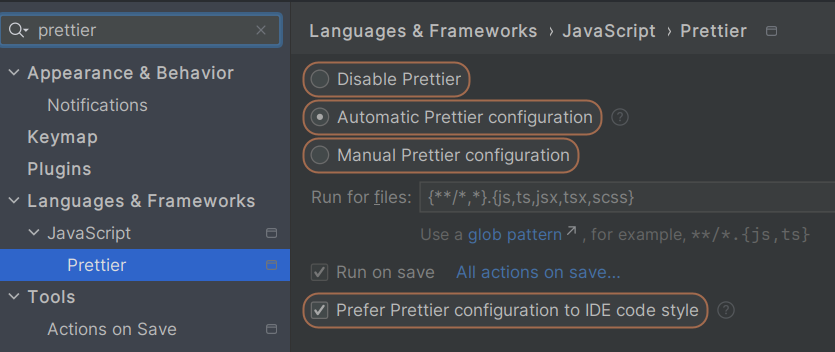
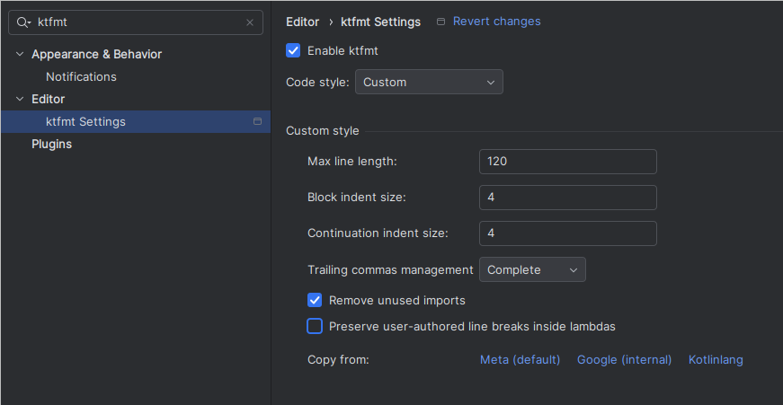
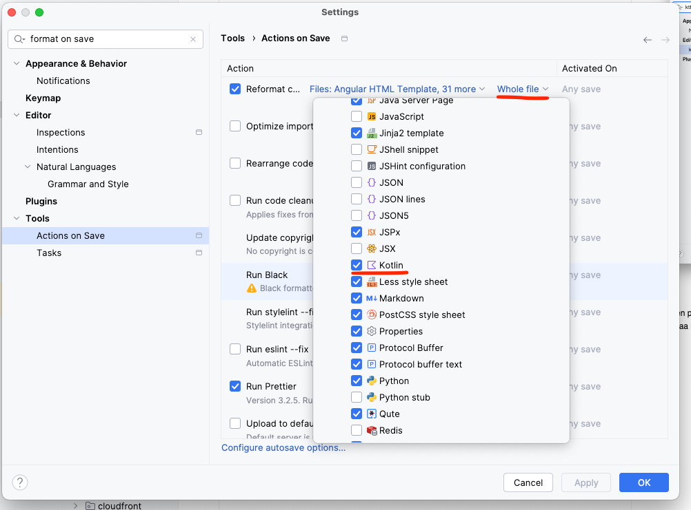

# Koodin automaattinen formatointi

Tahtotila on, että kaikki commitoitu koodi olisi aina projektin tyylisääntöjen mukaista, joten formatterit
konfiguroidaan ajettavaksi aina tiedoston tallennuksen yhteydessä. Kotlin-koodin osalta asia myös tarkastetaan
PR-buildissa; frontin puolella prettierin ajoa ei ole pakotettu.

## Frontend: Prettier

Frontend-puolella on käytössä autoformatterina Prettier-työkalu (https://prettier.io/). Se asentuun NPM:n kautta ja
sitä hyödyntävä Idea-plugarikin on bundlattuna Idean normaalissa asennuksessa. Jos frontin koodia käsittelee jossain
muussa editorissa, prettierin automaattiseen ajoon löytynee helposti keinot, sillä se on hyvin yleisesti käytetty.

### Konfigurointi

Prettierin konfiguraatio löytyy projektin juuresta, työkalun standardimuotoisesta konfiguraatiotiedostosta
`.prettierrc.json`.

### IntelliJ Idea

Prettierin ajoasetukset pitäisi tulla env-repon projektiasetusten mukana. Koska tuo ei ole aina täysin luotettavaa,
tarkasta seuraavat asetukset:


## Backend: ktfmt

Kotlin-puolella on käytössä autoformatterina ktfmt-työkalu (https://facebook.github.io/ktfmt/)

### Käyttöönotto IDEA:ssa ja konfigurointi

Ktfmt:n IDEA-plugarin käyttöönotto tapahtuu asentamalla virallinen
IDEA-plugari (https://plugins.jetbrains.com/plugin/14912-ktfmt) Plugari korvaa IDEA:n sisäisen Reformat code
-toiminnon, joten sitä voi _pääosin_ (ks. gotchat alempana) käyttää kuin IDEA:n omaa formatteria tai fronttipuolella
Prettieriä.

Ktfmt on vakiona pois päältä, joten se pitää enabloida erikseen asetuksista käyttöönoton jälkeen (ks. allaoleva kuva.)
Asetusten pitäisi tulla automaattisesti env-repossa sijaitsevasta asetustiedostosta, mutta mikäli näin ei käy, niin ne
voi asettaa käsin kuvan mukaiseksi.

Plugarin käyttämät tyylisäännöt tallentuvat env-repossa sijaitsevaan `.idea/ktfmt.xml`-tiedostoon.



#### Ktfmt:n käyttö IDEA:sta ja reformat on save

IDEA kannattaa asettaa reformatoimaan koodi tallennuksen yhteydessä. Varmista tällöin että IDEA formattaa koko
tiedoston, eikä vain muuttuneita rivejä (ks. gotchat alempana.)



### Ajo komentoriviltä

Ktfmt ajetaan `infra/script/ktfmt.sh`-skriptillä. Se ei ole osa Gradle-buildia, eli `./gradlew build` ei formatoi
koodia eikä tarkasta formatointia.

```
infra/script/ktfmt.sh                        formatoi työpuun muuttuneet .kt-tiedostot (myös untracked)
infra/script/ktfmt.sh --all                  formatoi repon kaikki .kt-tiedostot
infra/script/ktfmt.sh --dry-run [--all]      kertoo vain mitkä tiedostot muuttuisivat; palauttaa 1 jos niitä on
infra/script/ktfmt.sh [--dry-run] F.kt G.kt  formatoi annetut tiedostot
```

Ensimmäisellä ajolla skripti lataa ktfmt:n jarin Maven Centralista ja kääntää sitä vasten pienen ajurin
(`KtfmtRunner.java`). Molemmat välimuistitetaan repon ulkopuolelle, oletuksena hakemistoon
`~/.cache/geoviite/ktfmt` (ks. `GEOVIITE_KTFMT_CACHE`).

PR-buildi (`.github/workflows/pull_request.yml`) ajaa `ktfmt.sh --dry-run --all`, eli formatoimaton Kotlin-koodi
kaataa buildin.

#### Konfigurointi

Tyylisäännöt määritellään `infra/script/KtfmtRunner.java`-tiedostossa ja käytettävä ktfmt-versio `ktfmt.sh`:n alussa;
sekä env-repossa IDEA:n ktfmt.xml:ssä.

### Gotchas

1. Skripti ja IDEA:n Ktfmt-plugarit päivittyvät erillään, joten päivitettäessä toinen myös toinen tulee päivittää.
2. Vaikuttaisi siltä, että ainakin kirjoitushetkellä IDEA:n Reformat Code käyttää Ktfmt:tä ainoastaan mikäli mitään
   koodiblokkia ei ole valittuna. Jos koodia on valittuna, valitulle koodille ajetaan vain IDEA:n oma formatter, joka
   tuottaa erinäköistä jälkeä Ktfmt:hen verrattuna. Tämän vuoksi Reformat on save kannattaa pitää päällä, sillä se
   viimeistään tuo koodin Ktfmt:n mukaiseen muotoon.
