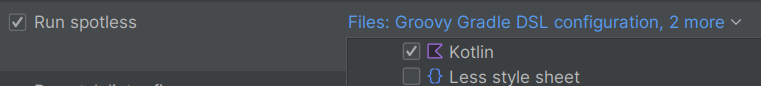

# Koodin automaattinen formatointi

Formattereiden ajoa ei ole toistaiseksi mitenkään pakotettu (esim. ajamalla niitä CI-putkessa, commit-hookissa jne).
Tahtotila kuitenkin on, että kaikki commitoitu koodi olisi aina projektin tyylisääntöjen sääntöjen mukaista, joten
formatterit konfiguroidaan ajettavaksi aina tiedoston tallennuksen yhteydessä.

## Frontend: Prettier

Frontend-puolella on käytössä autoformatterina Prettier-työkalu (https://prettier.io/). Se asentuun NPM:n kautta ja
sitä hyödyntävä Idea-plugarikin on bundlattuna Idean normaalissa asennuksessa. Jos frontin koodia käsittelee jossain
muussa editorissa, prettierin automaattiseen ajoon löytynee helposti keinot, sillä se on hyvin yleisesti käytetty.

### Konfigurointi

Prettierin konfiguraatio löytyy projektin juuresta, työkalun standardimuotoisesta konfiguraatiotiedostosta
`.prettierrc.json`.

### IntelliJ Idea

Prettierin ajoasetukset pitäisi tulla env-repon projektiasetusten mukana. Koska tuo ei ole aina täysin luotettavaa,
tarkasta seuraavat asetukset:


## Backend: ktfmt

Kotlin-puolella on käytössä autoformatterina ktfmt-työkalu (https://facebook.github.io/ktfmt/)

### Konfigurointi

Koska formatointi ajetaan gradle-taskina, sen konfiguraatio löytyy `build.gradle.kts` -tiedostosta. Samasta paikasta
voidaan myös päivittää ktfmt:n versio.

### Konfigurointi ja työkalun ajo komentoriviltä

Ktfmt ajetaan geoviitteessä Gradle-taskina gradlen spotless-pluginin kautta. Task näkyy gradle-taskeissa idean valikossa
tai sitä voidaan ajaa komentoriviltä gradlella.

Jos formatoinnin haluaa ajaa kaikille tiedostoille kerralla, tämän voi tehdä komentoriviltä helposti:

```
./gradlew spotlessApply
```

Vaihtoehtoisesti, jos halutaan käsitellä vain jotkut tiedostot, tällä muodolla voi valita niitä joustavasti:

```
./gradlew spotlessApply -PspotlessFiles=my/file/pattern.java,more/generic/.*-pattern.java
```

### IntelliJ Idea

Geoviitteessä käytetään myös Idea-plugaria "Spotless Applier", joka voidaan asentaa idean marketplacesta:
https://plugins.jetbrains.com/plugin/22455-spotless-applier. Sen avulla Spotless/ktfmt saadaan ajettua aina tallennuksen
yhteydessä. Pluginin asetukset pitäisi tulla projektin asetusten mukana env-reposta, mutta tuo ei välttämättä toimi aina
oikein. Varmista siis seuraavat asetukset:

- Spotlessin oma config
  

- Tools -> Actions on Save -> formatoinnin asetukset:
    - Poista kotlin-tiedostot Idean default fromatterilta ettei se mene ristiriitaan ktfmt:n kanssa
      
    - Valitse "Run spotless" ja aseta se formatoimaan kotlin-tiedostot
      

Pluginin toimintaa voi kokeilla tekemällä jonkun formatointivirheen haluttuun .kt tiedostoon. Sen pitäisi korjaantua
automaattisesti tallennuksen yhteydessä. Jos samaa Idea-pluginin ajaman komennon muotoa haluaa testata komentoriviltä,
sen voi tehdä näin:

```
./gradlew spotlessApply -PspotlessIdeHook="/<absoluuttinen-polku-koodiin>/src/main/kotlin/fi/fta/geoviite/infra/InfraApplication.kt"
```
