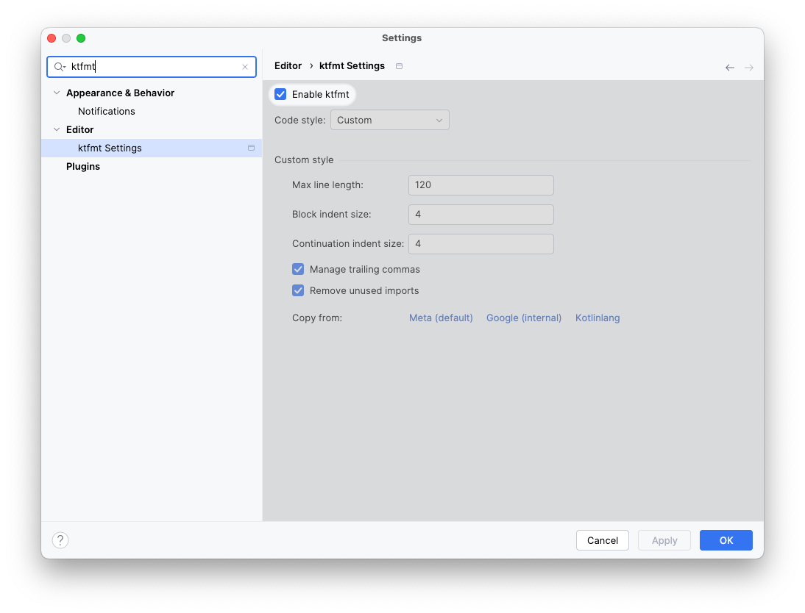
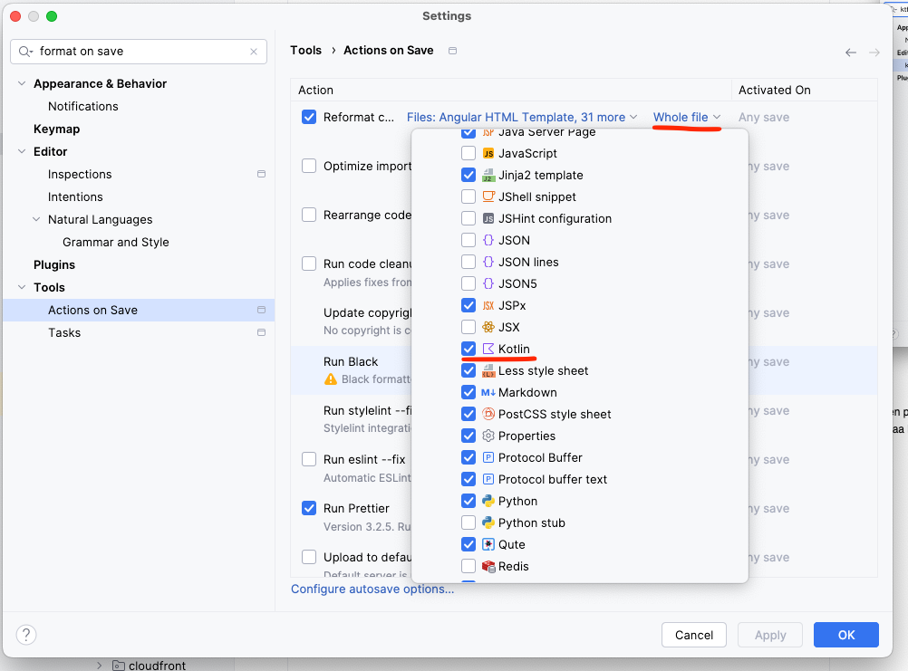

# Ktfmt

Kotlin-puolella on käytössä autoformatterina ktfmt-työkalu (https://facebook.github.io/ktfmt/)

Geoviitteessä on kaksi "virallista" tapaa ajaa Ktfmt:tä: IDEA-plugarin kautta ja Gradle-taskina. IDEA-plugari on kätevä
päivittäiseen devaustyöhön sillä sen saa ajautumaan automaattisesti tallennuksen yhteydessä. Gradle-taski on
käyttökelpoinen tilanteissa, joissa syystä tai toisesta Ktfmt halutaan ajaa koko koodipesälle (esim. jos joku on
unohtanut ajaa Ktfmt:tä päivittäisessä devauksessa ja asia huomataan jälkikäteen.) Näiden lisäksi Ktfmt on myös
mahdollista asentaa komentorivityökaluksi.

Ktfmt:n ajoa ei ole toistaiseksi mitenkään pakotettu (esim. ajamalla Ktfmt CI-putkessa, vertailemalla tuloksia ja
failaamalla jokin check mikäli eroavaisuuksia löytyy.) Tahtotila kuitenkin on, että kaikki commitoitu Kotlin-koodi olisi
aina Ktfmt:n sääntöjen mukaista, joten esim. Ktfmt:n ajoa tiedoston tallennuksen yhteydessä suositellaan.

**HUOM!** Gradle- ja IDEA-plugarit eivät käytä samoja asetustiedostoja, joten jos tyylisääntöjä muokataan, muutokset
pitää tehdä molempien konfiguraatiotiedostoihin. Tämä todennäköisesti pätee myös komentorivityökaluun, mikäli sitä
haluaa käyttää.

## Geoviitteen tyylisäännöt

Tyylittely tehdään custom-rulesetillä, jonka pohjana on ollut Ktfmt:n Kotlinlang-ruleset. Tärkein eroavaisuus
Kotlinlang-rulesettiin on rivien maksimipituus, joka on meillä säädetty 120 merkkiin (vakiona 100.) Muuten asetukset
ovat samat kuin Kotlinlang-setissä. Ktfmt ei ylipäätään tarjoa kovin paljon konfigurointimahdollisuuksia, ja käytännössä
koko konfiguraatio on nähtävillä "Käyttöönotto IDEA:ssa ja konfigurointi" -kappaleen kuvassa.

## Käyttöönotto IDEA:ssa ja konfigurointi

Ktfmt:n IDEA-plugarin käyttöönotto tapahtuu asentamalla virallinen
IDEA-plugari (https://plugins.jetbrains.com/plugin/14912-ktfmt.) Plugari korvaa IDEA:n sisäisen Reformat code
-toiminnon, joten sitä voi _pääosin_ (ks. gotchat alempana) käyttää kuin IDEA:n omaa formatteria tai fronttipuolella
Prettieriä.

Ktfmt on vakiona pois päältä, joten se pitää enabloida erikseen asetuksista käyttöönoton jälkeen (ks. allaoleva kuva.)
Asetusten pitäisi tulla automaattisesti env-repossa sijaitsevasta asetustiedostosta, mutta mikäli näin ei käy, niin ne
voi asettaa käsin kuvan mukaiseksi.

Plugarin käyttämät tyylisäännöt tallentuvat env-repossa sijaitsevaan `.idea/ktfmt.xml`-tiedostoon.

### Ktfmt:n käyttö IDEA:sta ja reformat on save

IDEA kannattaa asettaa reformatoimaan koodi tallennuksen yhteydessä. Varmista tällöin että IDEA formattaa koko
tiedoston, eikä vain muuttuneita rivejä (ks. gotchat alempana.)

## Ajo Gradlen kautta

Ktfmt:n Gradle-plugin luo `ktfmtFormat`, `ktfmtFormatMain` ja `ktfmtFormatTest`-taskit, joiden kautta voi ajaa Ktfmt:n
koko koodipesälle / varsinaiselle koodille / testeille valitun taskin mukaan. Lisäksi on olemassa `ktfmtCheck`-taski,
joka tarkistaa onko koodi Ktfmt:n sääntöjen mukaista. Myös tästä taskista on `ktfmtCheckMain` ja `ktfmtCheckTest`
-versiot.

### Konfigurointi

Gradle-pluginin käyttämät tyylisäännöt määritellään `ktfmt`-blockissa `build.gradle.kts`-tiedostossa.

## Gotchas

1. Gradlen ja IDEA:n Ktfmt-plugarit myös päivittyvät erillään, joten päivitettäessä toinen myös toinen tulee päivittää.
2. Vaikuttaisi siltä, että ainakin kirjoitushetkellä IDEA:n Reformat Code käyttää Ktfmt:tä ainoastaan mikäli mitään
   koodiblokkia ei ole valittuna. Jos koodia on valittuna, valitulle koodille ajetaan vain IDEA:n oma formatter, joka
   tuottaa erinäköistä jälkeä Ktfmt:hen verrattuna. Tämän vuoksi Reformat on save kannattaa pitää päällä, sillä se
   viimeistään tuo koodin Ktfmt:n mukaiseen muotoon.
