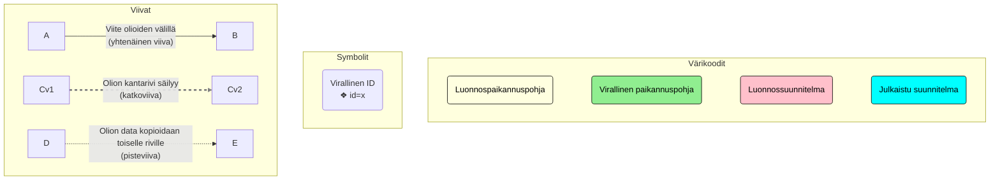
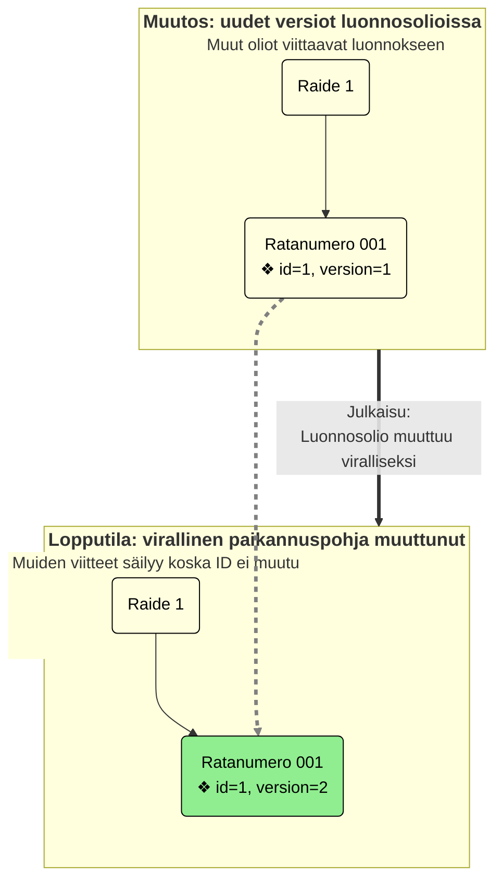
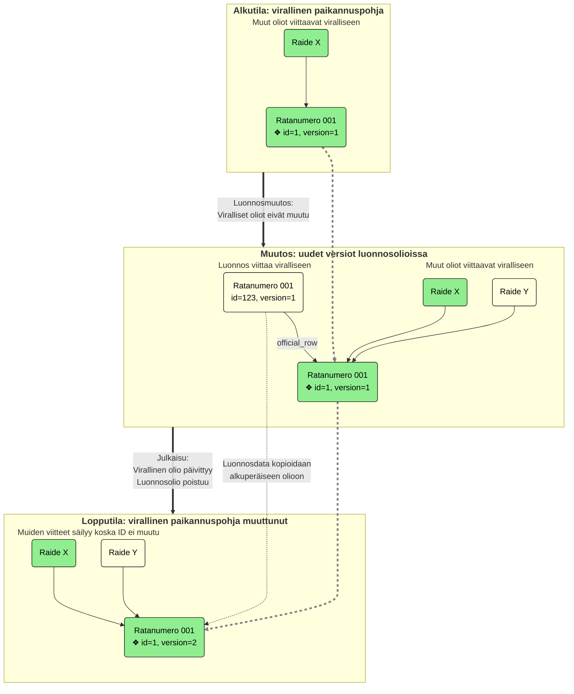
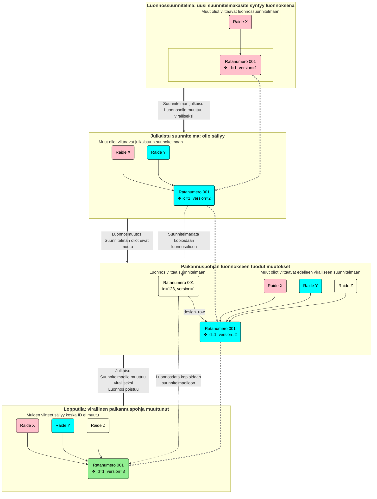
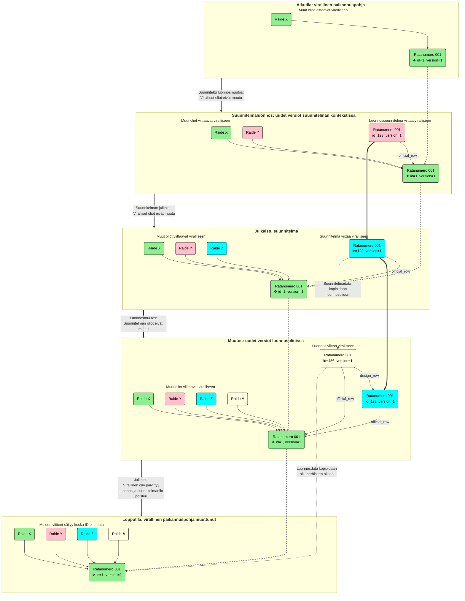

# Paikannuspohjan kontekstit (Layout Context)

Kukin paikannuspohjan käsitteistä voi kuulua yhteen tai useampaan eri kontekstiin. Kontekstilla siis tarkoitetaan eri
versiota paikannuspohjan datasta, kuitenkin siten että ne muodostavat aina yhtenäisen kokonaisuuden.

## Virallinen paikannuspohja (Official Layout)

Virallinen paikannuspohja on se data joka viedään ratkoon ja joka esittää rataverkon todellista nykytilaa parhaan
saatavilla olevan tiedon mukaan. Jos joku käsite on kerran ollut virallisessa paikannuspohjassa, se ei ikinä enää poistu
täydellisesti vaan sen poistot tehdään nk. soft deletenä, eli asettamalla ne "poistettu" (Deleted) tilaan.

## Luonnospaikannuspohja (Draft Layout)

Luonnospaikannuspohja on työtila jossa paikannuspohjaan voidaan tehdä muutoksia: uusien käsitteiden luontia ja
olemassaolevien muokkauksia. Koska luonnos on oma kontekstinsa, mikään muutos siellä ei vaikuta viralliseen
paikannuspohjaan suoraan.

Jos luonnosmuutosta ei haluta viedä viralliseen paikannuspohjaan, se voidaan myös perua (Revert). Tämä tapahtuu
yksinkertaisesti poistamalla luonnosolio, jolloin voimaan jää sen virallinen versio, jos sellaista on. Jos luonnos on
uusi luonti, sen peruminen poistaa koko käsitteen, mikä tarkoittaa että myös siihen viittaavat käsitteet täytyy poistaa
tai muuttaa niin että viittaus poistuu.

Luonnosmuutokset voidaan viedä viralliseen paikannuspohjaan julkaisu-toiminnon (Publication) kautta. Luonnostilassa on
mahdollista olla tilapäistä / osittaista dataa, koska sitä ollaan vasta luomassa, mutta sellaista ei voi olla
virallisessa paikannuspohjassa. Tästä johtuen, julkaisuun sisältyy joukko validointeja (julkaisuvalidointi, publication
validation, kts. [Julkaisu](julkaisu.md)), jonka avulla varmistetaan että julkaistavat tiedot muodostavat eheän
kokonaisuuden. Tässä varmistetaan myös että virallisesta paikannuspohjasta ei voida viitata pelkästään luonnoksena
olevaan käsitteeseen.

## Suunniteltu paikannupohja (Planned Layout)

Suunniteltuja paikannuspohjia voi olla monta, sillä ne koostuvat erillisistä suunnitelmista jotka tarjoavat itsenäiset
joukot suunniteltuja muutoksia. Käyttäjän kannalta ne toimivat pitkälti kuten luonnospaikannuspohja, mutta ne
ovat kukin omia erillisiä kontekstejaan. Suunniteltu paikannuspohja rakentuu aina virallisen paikannuspohjan päälle,
eikä siis ole mitenkään tietoinen varsinaisen paikannupohjan luonnoskontekstista.

Suunnitelmilla on myös omat luonnosversionsa ja niistä tehdään omia julkaisujaan, jotka siis menevät julkaistuksi
suunnitelmaksi, ei varsinaiseen paikannuspohjaan. Vasta julkaistu suunnitelma viedään Ratkoon suunniltuina käsitteinä,
jolloin niihin voidaan suunnitella myös muita kohteita Ratkon puolella.

Kun suunnitelman käsitteet valmistuvat, ne viedään ensin varsinaisen paikannuspohjan luonnoksiksi. Luonnospuolella niitä
voidaan edelleen muokata ja täydentää ennen kun ne julkaistaan normaalin luonnoksen tapaan viralliseksi. Tässä kohtaa
myös itse suunnitelma päivitetään valmistuneeksi.

## Kontekstien väliset siirtymät

Sekä virallisen paikannuspohjan että suunnitelmien muutokset tehdään aina luonnosten kautta. Suunnitelmien
valmistuminenkin on virallisen paikannuspohjan muutos ja menee luonnoksen kautta. Mahdollisia siirtymiä kontekstien
välillä ovat siis:

- Virallinen paikannuspohja -> Luonnospaikannuspohja (luonnosmuutos)
- Luonnospaikannuspohja -> Virallinen paikannuspohja (paikannuspohjan julkaisu)
- Virallinen paikannuspohja -> Luonnossuunnitelma (suunniteltu muutos)
- Luonnossuunnitelma -> Julkaistu suunnitelma (suunnitelman julkaisu)
- Julkaistu suunnitelma -> Luonnospaikannuspohja (suunnitelman valmistuminen)

## ID käsittely ja viittaukset kontekstien välillä

Eri kontekstien versiot samasta käsitteestä ovat kannassa omia rivejään ja siten niillä on omat ID:nsä. Käyttöliittymän
kannalta käsittellä on kuitenkin aina vain yksi ID ja lisätietona konteksti, jossa sitä tarkastellaan. Tuo yksi ID on
käsitteenä nimeltään virallinen ID (official ID). Käytännössä se on käsitteen ensimmäisen ilmenemän ID, riippumatta
missä kontekstissa se ensimmäisen kerran syntyi. Koska tuo ID ei muutu käsitteen siirtyessä eri kontekstien välillä,
käyttöliittymä voi helposti siirtyä tarkastelemaan koko paikannuspohjaa eri konteksteissa.

Myös käsitteiden keskinäiset viittaukset tehdään aina tällä virallisella ID:llä, minkä johdosta noita viittauksia ei
tarvitse korjata silloin kun käsiteestä tehdään uusi versio toiseen kontekstiin -- virallinen ID säilyy aina samana.
Koska luonnos ja suunnitelmat rakentuvat virallisen paikannuspohjan päälle, tämä tarkoittaa että niiden sisältämät
käsitteet voivat viitata virallisilla ID:llä sekä oman kontekstin käsitteisiin että virallisiin käsitteisiin.
Vastaavasti suunnitelman luonnosolio voi viitata suunnitelman luonnoskäsitteisiin, sen julkaistuihin käsitteisiin tai
virallisen paikannuspohjan käsitteisiin, mutta ei virallisen paikannuspohjan luonnoksiin.

Lopullinen rivi jota viite tarkoittaa pitää siis aina tulkita huomioiden myös käsiteltävä konteksti. Jos esimerkiksi
viralliseen käsitteeseen tulee muutos luonnoskontekstiin, toisen luonnoksen viite kyseiseen olioon säilyy
muuttumattomana mutta tarkoittaa nyt luonnosversiota käsitteestä. Vastaavasti jos käsite poistuu luonnoskontekstista,
sama viite tarkoittaa nyt virallisesta paikannuspohjasta tulevaa oliota.

Käsitteiden elinkaaria uuden luonnissa tai olemassaolevan muutoksissa kuvataan alla tarkemmin eri skenaarioille
kontekstit huomioiden. Huomattavaa on, että ensimmäisenä syntynyt olio (tietokantarivi) säilyy ja siirtyy lopulta
viralliseen paikannuspohjaan, mutta muokattaessa muutokset tehdään kopioon, josta data kopioidaan alkuperäiselle
julkaisussa. Tämä varmistaa että virallinen ID säilyy muita viittaajia varten kaikissa ketjuissa.

### Käsitteiden viitteet ja kontekstin esitys tietokannassa

Alla oleva taulukko kuvaa eri kontekstien esitystavat tietokannan sarakkeissa, sekä virallisen ID:n määräytymisen.

| Konteksti                 | Virallinen ID                                | draft | design_id | official_row_id | design_row_id |
|---------------------------|----------------------------------------------|-------|-----------|-----------------|---------------|
| Virallinen paikannuspohja | id                                           | false | null      | null            | null          |
| Luonnospaikannuspohja     | coalesce(official_row_id, design_row_id, id) | true  | null      | X / null        | X / null      |
| Julkaistu suunnitelma     | coalesce(official_row_id, id)                | false | X         | X / null        | null          |
| Luonnossuunnitelma        | coalesce(official_row_id, design_row_id, id) | false | X         | X / null        | X / null      |

#### Virallinen paikannuspohja

- Virallinen käsite ei voi koskaan viitata muihin konteksteihin, eikä siihen voi liittyä suunnitelmaa

#### Luonnospaikannuspohja

- Jos official_row_id on määritelty, kyseessä on luonnosmuutos, muutoin kyseessä on uusi luonnos
- Jos design_row_id on määritelty, draft on luotu toteuttamalla se suunnitelmasta
    - Julkaisun yhteydessä sekä suunnitelmarivi että luonnosrivi poistuu, sillä kyse on suunnitelman valmistumisesta

#### Julkaistu suunnitelma

- Jos official_row_id on määritelty, kyseessä on muutossuunnitelma. Muutoin kyseessä on uuden olion suunnitelma.

#### Luonnossuunnitelma

- Jos design_row_id on määritelty, kyseessä on luonnosmuutos olemassaolevaan suunnitelmaan, muutoin kyseessä on uusi
  luonnos
- Jos official_row_id on määritelty, kyseessä on suunniteltu muutos viralliseen paikannuspohjaan, muutoin kyseessä on
  uuden käsitteen suunnitelma
- Huom. kaikki yhdistelmät official_row_id:n ja design_row_id:n kanssa ovat mahdollisia:
    - Uusi luonnossuunnitelma uudelle raiteelle: ei kumpaakaan määritelty
    - Uusi luonnossuunnitelma olemassaolevalle raiteelle: vain official_row_id määritelty
    - Muokattu luonnossuunnitelma uudelle raiteelle: vain design_row_id määritelty
    - Muokattu luonnossuunitelma olemassaolevalle raiteelle: molemmat määritelty

### Tietokantarivien elinkaari eri käyttötapauksissa

#### Uusien käsitteiden lisääminen luonnospaikannuspohjan kautta

Tässä käyttötapauksessa operaattori lisää järjestelmään kokonaan uuden
ratanumeron ja raiteen.

##### Alkutila

Tietokannassa ei ole ratanumero tai raidetta.

##### Operaattori lisää ratanumeron ja raiteen.

Operaattori lisää luonnospaikannuspohjaan ratanumeron ja sille yhden raiteen.
Tietokantaan syntyy molemmille käsitteille rivit, jotka ovat merkattu luonnoksiksi.
Raide viittaa ratanumeroon track_number_id kentän arvolla, joka on ratanumeron official_id.

| käsitteen nimi | id  | draft | official\_row\_id | design\_id | design\_row\_id | layout\_context\_id | official\_id |
|:---------------|:----|:------|:------------------|:-----------|:----------------|:--------------------|:-------------|
| ratanumero A   | 693 | true  | null              | null       | null            | main\_draft         | 693          |

| käsitteen nimi | id    | draft | official\_row\_id | design\_id | design\_row\_id | layout\_context\_id | official\_id | track\_number\_id |
|:---------------|:------|:------|:------------------|:-----------|:----------------|:--------------------|:-------------|:------------------|
| raide X        | 11846 | true  | null              | null       | null            | main\_draft         | 11846        | 693               |

##### Operaattori julkaisee ratanumeron

Oikeasti operaattori todennäköisesti julkaisisi samalla myös raiteen, mutta koska käsitteitä voi julkaista erikseen,on
mielekästä nähdä arvojen eläminen erikseen julkaistaessa.

Tässä tilanteessa vain ratanumero-rivin draft ja layout_context_id muuttuvat. "ratanumero A" kuuluu nyt viralliseen
paikannuspohjaan. Huomaa että raide on yhä luonnospaikannuspohjassa, mutta se viittaa virallisessa paikannuspohjassa
olevaan ratanumeroon. Viittaus tapahtuu official_id:llä, joka ei muutu, joten raiteen tietokantariviä ei muokata.

| käsitteen nimi | id  | draft | official\_row\_id | design\_id | design\_row\_id | layout\_context\_id | official\_id |
|:---------------|:----|:------|:------------------|:-----------|:----------------|:--------------------|:-------------|
| ratanumero A   | 693 | false | null              | null       | null            | main\_official      | 693          |

| käsitteen nimi | id    | draft | official\_row\_id | design\_id | design\_row\_id | layout\_context\_id | official\_id | track\_number\_id |
|:---------------|:------|:------|:------------------|:-----------|:----------------|:--------------------|:-------------|:------------------|
| raide X        | 11846 | true  | null              | null       | null            | main\_draft         | 11846        | 693               |

##### Operaattori julkaisee raiteen

Tässä muuttuvat raiteen draft ja layout_context_id. Nyt sekä ratanumero että raide ovat virallisessa paikannuspohjassa.

| käsitteen nimi | id  | draft | official\_row\_id | design\_id | design\_row\_id | layout\_context\_id | official\_id |
|:---------------|:----|:------|:------------------|:-----------|:----------------|:--------------------|:-------------|
| ratanumero A   | 693 | false | null              | null       | null            | main\_official      | 693          |

| käsitteen nimi | id    | draft | official\_row\_id | design\_id | design\_row\_id | layout\_context\_id | official\_id | track\_number\_id |
|:---------------|:------|:------|:------------------|:-----------|:----------------|:--------------------|:-------------|:------------------|
| raide X        | 11846 | false | null              | null       | null            | main\_official      | 11846        | 693               |

#### Käsitteen muokkaaminen luonnospaikannuspohjan kautta

Tässä käyttötapauksessa operaattori muokkaa virallisessa paikannuspohjassa olevaa käsitettä.

##### Alkutila

Virallisessa paikannuspohjassa on ratanumero, sekä siihen viittaava raide.

| käsitteen nimi | id  | draft | official\_row\_id | design\_id | design\_row\_id | layout\_context\_id | official\_id |
|:---------------|:----|:------|:------------------|:-----------|:----------------|:--------------------|:-------------|
| ratanumero A   | 693 | false | null              | null       | null            | main\_official      | 693          |

| käsitteen nimi | id    | draft | official\_row\_id | design\_id | design\_row\_id | layout\_context\_id | official\_id | track\_number\_id |
|:---------------|:------|:------|:------------------|:-----------|:----------------|:--------------------|:-------------|:------------------|
| raide X        | 11846 | false | null              | null       | null            | main\_official      | 11846        | 693               |

##### Operaattori muokkaa olemassa olevaa ratanumeroa

Operaattori muokkaa ratanumeron tietoja (esim. nimeä). Alkuperäinen ratanumeron tietokantarivi (id=693) säilyy ja
rinnalle
luodaan uusi rivi (id=694). Uudessa rivissä on tieto, minkä alkuperäisen rivin luonnos se on (official_row_id).

Raiteen viittaus ratanumeroon tapahtuu official_id:llä, joka ei muutu, joten raiteen tietokantariviä ei muokata.

Jos nyt halutaan näyttää esim. raide X:n ratanumeron nimi luonnospaikannuspohjassa (main_draft), niin raiteella on
tiedossa ratanumeron alkuperäinen id (693), joten näillä tiedoilla voidaan hakea oikea ratanumeron tietokantarivi,
jossa official_id=693 ja layout_context_id=main_draft. Näillä tiedoilla löytyy rivi, jonka id=694 ja nimi=ratanumero B.

| käsitteen nimi | id  | draft | official\_row\_id | design\_id | design\_row\_id | layout\_context\_id | official\_id |
|:---------------|:----|:------|:------------------|:-----------|:----------------|:--------------------|:-------------|
| ratanumero A   | 693 | false | null              | null       | null            | main\_official      | 693          |
| ratanumero B   | 694 | true  | 693               | null       | null            | main\_draft         | 693          |

| käsitteen nimi | id    | draft | official\_row\_id | design\_id | design\_row\_id | layout\_context\_id | official\_id | track\_number\_id |
|:---------------|:------|:------|:------------------|:-----------|:----------------|:--------------------|:-------------|:------------------|
| raide X        | 11846 | false | null              | null       | null            | main\_official      | 11846        | 693               |

##### Operaattori julkaisee ratanumeron muutoksen

Kun muunnos julkaistaan luonnospaikannuspohjasta viralliseen paikannuspohjaan,
luonnosrivi tiedot (esim. nimi) kopioidaan viralliselle riville (id=693) ja sitten luonnosrivi (id=694) poistetaan
tietokannasta.

Nyt ratanumeron nimi on päivittynyt viralliseen paikannuspohjaan.

| käsitteen nimi | id  | draft | official\_row\_id | design\_id | design\_row\_id | layout\_context\_id | official\_id |
|:---------------|:----|:------|:------------------|:-----------|:----------------|:--------------------|:-------------|
| ratanumero B   | 693 | false | null              | null       | null            | main\_official      | 693          |

| käsitteen nimi | id    | draft | official\_row\_id | design\_id | design\_row\_id | layout\_context\_id | official\_id | track\_number\_id |
|:---------------|:------|:------|:------------------|:-----------|:----------------|:--------------------|:-------------|:------------------|
| raide X        | 11846 | false | null              | null       | null            | main\_official      | 11846        | 693               |

### Kaavioiden merkinnät

### Kaavio: Uuden käsitteen luonti luonnoksen kautta

Kun olio luodaan uutena, uusi olio ilmestyy ensin luonnokseksi ja muutetaan siitä viralliseksi julkaisussa. Official ID
on siis luodun luonnosrivin ID ja se säilyy, koska itse olio vain päivitetään viralliseksi.

### Kaavio: Olemassaolevan käsitteen muokkaus luonnoksen kautta

Kun oliota muutetaan, muutokset kirjataan luonnoksena tehtyyn kopio-olioon. Kun muutokset julkaistaan, tiedot kopioidaan
luonnoksesta alkuperäiseen olioon. Virallinen ID on alkuperäisen virallisen olion ID ja se säilyy koska oliota vain
päivitetään.

### Suunnitelmakäsitteiden luonti ja muokkaus

Suunnitelmakäsitteiden luonti, muokkaus ja julkaisu tapahtuu samoin kuin virallisessa paikannuspohjassa, luonnosten
kautta. Näistä ketjuista ei ole erillisiä kaavioita, koska prosessi on sama kuin yllä. On kuitenkin hyvä huomata
viittauksiin tulee yksi kerros lisää, sillä suunnitelmaluonnos voi viitata sekä julkaistuun suunnitelmaan että
viralliseen paikannuspohjaan. Virallisen paikannuspohjan luonnokset ja suunnitelmaluonnokset elävät kuitenkin täysin
erillään, eikä niiden välillä voi olla viittauksia.

### Kaavio: Uuden käsitteen tuonti viralliseen paikannuspohjaan suunnitelman kautta

Kun uusi käsite luodaan suunnitelmaan, se syntyy ensin luonnossuunnitelmaoliona. Se julkaistaan ensin viralliseksi
suunnitelmaksi, sillä vain virallisesta suunnitelmasta voidaan tuoda dataa viralliseen paikannuspohjaan.

Kun suunnitelma valmistuu, siitä luodaan luonnosolio kopiona ja sitä voidaan muokata vielä edelleen. Kun suunnitelman
valmistuminen julkaistaan, suunnitelmaolio muutetaan viralliseksi ja siihen kopioidaan lopulliset tiedot luonnosoliosta.
Suunnitelmaolion ID on virallinen ID ja se säilyy, koska sama olio päivitetään lopulta viralliseksi.

### Kaavio: Olemassaolevan käsitteen muokkaus suunnitelman kautta

Suunniteltaessa muutos olemassaolevaan käsitteeseen, suunnitelmaan luodaan ensin luonnoskopio johon muutokset tehdään.
Nämä muutokset on julkaistava viralliseksi suunnitelmaksi ennen kun muutosta voidaan viedä viralliseen paikannuspohjaan.

Kun suunnitelma valmistuu, sen tiedot kopioidaan virallisen paikannuspohjan luonnosolioon, jota voidaan muokata
edelleen. Kun suunnitelman valmistuminen julkaistaan, alkuperäiselle oliolle kopioidaan data luonnosoliolta ja luonnos
sekä suunnitelman olio poistetaan. Alkuperäisen virallisen olion ID on virallinen ID ja se säilyy koska oliota vain
päivitetään.

