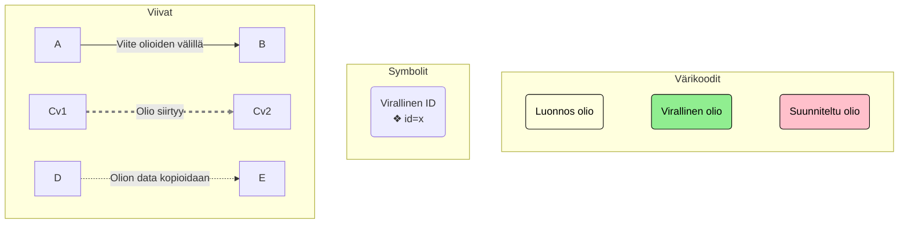
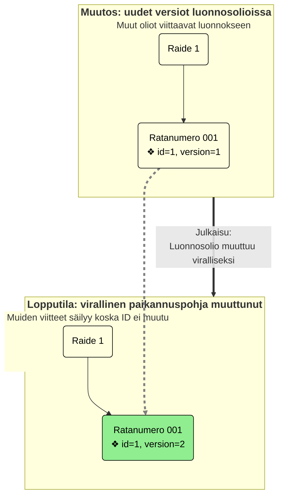
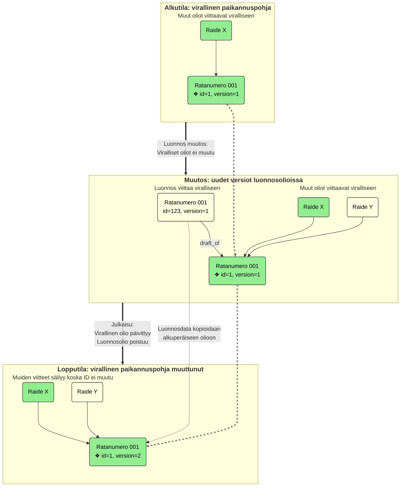
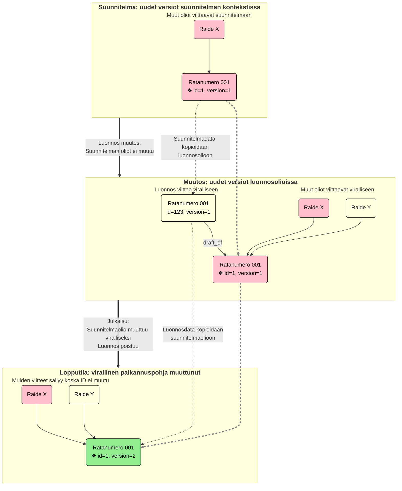
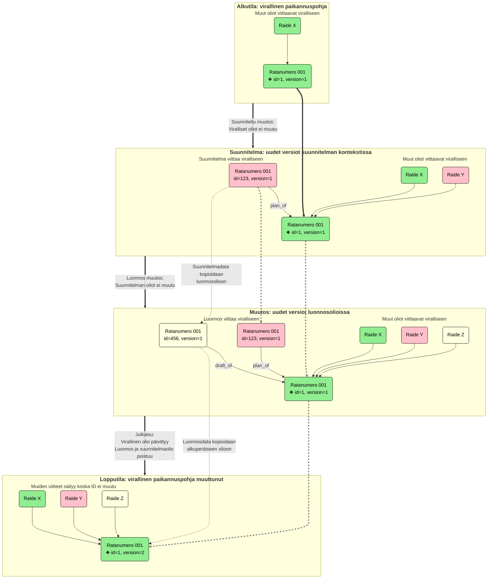

# Paikannuspohjan kontekstit (Layout Context)

Kukin paikannuspohjan käsitteistä voi kuulua yhteen tai useampaan eri kontekstiin. Kontekstilla siis tarkoitetaan eri
versiota paikannuspohjan datasta, kuitenkin siten että ne muodostavat aina yhtenäisen kokonaisuuden.

## Virallinen paikannuspohja (Official Layout)

Virallinen paikannuspohja on se data joka viedään ratkoon ja joka esittää rataverkon todellista nykytilaa parhaan
saatavilla olevan tiedon mukaan. Jos joku käsite on kerran ollut virallisessa paikannuspohjassa, se ei ikinä enää poistu
täydellisesti vaan sen poistot tehdään nk. soft deletenä, eli asettamalla ne "poistettu" (Deleted) tilaan.

## Luonnos paikannuspohja (Draft Layout)

Luonnos paikannuspohja on työtila jossa paikannuspohjaan voidaan tehdä muutoksia: uusien käsitteiden luontia ja
olemassaolevien muokkauksia. Koska luonnos on oma kontekstinsa, mikään muutos siellä ei vaikuta viralliseen
paikannuspohjaan suoraan.

Luonnosmuutokset voidaan viedä viralliseen paikannuspohjaan julkaisu-toiminnon (Publication) kautta. Luonnostilassa on
mahdollista olla tilapäistä / osittaista dataa koska sitä ollaan vasta luomassa, mutta sellaista ei voi olla
virallisessa paikannuspohjassa. Tästä johtuen, julkaisuun sisältyy joukko validointia (publication validation), jonka
avulla varmistetaan että julkaistavat tiedot muodostavat eheän kokonaisuuden.

Koska virallisessa paikannuspohjassa olevan käsitteen poisto tehdään vain tilamuutoksella, sekin on oliotasolla vain
muokkaus. Luonnos kontekstista voidaan kuitenkin poistaa oikeasti sellaisia luonnoskäsitteitä, joita ole vielä julkaistu
viralliseen paikannuspohjaan. Tätä sanotaan luonnosmuutoksen perumiseksi (Revert).

## Suunniteltu paikannupohja (Planned Layout)

Suunniteltuja paikannuspohjia voi olla monta, sillä ne koostuvat erillisistä suunnitelmista jotka tarjoavat itsenäiset
joukot suunniteltuja muutoksia. Käyttäjän kannalta ne toimivat pitkälti kuten luonnos paikannuspohja, mutta ne
ovat kukin omia erillisiä kontekstejaan.

Suunnitelmille tehdään omia julkaisuja (toisin kuin luonnokselle, jonka julkaisu on virallisen paikannuspohjan muutos).
Julkaistu suunnitelma viedään Ratkoon suunniltuina käsitteinä, jolloin niihin voidaan suunnitella myös muita kohteita
Ratkon puolella.

Suunniteltu paikannuspohja rakentuu aina virallisen paikannuspohjan päälle, eikä siis ole mitenkään tietoinen luonnos
paikannuspohjasta. Kun suunnitelman käsitteet kuitenkin valmistuvat, ne viedään ensin luonnoksiksi. Luonnospuolella
niitä voidaan edelleen muokata ja täydentää ennen kun ne julkaistaan normaalin luonnoksen tapaan viralliseksi. Tässä
kohtaa myös suunnitelmajulkaisu päivitetään valmistuneeksi.

## ID käsittely ja viittaukset kontekstien välillä

Eri kontekstien versiot samasta käsitteestä ovat kannassa omia rivejään ja siten niillä on omat ID:nsä. Käyttöliittymän
kannalta käsittellä on kuitenkin aina vain yksi ID ja lisätietona konteksti jossa sitä tarkastellaan. Tuo yksi ID on
käsitteenä nimeltään virallinen ID (official ID). Käytännössä se on käsitteen ensimmäisen ilmenemän ID, riippumatta
missä kontekstissa se ensimmäisen kerran syntyi. Koska tuo ID ei muutu käsitteen siirtyessä eri kontekstien välillä,
käyttöliittymä voi helposti siirtyä tarkastelemaan koko paikannuspohjaa eri konteksteissa.

Myös käsitteiden keskinäiset viittaukset tehdään aina tällä virallisella ID:llä, minkä johdosta noita viittauksia ei
tarvitse korjata silloin kun käsiteestä tehdään uusi versio toiseen kontekstiin -- virallinen ID säilyy aina samana.
Koska luonnos ja suunnitelmat rakentuvat virallisen paikannuspohjan päälle, tämä tarkoittaa että niiden sisältämät
käsitteet voivat viitata virallisilla ID:llä sekä oman kontekstin käsitteisiin että virallisiin käsitteisiin.

Lopullinen rivi jota viite tarkoittaa pitää siis aina tulkita huomioiden myös konteksti. Jos esimerkiksi viralliseen
käsitteeseen tulee muutos luonnoskontekstiin, viite olioon säilyy muuttumattomana ja osoittaa nyt luonnosversioon.
Vastaavasti jos käsite poistuu luonnoskontekstista, viite tarkoittaa nyt virallisesta paikannuspohjasta tulevaa oliota.

Käsitteiden elinkaaria uuden luonnissa tai olemassaolevan muutoksissa kuvataan alla tarkemmin eri skenaarioille
kontekstit huomioiden. Huomattavaa on, että ensimmäisenä syntynyt olio (tietokantarivi) säilyy ja siirtyy lopulta
viralliseen paikannuspohjaan, mutta muokattaessa muutokset tehdään kopioon, josta data kopioidaan alkuperäiselle
julkaisussa. Tämä varmistaa että virallinen ID säilyy muita viittaajia varten kaikissa ketjuissa.

### Kaavioiden merkinnät

### Kaavio: Uuden käsitteen luonti luonnoksen kautta

Kun olio luodaan uutena, uusi olio ilmestyy ensin luonnokseksi ja muutetaan siitä viralliseksi julkaisussa. Official ID
on siis luodun luonnosrivin ID ja se säilyy, koska itse olio vain päivitetään viralliseksi.

### Kaavio: Olemassaolevan käsitteen muokkaus luonnoksen kautta

Kun oliota muutetaan, muutokset kirjataan luonnoksena tehtyyn kopio-olioon. Kun muutokset julkaistaan, tiedot kopioidaan
luonnoksesta alkuperäiseen olioon. Virallinen ID on alkuperäisen virallisen olion ID ja se säilyy koska oliota vain
päivitetään.

### Kaavio: Uuden käsitteen luonti suunnitelman kautta

Kun uusi käsite luodaan suunnitelmaan, uusi olio ilmestyy suunnitelmaoliona. Kun suunnitelma valmistuu, siitä luodaan
luonnosolio kopiona ja sitä voidaan muokata vielä edelleen. Kun suunnitelman valmistuminen julkaistaan, suunnitelmaolio
muutetaan viralliseksi ja siihen kopioidaan lopulliset tiedot luonnosoliosta. Suunnitelmaolion ID on virallinen ID ja se
säilyy, koska sama olio päivitetään lopulta viralliseksi.

### Kaavio: Olemassaolevan käsitteen muokkaus suunnitelman kautta

Suunniteltaessa muutos olemassaolevaan käsitteeseen, suunnitelmaan luodaan kopio johon muutokset tehdään. Kun
suunnitelma valmistuu, sen tiedot kopioidaan luonnosolioon, jota voidaan muokata edelleen. Kun suunnitelman
valmistuminen julkaistaan, alkuperäiselle oliolle kopioidaan data luonnosoliolta ja luonnos sekä suunnitelman olio
poistetaan. Alkuperäisen virallisen olion ID on virallinen ID ja se säilyy koska oliota vain päivitetään.

