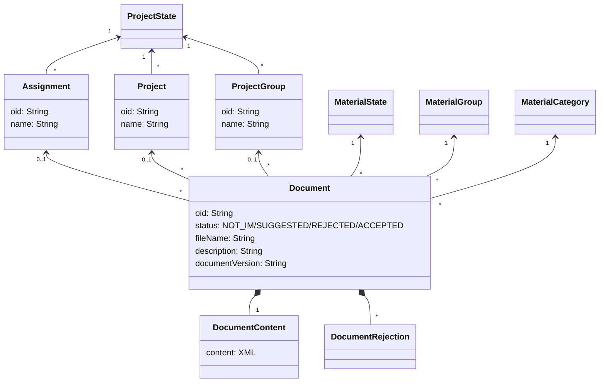

# Projektivelho

## Yleistä

ProjektiVelho-integraatio on tiedostojen käsin uploadaamisen ohella toinen tapa tuoda rata-aineistoja Geoviitteeseen.
Tätä tarkoitusta varten on toteutettu integraatio, jossa Geoviite kyselee periodisesti ProjektiVelholta
listauksen uusimmista sinne syötetyistä InfraModel-tiedostoista ja suodattaa niistä pois valistuneella arvauksella
kaikki ei-rata-aineistot. Koska koneellinen suodatus ei ole pomminvarma, haettuja aineistoja ei lisätä käytettäviksi
inframalleiksi, vaan ne ainoastaan listataan operaattoreille manuaalista läpikäyntiä varten. Lopullinen valta
aineistojen hyväksymiseen ja hylkäämiseen on siis Geoviite-operaattorilla. 

## Tekninen yleiskuvaus

ProjektiVelho-integraatio on pull-tyyppinen integraatio, jossa Geoviite käy periodisesti hakemassa ProjektiVelhosta 
kaikki sinne viimeisimmän onnistuneesti Geoviitteeseen tallennetun aineiston jälkeen lisätyt aineistot. Koska aineistoja 
on potentiaalisesti paljon, haku tehdään batcheissa (batchin koko konfiguroitavissa, toistaiseksi max. 100 aineistoa.) 
Prosessi menee jotakuinkin seuraavasti:
- Geoviite käynnistää ProjektiVelhoon haun. Haku itsessään on async, ja ProjektiVelho palauttaa tässä vaiheessa 
Geoviittelle haun id:n, jonka Geoviite tallentaa kantaan.
- Haun suorittumista seurataan periodisesti. Tässä yhteydessä päivitetään myös ProjektiVelhon nimikkeistö mikäli siihen 
on muutoksia.
- Kun haku on valmis, haetaan sen tulokset ProjektiVelhosta.
- Tämän jälkeen jokaisesta aineistosta haetaan metadatat (toimeksianto, projekti ja projektijoukko) sekä itse tiedosto.
- Tiedosto koitetaan parsia IM-tiedostoksi. Jos parsinta epäonnistuu kokonaan, tiedosto hylätään.
- Kaikista tiedostoista tallennetaan kantaan vähintään metadatat, paitsi tilanteessa jossa tiedoston tai sen metadatan 
hakemisessa menee jotain vikaan. Tällöin tiedosto jätetään käsittelemättä ja integraatio koittaa jatkaa siitä uudestaan
seuraavalla ajokerralla. Tällä pyritään varmistumaan siitä, että mikään tiedosto ei jää käsittelemättä

## Tietomalli

Geooviitteeseen tallennetaan erikseen Projektivelhosta tuodut dokumentit sekä niihin liittyvät toimeksiannot, projektit
ja projektijoukot. Näistä voidaan haluttaessa tuoda tietyt dokumentit geoviitteen inframalli-listaukseen erillisenä
käyttäjän operaationa.

Geoviitteeseen synkronoidaan tarvittavilta osin myös Projektivelhon nimikkeistöt (Dictionary), joita käytetään sieltä
saatujen tietojen tulkitsemiseen. Näitä on mm. materiaalin luokitteluun ja tilaan liittyvät enumeraatiot. Käytännössä ne
ovat koodi-nimi pareja, joista koodia käytetään dokumenttien sisällön kuvaamisessa ja nimeä siinä kohtaa kun arvo
halutaan esittää käyttöliittymällä.

## Käsitteistön yhdistyminen Geoviitteen muuhun tietomalliin

Projektivelhosta ladattavat tiedostot ovat InfraModel-tiedostoja, jotka sisältävät tietoa täsmälleen samassa muodossa 
kuin Geoviitteeseen käsinkin tuotavat inframallit, ja täten ne myös tallennetaan Geoviitteeseen täysin samalla tavalla. 
ProjektiVelhosta haetaan kuitenkin kullekin sieltä tuotavalle tiedostolle myös metatietoa sen projektirakenteesta, jota 
ei ole saatavilla käsin tuotavista tiedostoista. Tämä metatieto tallennetaan `projektivelho`-schemaan 
`document`- tauluun
