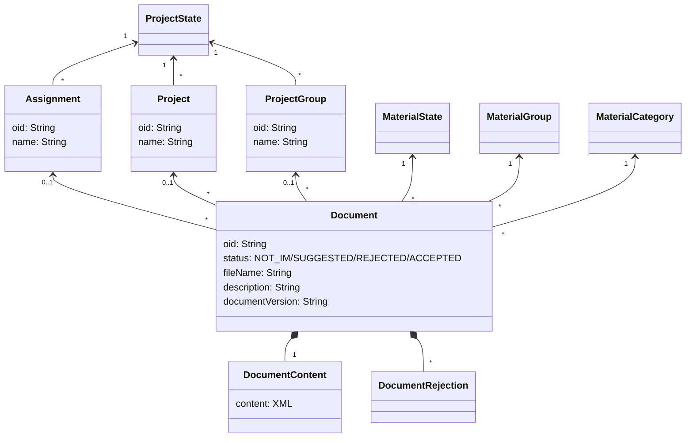

# Projektivelho

## Tietomalli

Geooviitteeseen tallennetaan erikseen Projektivelhosta tuodut dokumentit sekä niihin liittyvät toimeksiannot, projektit
ja projektijoukot. Näistä voidaan haluttaessa tuoda tietyt dokumentit geoviitteen inframalli-listaukseen erillisenä
käyttäjän operaationa.

Geoviitteeseen synkronoidaan tarvittavilta osin myös Projektivelhon nimikkeistöt (Dictionary), joita käytetään sieltä
saatujen tietojen tulkitsemiseen. Näitä on mm. materiaalin luokitteluun ja tilaan liittyvät enumeraatiot. Käytännössä ne
ovat koodi-nimi pareja, joista koodia käytetään dokumenttien sisällön kuvaamisessa ja nimeä siinä kohtaa kun arvo
halutaan esittää käyttöliittymällä.

