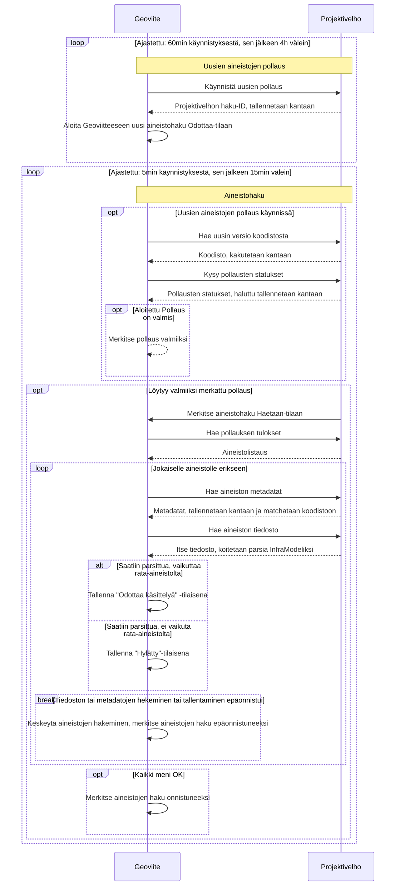

# Projektivelho

## Yleistä

ProjektiVelho-integraatio on tiedostojen käsin uploadaamisen ohella toinen tapa tuoda rata-aineistoja Geoviitteeseen.
Tätä tarkoitusta varten on toteutettu integraatio, jossa Geoviite kyselee periodisesti ProjektiVelholta
listauksen uusimmista sinne syötetyistä InfraModel-tiedostoista ja suodattaa niistä pois valistuneella arvauksella
kaikki ei-rata-aineistot. Koska koneellinen suodatus ei ole pomminvarma, haettuja aineistoja ei lisätä käytettäviksi
inframalleiksi, vaan ne ainoastaan listataan operaattoreille manuaalista läpikäyntiä varten. Lopullinen valta
aineistojen hyväksymiseen ja hylkäämiseen on siis Geoviite-operaattorilla. 

## Tekninen yleiskuvaus

ProjektiVelho-integraatio on pull-tyyppinen integraatio, jossa Geoviite käy periodisesti kyselemässä 
ProjektiVelholta uusia aineistoja. Haku koostuu kahdesta osasta, jotka on ajastettu bäkkärille erillisinä: 

1. Uusien aineistojen pollaus, jossa projektivelhosta kysellään mitä uusia aineistoja olisi saatavilla
2. Aineistohaku, jossa aineistot metatietoineen ladataan Geoviitteeseen

Pollaus kysyy ProjektiVelholta viimeistä onnistuneesti tallennettua aineistoa seuraavat N aineistoa (defaulttina 
N=100, mutta N on konfiguroitavissa.) Tämä haku kestää pitkään, joten sen tuloksia ei jäädä odottelemaan tässä
osassa.

Aineistohaku kyselee käynnissä olevan pollauksen tilan Velholta ja jos se on valmis, niin se suorittaa varsinaisen
aineistojen haun ja tallentamisen Geoviitteeseen. Tässä yhteydessä päivitetään myös Geoviitteen käsitys Projektivelhon
koodistosta. Kukin aineisto käsitellään yksitellen. Jos käsittely epäonnistuu, niin nostetaan kädet ilmaan. Seuraavalla 
kierroksella aloitetaan uudestaan epäonnistuneesta aineistosta.

Yksityiskohtaisempi sekvenssikaavio aiheesta:

## Tietomalli

Geooviitteeseen tallennetaan erikseen Projektivelhosta tuodut dokumentit sekä niihin liittyvät toimeksiannot, projektit
ja projektijoukot. Näistä voidaan haluttaessa tuoda tietyt dokumentit geoviitteen inframalli-listaukseen erillisenä
käyttäjän operaationa.

Geoviitteeseen synkronoidaan tarvittavilta osin myös Projektivelhon nimikkeistöt (Dictionary), joita käytetään sieltä
saatujen tietojen tulkitsemiseen. Näitä on mm. materiaalin luokitteluun ja tilaan liittyvät enumeraatiot. Käytännössä ne
ovat koodi-nimi pareja, joista koodia käytetään dokumenttien sisällön kuvaamisessa ja nimeä siinä kohtaa kun arvo
halutaan esittää käyttöliittymällä.

## Aineistojen metatiedotus (koodisto ja projektihierarkia)

Projektivelhosta tuotavat inframallit sisältävät InfraModel-tiedostojen ulkopuolista metatietoa, josta 
osa tallennetaan Geoviitteeseen. Aineiston projektihierarkia (projektijoukko,- projekti- ja 
toimeksiantoviittaukset) tallennetaan siksi, että se voidaan näyttää operaattorille. Operaattorin on näiden 
avulla mahdollista navigoida niiden kautta Projektivelhoon tutkimaan suurempaa kokonaisuutta aineiston ympäriltä. 
Tämä informaatio on saatavilla vain projektivelhon kautta tuoduille aineistoille. Loput metatiedot (tiedoston 
versio- ja koodistotiedot.) tallennetaan siksi, että siitä on mahdollisesti hyötyä tulevaisuudessa ja ne 
vievät melko vähän tilaa.

## Muuta teknistä

- Frontti ei ole koskaan suoraan yhteydessä Projektivelhoon (myös redirectit kulkevat bäkkärin kautta) 
- Projektivelhoon ei (ainakaan toistaiseksi) suoriteta yhtäaikaisia kutsuja
- Autentikaatio hoidetaan Bearer-authilla. Tokenin ikä tarkastellaan aina jokaisen kutsun alussa ja se päivitetään
alkaa käydä liian vanhaksi. Login-osoite on eri kuin varsinaisten kyselyiden osoite, joten se tarvitsee oman
`WebClient`:in
