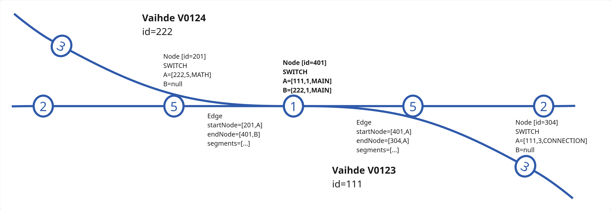

# Rataverkon graafimalli

Rataverkon graafimalli muodostaa matemaattisen graafin raiteista, vaihteista ja niiden kytkennöistä. Tämä ei näy
osana Geoviitteen linkitystä käyttäjälle vaan se on sisäisesti vain raiteiden tietosisällön tallennusmuoto. Se on
kuitenkin keskeinen osa topologiadatan muodostusta ja tarjoaa helpot käsitteet joita voidaan käyttää erilaisissa
graafialgoritmeissa, kuten reitityksessä.

## Tietosisältö

Graafimalli koostuu solmuista (LayoutNode) ja kaarista (LayoutEdge). Solmut vaihdepisteitä tai raiteiden päitä ja kaaret
geometrioita, jotka yhdistävät ne. Yhdessä ne muodostavat rataverkon graafin, jota voidaan käyttää esimerkiksi
reititykseen tai mallintamaan rataosuuksia yli useiden raiteiden.

Itse raiteet koostuvat tietystä kokoelmasta kaaria ja siten myös solmuja. Solmujen kautta ne kytkeytyvät vaihteisiin
ja muihin raiteisiin.

### Muuttumattomuus (immutability)

Graafin käsitteistö poikkeaa muusta paikannuspohjan käsitteistöstä siinä että sen solmut ja kaaret eivät versioidu kuten
muut rataverkon oliot, vaan ovat muuttumattomia (immutable). Sekä solmut että kaaret on määritelty niin että niiden data
yksilöi ne täysin, eli samansisältöinen solmu tai kaari on sama solmu tai kaari. Tämän ansiosta eri paikannuspohjan
konteksteissa luodut viitteet tiettyyn vaihdepisteeseen päätyvät viittaamaan samaan solmuun ja graafi pysyy kytkettynä
vaikka raiteita luodaan ja muokataan eri paikannuspohjan konteksteissa.

Sen sijaan sijaintiraiteen geometria (LocationTrackGeometry) versioituu sijaintiraiteen itsensä (LocationTrack) mukana
ja jokainen geometrian versio viittaa tiettyyn joukkoon muuttumattomia kaaria. Näin ollen, raiteen versiot yksilöivät
koko geometriansa aivan kuten muunkin datan. Tarkemmin raiteen versioista voi lukea dokumenteista
[Paikannuspohjan kontekstit](paikannuspohjan_kontekstit.md) ja [Tietokanta](tietokanta.md).
  
Koska rataverkko voi muuttua ja kaaret/solmut ovat muuttumattomia, on huomattavaa että kaikki kannasta löytyvät kaaret
tai solmut eivät aina ole voimassa. Ne kuuluvat tiettyyn rataverkon tilaan jos ja vain jos joku raide kyseisessä
rataverkon versiossa viittaa niihin.

### Solmut (LayoutNode)

Solmu kuvaa rataverkon haarautumiskohtaa ja on sisällöltään oikeastaan pelkkä identiteetti. Sen sisältö (viite
vaihdepisteeseen tai raiteen päätyyn) yksilöi sen täysin ja toista samansisältöistä solmua ei voi olla. Sen sijaan eri
sisältöinen solmu (eri vaihdepiste/raiteen pää) on aina eri solmu.

Yllä oleva kuva näytää solmu solmujen tietosisällön eri tyyppisille solmuille. Raiteen päätesolmut kertovat mistä
raiteesta (virallinen ID) on kyse ja onko kyse ko. raiteen alusta vai lopusta. Tällaisessa solmussa ei ole koskaan
vaihdetietoja, koska jos raide päättyy vaihteelle, se kytketään raiteen päätesolmun sijaan vaihdesolmuun. Kaksi
raiteen päätysolmua on kuitenkin mahdollista kytkeä toisiinsa (yhdistelmäsolmu) tilanteessa, jossa raidetunnus vaihtuu
maastossa ilman vaihdetta.

Vaihteiden solmut puolestaan sisältävät viitteen vaihteeseen sekä vaihdepisteen tunnuksen (numero) ja roolin. Rooli on
osa solmun identiteettiä, sillä jos vaihdetyyppi vaihtuu niin että saman vaihdepisteen merkitys topologiassa muuttuu,
on tuo graafin kannalta eri solmu. Tällainen voisi tapahtua esimerkiksi vaihdepisteellä 5 jos vaihteen tyyppi vaihtuu
YV-vaihteesta RR-vaihteeksi linkityksessä. Tuollaiset muutokset ovat epätavallisia koska fyysinen vaihde ei toki vaihda
tyyppiään, mutta tiedon korjauksissa tämä on mahdollista.

Solmuilla on aina käsitteellisesti kaksi porttia. Perusmuodossaan (kuten kaikki ylläolevan kuvan solmut), näistä toinen
on aina null eli määrittelemätön. Kun kaari kytkeytyy solmuun null-portin puolelta (kuvassa vasemmanpuolinen kaari), on
kyseessä ulkoinen kytkentä eli topologialinkki. Tässä kaari (ja siten raide) siis päättyy siihen mistä vaihde alkaa.
Vastaavasti ei-null portin kautta kytkeytyminen (kuvassa oikeanpuoleinen alaspäin kaartuva kaari) tarkoittaa että kaari
on osa viitatun vaihteen sisäistä geometriaa, eli se on samalla myös vaihteen kaari. Vaihteen keskellä olevaan solmuun
(vaihdepiste 5 kuvassa) kytkeydytään molemmilta puolin A-porttiin. Solmu on määritelty niin että jos toinen portti
uupuu, se on aina B-portti ja A on puolestaan aina määritelty.

Molemmat portit ovat solmulla käytössä tilanteessa, jossa 2 vaihdetta ovat raiteella aivan peräkkäin. Tällöin molemmilla
vaihteilla on vaihdepiste samassa solmussa. Alla oleva kuva esittää tällaista tilannetta. Solmuja on vain yksi, ja sen
identiteetti on eri kuin pelkän yksittäisen vaihteen identiteetit. Molemmista päistä tulevat kaaret kytkeytyvät samaan
solmuun, mutta eri portteihin sen mukaan kumman vaihteen puolelta ne tulevat. Solmun määritelmään kuuluu että A ja B
valikoidaan deterministisesti niin että kahden vaihdepisteen yhdistelmä on aina sama solmu. Käytännössä tämä tehdään
järjestämällä portit sisällön (ID, joint, role) mukaan.

Solmulla ei ole omaa sijaintia, vaan sille saadaan sijainti katsomalla kaaria jotka siihen päättyvät. Koska geometriat
voivat tulla eri lähteistä, tämä ei välttämättä ole täysin yksiselitteinen kaikissa tilanteissa, eli eri raideversioilla
voi olla eri käsitys solmun (esim. vaihdepisteen) sijainnista. Toinen tapa saada paikannuspohjan kontekstiin ja tilaan
sidottu sijainti solmulle on katsoa sen viittaaman vaihdepisteen tai raiteen pään sijainti.

#### Solmujen muodostuminen linkityksessä

Koska solmujen sisältö määrittelee niiden identiteetin, linkitystä tehtäessä ei tarvitse huolehtia mahdollisesti jo
olemassaolevista solmuista niille vaihdepisteille tai raiteen päille jotka syntyvät. Riittää että raiteille luodaan
sellaiset uudet solmut jotka vastaavat uutta tilaa (TmpNode-oliot). Kun solmu tallennetaan, tietokannasta palautuu joko
uusi ID (jos solmu oli uniikki) tai aiemman solmun ID (jos se oli jo olemassa). Näin samaan vaihdepisteeseen kytkeytyvät
raiteet päätyvät automaattisesti kytkeytymään graafiin oikein ilman että viittauksista tarvitsee erikseen huolehtia
linkitettävän vaihteen osalta.

Topologiakytkennät (kytkeytyminen vaihdepisteeseen "ulkoapäin") ei kuitenkaan ole osa itse linkityksen manuaalisia
valintoja vaan se päätellään sijaintien perusteella topologian uudelleenlaskennassa itse linkityksen jälkeen. Tämä
tapahtuu hakemalla rataverkon versiosta muuttuneiden solmujen läheltä muut solmut ja tarkastelemalla voivatko ne
kytkeytyä toisiinsa. Tässä on kaksi eri tilannetta: raiteen päättyminen lähellä vaihdepistettä tai kahden vaihdepisteen
päätyminen lähekkäin.
 
Jos raide päättyy lähelle jotain vaihdesolmua, raiteelle vaihdetaan päätesolmun tilalle kyseinen vaihdesolmu. Tämä
vaihto on loogisesti samanlainen riippumatta siitä syntyikö tilanne linkittämällä kyseiseen kohtaan toinen vaihde vai
muuttamalla raiteen geometriaa niin että se päätyy olemassaolevan vaihdepisteen lähelle. Molemmissa tapauksissa haetaan
kyseisen kohdan solmut ja vaihdetaan kytkentä tilanteen mukaisesti.

Jos kaksi vaihdepistettä on lähekkäin, niiden tilalle syntyy yhdistelmäsolmu. Sillä on portteina molempien vaihteiden
vaihdepisteet ja kaaret kytkeytyvät siihen porttiin kumman vaihdepiste niillä alunperin oli, eli kumman vaihteen
puolelta ne tulevat. Aiemmat yhden vaihdepisteen solmut eivät poistu kannasta mutta ne jäävät pois raiteilta eivätkä 
siten ole enää osa kyseistä rataverkon tilaa.

### Kaaret (LayoutEdge)

Kaari kuvaa tiettyä geometriaa joka yhdistää kaksi solmua toisiinsa. Vastaavasti kuin solmut, kaaret ovat itsessään
muuttumattomia. Toisin sanoen, kaari ei voi muuttua eri solmujen väliksi vaan solmujen vaihtuessa syntyy uusi kaari.
Myös itse geometria, joka yhdistää samat kaksi solmua on muuttumaton, eli eri muotoinen kaari on identiteetiltään eri
kaari. Muuttumattomuudesta johtuen useampi eri raide tai raideversio voi huoletta viitata samaan kaareen jos niiden
geometriat ovat identtiset. Tämä on tyypillistä esimerkiksi saman raiteen eri versioilla tai duplikaattiraiteilla.

Geoviitteen tietomallissa kaaren kytkentä solmuun on kääritty EdgeNode-olioon, joka kuvaa liittyvän solmun ID:n lisäksi
portin, eli puolen jolta kaari kiinnittyy solmuun. Se tarjoaa koodissa käsitteen "sisä" (inner) ja "ulko" (outer)
kytkennöistä vaihteeseen.

#### Kaarten muodostuminen linkityksessä

Kuten solmuillakin, myös kaarilla data yksilöi identiteetin. Jos luodaan uusi kaari, jonka sisältö on identtinen jonkun
olemassaolevan kaaren kanssa, kannasta palautuu tallennuksessa olemassaolevan kaaren ID. Muutoin uusi data tallentuu
uutena kaarena ja palautetaan sen ID. Näin identtiset geometria päätyy tallentumaan vain kerran ilman että koodissa
tarvitsee huolehtia siitä että säilytetään muutostilanteissa samat olioviitteet.

## Tarkkuustasot ja yksinkertaistus

Geoviite luo graafimallin nk. nano-tarkkuustasolla, mikä tarkoittaa että jokainen vaihdepiste on oma solmunsa.
Käytännössä ulkoisille käyttäjille tuo on kuitenkin tarpeettoman tarkka, joten graafimalli voidaan yksinkertaistaa nk.
mikro-tarkkuustasolle, jossa kukin vaihde kuvataan yhtenä graafin haarautumispisteenä. Tätä eroa havainnollistetaan alla
olevassa kuvassa.

Mikro-tasolla solmuista suodatetaan mukaan vain ne vaihdesolmut, joiden kohdalla graafi voi oikeasti haarautua. Tämä
tarkoittaa käytännössä vaihteiden MAIN-roolin solmuja (YV-vaihteella vaihdepiste 1, RR-vaihteella vaihdepiste 5, jne.)
Raiteen päätesolmut tulevat aina mukaan mikrotason graafiin.

Koska solmuista poistuu osa, myös kaaret täytyy koostaa yhdistelmiksi nanotason kaaria. Yhdistelmäkaaren identiteetti
voidaan ajatella olevan lista sen koostavien kaarien ID:stä, mutta kaarien identiteeteillä ei yleisesti ole merkitystä
sovelluslogiikassa. Niissä kiinnostavampaa on geometria, ja se muodostuu yhdistelmien geometrioista.

Raiteet päättyvät yleensä lähtökohtaisesti vaihteen MAIN-pisteelle, mutta tämä ei ole absoluuttinen sääntö. Niissä
poikkeustilanteissa joissa raide päättyykin jollekin muulle vaihdepisteelle, sen geometria ei ole enää yksiselitteisesti
tietty joukko yhdistelmäkaaria.
