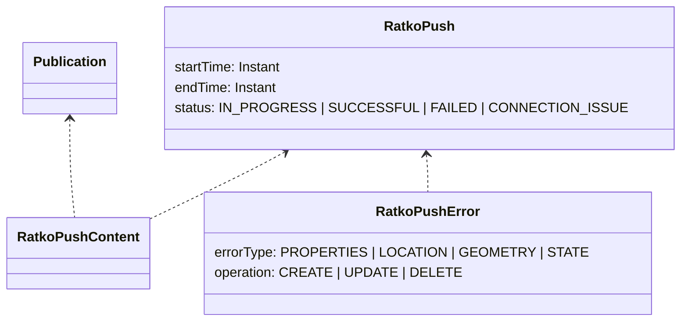

# Ratkovienti
Täällä on kuvattuna ratkoviennin prosessi sekä sen tietomalli.  
Ratkoviennillä tarkoitetaan ratanumeroiden, sijaintiraiteiden sekä vaihteiden geometrioiden päivittämistä Ratkoon.

Geoviitteen ja Ratkon välinen integraatio on toteutettu push-tyyppisenä eli yksisuuntaisena.  
Järjestelmien välinen kommunikaatio tapahtuu REST-rajapinnoilla. 

Ratkovienti tapahtuu erillisellä asynkronisella prosessilla ja ylätasolla se koostuu seuraavista vaiheista:
- Haetaan kaikki julkaisut, joita ei vielä ole viety Ratkoon
- Yhdistetään julkaisujen muutokset, jotta saadaan erotus Ratkon ja Geoviitteen nykytilan välillä
- Viedään tähän liittyvät käsitteet käsite kerrallaan Ratkoon (ratanumerot, raiteet, vaihteet)

## Julkaisuiden koostaminen
Julkaisujen yhdistäminen tehdään, jotta virhetilanteissa on mahdollista korjata tilannetta toisella julkaisulla.
Yhteysvirheiden tapauksessa julkaisua yritetään automaattisesti uudelleen seuraavalla ajolla, mutta muissa virheissä ei
ole syytä olettaa että tilanne korjaantuisi automaattisesti. Tällöin virhe voidaan korjata joko Ratkon puolella tai
muuttamalla vietävää datajoukkoa uudella julkaisulla, jolloin datan koostamisen ansiosta virheellistä välitilaa ei
tarvitse saada menemään läpi.

## Tietomalli
Alla on kuvattuna yksikertaistettu malli ratkoviennin käsitteistä.

## OIDien hakeminen
Geoviitteessä luoduille uusille käsiteille (ratanumeroille, raiteille sekä vaihteille) haetaan Ratkosta OID-tunniste osana paikannuspohjan julkaisua.  
OIDIt ovat globaalisti uniikkeja ja niitä käytetään käsitteiden tunnistamiseen eri järjestelmien välillä.

## Ratanumeroiden, sijaintiraiteiden sekä vaihteiden vienti
Käsitteet viedään tietyssä järjestyksessä Ratkoon, jotta voidaan varmistaa käsitteiden välinen eheys myös viennin aikana:  
Ratanumeron muutokset viedään aina ensimmäisenä Ratkoon, minkä jälkeen voidaan vasta viedä sijaintiraiteisiin tulleet muutokset. 
Vaihteisiin kohdistuvat muutokset viedään viimeisenä koska vaihteen linjoilla on taas riippuvuuksia sijaintiraiteisiin.

Sijaintiraiteen ja ratanumeron päätepisteet käsitellään aina omana operaationa, sillä Ratkossa ne ovat käsitteellisesti eri asioia kuin muut raiteen pisteet.

### Manuaalisesti käynnistetty sijaintiraiteen ratkovienti
Geoviitteen käyttöliittymästä on myös mahdollista käynnistää ratkovienti yksittäiselle sijaintiraiteelle.
Tällöin Ratkoon päivitetään halutut raiteen ratakilometrit, sekä niille välille osuvat topologisesti kytkeytyneet vaihteet.

### Vaihteen vienti, erikoistilanne
Ratkossa vaihteet kytkeytyvät raiteisiin rataosoitteen perusteella, mikä tarkoittaa siis sitä, että vaihteen kautta kulkevilla raiteilla on oltava sopivat (epä-)tasametripisteet ennen kuin vaihteen linjoja voidaan päivittää.  
Koska historiallisista syistä Geoviitteen ja Ratkon rataosoitteistot poikkeavat hieman, Geoviite päivittää ainoastaan ne vaihteen linjat, joiden geometriat on juuri päivitetty.

## Hyvä tietää integraatiosta
- Ratko käyttää sisäisesti TM35FIN-koordinaattijärjestelmää, mutta rajapinnoissa koordinaatit välitetään WGS84 muodossa. 
  - Tosin Ratkon asset-rajapinta tekee tässä pienen poikkeuksen eli se ottaa vastaan koordinaatit ("geometry") WGS84:ssa, mutta sama rajapinta palauttaa koordinaatit TM35FINinä. 
    WGS84 koordinaatit löytyvät taas toisesta kentästä ("geometryOriginal").
- Rajapinnoissa Ratkon palauttama km+m (rataosoite) on pyöristetty arvo. Tarkka rataosoite saadaan yhdistämällä km- ja m-kentän arvot.
