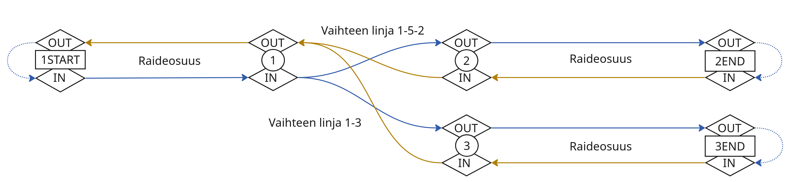

# Reititys

Reititys on rataverkon graafimallin päälle rakennettu ominaisuus, joka etsii lyhimmän reitin kahden rataverkon pisteen
välillä. Reitti kulkee raiteita ja vaihteita pitkin noudattaen rataverkon topologiaa, eli se voi haarautua vaihteissa ja
kääntyä takaisin raiteiden päissä, mutta ei voi hypätä raiteelta toiselle ilman topologista kytkentää, tai kääntyä
vastoin vaihdetyypin mukaisia kääntymissääntöjä.

Reititys on tarjolla käyttöliittymällä karttatyökaluna, jolla voi valita kaksi pistettä kartalta ja visualidoia niiden
välinen reitti. Taustapalveluiden puolella reititystä hyödynnetään sisäisesti esimerkiksi liikennepaikkavälien
pituuksien laskennassa.

## Reitinhaku

Reitinhaku tapahtuu ylätasolla seuraavasti:

- Luodaan varsinainen reititysgraafi rataverkkodatasta
- Haetaan raiteiden spatiaalisesta välimuistista (`LocationTrackSpatialCache`) lähin raide alku- ja loppupisteelle
- Luodaan tilapäisgraafi alku- ja loppupisteille sekä niiden kytkennöille varsinaiseen graafiin
- Muodostetaan tilapäisgraafista ja varsinaisesta graafista unioni ja haetaan sen päältä lyhin Dijkstra-algoritmilla
- Muutetaan löydetty (kaarilistauksena esitetty) reitti niitä vastaaviksi raideosuuksiksi

Varsinaista graafihakua ei tarvitse lainkaan jos alku- ja loppupisteet ovat sama piste tai sijaitsevat samalla kaarella
tai vaihdelinjalla. Näissä tapauksissa reitinhaku voidaan oikosulkea pelkäksi raideosuuden mappaukseksi.

Reitityksen hitain osuus on graafin rakentaminen koko rataverkon pohjalta. Tämän vuoksi se on syytä pitää välimuistissa
ja tuottaa uudelleen vain kun rataverkko muuttuu. Sinällään tarvetta esimerkiksi kantaan tallennukselle ei toistaiseksi
ole, sillä graafin tuottaminen on sekin vain sekunnin osia. Välimuisti on toteutettu `RoutingService`-luokassa ja nojaa
paikannuspohjan muutosoaikoihin perustuen.

## Reititysgraafin toteutus JGraphT-kirjaston avulla

Reitityksen graafi toteutetaan [JGraphT](https://jgrapht.org/)-kirjastolla. Kirjasto tarjoaa valmiit tietorakenteet mm.
suunnatulle, painotetulle monigraafiille (`DirectedWeightedMultigraph`) sekä lyhimmän polun etsinnän Dijkstran
algoritmilla (`DijkstraShortestPath`). Geoviitteen reititysmalli käärii JGraphT-graafin omaan `RoutingGraph`-olioon,
joka sisältää graafin lisäksi kaari- ja vaihdekohtaisen metadatan, jonka avulla löytynyt reitti voidaan tulkita
takaisinpäin rataverkon raideosuuksiksi.

Reititysgraafi rakentuu [rataverkon graafimallin](rataverkko_graafi.md) käsitteistä: solmuista (`LayoutNode`) ja
kaarista (`LayoutEdge`). Reitityksen oma graafi ei kuitenkaan ole suoraan sama kuin rataverkon graafi, vaan se on
erillinen JGraphT-pohjainen rakenne, joka on optimoitu nimenomaan reitinhakuun suunnatulla mallilla ja
vaihdekohtaisilla yhteyssäännöillä. Rataverkon graafi toimii pohjadatana, josta reititysgraafi rakennetaan.

### Rataverkon tilapäinen reititysgraafi

Reititystä varten muodostetaan käytännössä aina kaksi graafia. Ensimmäinen näistä on varsinainen rataverkosta rakennettu
graafi joka sisältää kaikki raiteet ja vaihteet, eli kuvaa koko rataverkon mahdollisen reitityksen. Toinen on tilapäinen
lisägraafi, johon luodaan solmut haetun reitin alku- ja loppupisteelle sekä kaaret jotka yhdistää ne päägraafin
solmuihin molempiin suuntiin molemmista pisteistä. Varsinainen reititys tehdään näiden graafien unionin päällä.

Erillinen tilapäisgraafi mahdollistaa sen että että rataverkon päägraafi on muuttumaton useiden reittihakujen välillä,
ja voidaan pitää välimuistissa niin kauan kuin itse rataverkko ei muutu.

## Graafin rakenne

Reititysgraafi on suunnattu painotettu monigraafi, jossa solmut ovat suunnallisia liittymäpisteitä ja kaaret ovat
painotettuja yhteyksiä niiden välillä. Painotus on kaaren pituus metreinä, joten Dijkstra löytää lyhimmän fyysisen
reitin.

### Suunnattu graafi (IN/OUT -solmut)

Koska reitti kulkee rataverkolla tiettyyn suuntaan, graafin solmut on jaettu suunnallisiksi. Jokaisesta fyysisestä
pisteestä (vaihdepisteestä tai raiteen päästä) luodaan kaksi solmua: **IN** (saapuva) ja **OUT** (lähtevä). Tämä
mahdollistaa sen, että vaihteen läpi kulkeva liikenne seuraa oikeita kääntymissääntöjä: liikenne saapuu
vaihteeseen jonkun sen vaihdepisteeseen IN-solmun kautta ja poistuu toisen vaihdepisteen OUT-solmun kautta. Graafiin
lisätään vain vaihteen rakenteen (`SwitchStructure`) sisältämien linjausten (`SwitchStructureAlignment`) mukaiset
yhteydet, jolloin reititys on mahdollista vain määriteltyjä linjauksia pitkin.

Esimerkiksi yksinkertaisessa (YV) vaihteessa, on linjat 1-5-2 ja 1-3. Näistä muodostetaan graafiin yhteydet 1(IN) -> 2
(OUT), 1(IN) -> 3(OUT), sekä niiden vastakkaiset suunnat 2 (IN) -> 1 (OUT) ja 3 (IN) -> 1 (OUT). Yhteyttä pisteiden 2 ja
3 välillä ei ole. Tällöin jos tullaan vaihteeseen vaikkapa pisteen 2 kautta, eli 2 (IN), voidaan siitä jatkaa eteenpin
vain pisteen 1 (OUT) kautta.

Raideosuudet puolestaan kytkevät niiden alun ja lopun solmut toisiinsa niin että toisen pään OUT-solmu on yhteydessä
toisen pään IN-solmuun ja päinvastoin, jolloin reitti voi kulkea kumpaankin suuntaan raiteella, mutta sen täytyy jatkaa
raideosuuden jälkeen samaan suuntaan. Poikkeuksena tähän on raiteiden päät, joissa lisätään ylimääräinen nollapituinen
kaari OUT-solmusta IN-solmuun, mikä mahdollistaa reitin kääntymisen ympäri raiteen päässä.

Alla oleva kuva esittää esimerkin YV-vaihteen IN/OUT-kytkennöistä siihen liittyvien kolmen raideosuuden kanssa. Kukin
vaihdepiste on kuvattu IN- ja OUT-solmuparinaan. Vaihteen linjaukset kulkevat IN-solmusta OUT-solmuun (esim. 1 IN → 2
OUT). Raideosuudet kulkevat raiteen alun IN-solmusta ("sisään raiteelle") vaihdepisteen IN-solmuun ("sisään
vaihteeseen") ja vastaavasti vaihdepisten OUT-solmusta ("ulos vaihteesta") raiteen päädyn OUT-solmuun ("ulos
raiteelta"). Raiteiden päädyissä nähdään yhdyskaaret päädyn OUT-solmusta saman pisteen IN-solmuun, mahdollistaen
kääntymisen takaisin linjalle. Seuraamalla yhdyskaarien kulkusuuntia voidaan todentaa että suunnattu graafi toteuttaa
YV-vaihteen kääntymissäännöt.

Lisäksi yhdyssolmuissa, eli solmuissa jossa kaksi vaihdetta ovat välitömästi peräkäin ilman raideosuutta niiden välissä,
luodaan molempiin suuntiin nollapituinen kaari kummankin vaihdepisteen OUT- solmulta vastakkaisen IN-solmuun välille,
mikä mahdollistaa siirtymisen vaihteelta toiselle.

Koska raideosuudet rakennetaan paikannuspohjan `LayoutEdge`-olioista, duplikaattiraiteista ei synny reititysgraafiin
duplikaattikaaria, vaan jokainen raideosuus syntyy vain kerran. On kuitenkin oleellista muistaa että millä vain
osuudella saattaa kulkea kuitenkin useampi sijaintiraide.

### Kaarien pituudet (painot)

Raideosuuksilla vaihteiden (tai raiteen pään ja vaihteen) välillä kaaren pituus on luonnollisesti raideosuuden pituus
metreinä. Vaihteen sisäiseltä osuudelta raiteesta itsestään ei kuitenkaan luoda reititysgraafiin lainkaan kaaria. Sen
sijaan kaikista vaihteista luodaan kaaret vain niiden rakenteen mukaisten linjausten mukaisesti, kuten yllä on kuvattu.
Näiden kaarien pituus on linjauksen geometrinen pituus, siten kun se vaihdetyypille on määritetty. Oikeasti maastossa
raideosuus ei välttämättä vastaa millin tarkkuudella rakenteen mukaista linjan pituutta, mutta sen pitäisi olla
käytännössä lähes sama.

### Solmutyypit (RoutingVertex)

Reititysgraafissa on kolme solmutyyppiä. Olleellista näissä kaikissa on että solmun sisältö kuvaa sen identiteetin, eli
kahta samansisältöistä vertexiä ei voi olla graafissa yhtä aikaa.

- **SwitchJointVertex**: Vaihteen suunnattu vaihdepiste. Solmuja luodaan vaihteen linjausten päätepisteille, eli niille
  vaihdepisteille joihin raide voi kytkeytyä vaihteen ulkopuolelta.

- **TrackBoundaryVertex**: Raiteen pää, joko alku (START) tai loppu (END). Syntyy vain raiteille, jotka eivät kytkeydy
  mihinkään vaihteeseen kyseisessä päässä (muutoin luodaan SwitchJointVertex).

- **TrackMidPointVertex**: Väliaikainen solmu, joka luodaan reitinhakua varten mielivaltaiseen pisteeseen raiteen
  varrella. Tämä mahdollistaa sen, että reitinhaku voi alkaa ja päättyä mihin tahansa kohtaan raiteella, eikä vain
  solmujen kohdalla.

### Kaarityypit (RoutingEdge)

Graafissa on viisi kaarityyppiä:

- **TrackEdge**: Raideosuus joka vastaa jotain `LayoutEdge`ä, eli raiteen osuutta kahden vaihteen (tai raiteen päädyn)
  välillä. Suunta on UP kasvavien m-arvojen suuntaa (kaaren alusta loppuun) tai DOWN vastakkaiseen suuntaan (lopusta
  alkuun). Näitä luodaan vain raideosuuksille, jotka eivät ole vaihteen sisäistä geometriaa.

- **PartialTrackEdge**: Tilapäisgraafissa käytettävä osittainen `LayoutEdge`, tietyllä m-arvovälillä. Näiden avulla
  kytketään tilapäisgraafin alku- ja loppusolmut (mielivaltaisessa kohdassa raideosuutta) päägraafiin. Suunta on UP
  kasvavien m-arvojen suuntaan, samoin kuin `TrackEdge`illä.

- **SwitchInternalEdge**: Vaihteen sisäinen yhteys tietyn linjauksen läpi, yhdeltä ulkoiselt vaihdepisteeltä toiselle.
  Suunta on UP vaihdelinjan määriteltyyn suuntaan, esim 1-5-2 linjalle 1 (IN) -> 2 (OUT) on UP. Vastakkainen reitti, eli
  2 (IN) -> 1 (OUT) on vastaavasti suunta DOWN.

- **PartialSwitchInternalEdge**: Tilapäisgraafissa käytettävä osittainen vaihteen sisäinen yhteys, jota käytetään kun
  reitti alkaa tai päättyy vaihdelinjan sisällä. Suunta määritellään vaihdelinjan mukaisesti kuten `SwitchInternalEdge`
  illä.

- **DirectConnectionEdge**: Nollapituinen yhteys kahden samassa sijainnissa olevan solmun välillä. Käytetään kun kaksi
  vaihdepistettä tai raiteen päätä sijaitsevat samassa solmussa (esim. yhdistelmäsolmussa) sekä raiteen päissä
  kääntymiseen. Näiden kaarien pituus on aina nolla. Raiteen päässä niiden suunta on aina UP, sillä tällaisia kaaria
  tarvitaan vain yksi (OUT -> IN). Yhdistelmäsolmuilla luodaan sekä UP että DOWN suuntaiset kaaret erottelemaan molemmat
  kulkusuunnat.

## Reitin muuntaminen raideosuuksiksi

Jotta reitityksen ulospäin annettava tulos voidaan kuvata Geoviitteen käsitteistön rataosuuksina, reititysgraafin mukana
kulkee myös alkuperäinen rataverkkodata, josta se luotiin. Reititys tuottaa löydetyn reitin listana `JGraphT`-graafin
kaaria, joita pitkin reitti kulkee. Nämä mapataan takaisin raiteiksi ja vaihdelinjoiksi joista kyseiset kaaret luotiin,
muuntaen reittiosuuksien kaaren sisäiset m-arvot takaisin raiteiden m-arvoiksi.

Koska kunkin kaaren kohdalla saattaa kulkea useampi sijaintiraide (duplikaattiraiteet), tässä mappauksessa joudutaan
valitsemaan joku raide jolla reitti määritellään. Reitin pituuden kannalta raiteen valinta ei kuitenkaan muuta mitään,
joten valinta voi olla mielivaltainen.

### M-arvomuunnokset

Raideosuuksia kuvaavilla kaarilla m-arvot ovat paikannuspohjan `LayoutEdge`:n sisäisiä m-arvoja, eli
`LineM<EdgeM>`. Ne muunnetaan raiteen m-arvoiksi (`LineM<LocationTrackM>`) samoin kuin paikannuspohjassa muuallakin:
yhdistämällä sisäinen m-arvo kyseisen kaaren alku-m-arvoon kyseisellä raiteella.

Vaihteilla puolestaan vaihdelinja kuvataan yhtenä kokonaisuutena (`SwitchEdge`), joten sen m-arvot kuvataan linjan
sisäisinä, tyypillä `LineM<SwitchStructureAlignmentM>`. Jotta nämä voidaan muuntaa raiteen m-arvoiksi, täytyy
vaihdeosuus ensin mapata niihin kaariin jotka linjan kulkevat, ja muuntaa vaihdelinjan m-arvot kaaren m-arvoiksi. Tämän
jälkeen ne voidaan taas muuntaa normaalisti kaarelta raiteen m-arvoiksi.
