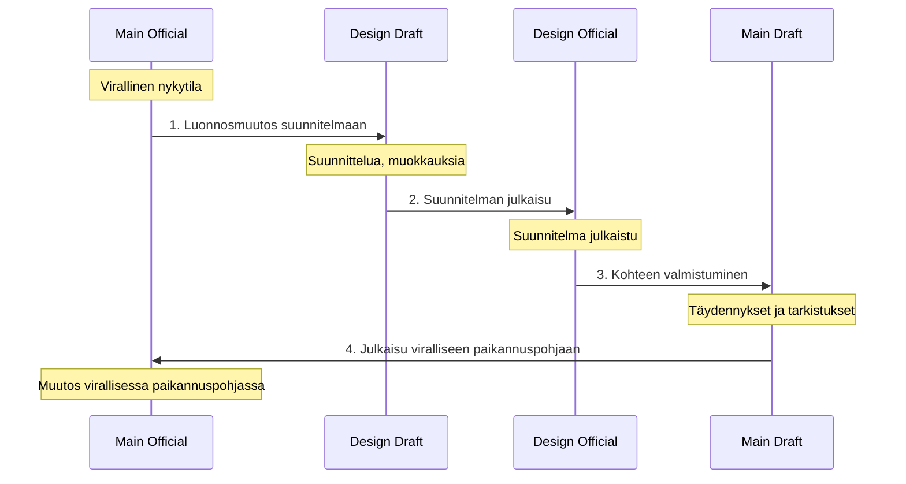
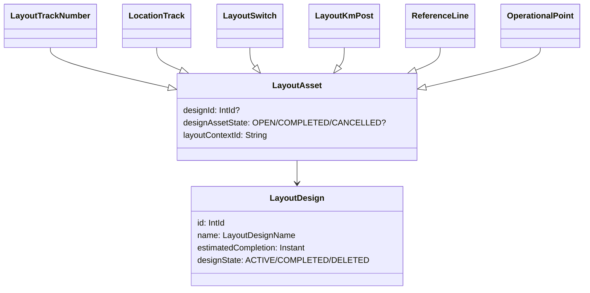

# Suunnitelmatila (Design)

Suunnitelmatila on Geoviitteen ominaisuus, joka mahdollistaa rataverkon tulevien muutosten suunnittelun ja hallinnan
erillään virallisesta paikannuspohjasta. Suunnitelmat muodostavat omat kontekstinsa, joissa voidaan kehittää ja
julkaista rataverkon muutoksia vaikuttamatta viralliseen paikannuspohjaan ennen niiden valmistumista. Suunnitelmilla on
pääasiallisena käyttötarkoituksena tulevien rataverkon muutosten visualisointi ja suunnittelu Geoviitteessä.

Suunnitelmatilat toimivat kuin virallisen paikannuspohjankin muokkaus: muokkaukset tehdään suunnitelmakontekstin
sisäisessä luonnostilassa, josta ne julkaistaan osaksi suunnitelman sisäistä paikannuspohjaa. Kohteiden valmistuessa ne
on mahdollista siirtää Geoviitteen varsinaiseen paikannuspohjaan siirtämällä ne ensin luonnostilaan ja julkaisemalla ne
sieltä viralliseen paikannuspohjaan.

## Suunnitelman ja virallisen paikannuspohjan suhde

Suunnitelmat elävät omissa paikannuspohjan konteksteissaan ja ovat siksi täysin itsenäisiä ja toisistaan riippumattomia.
Kukin suunnitelma rakentuu virallisen paikannuspohjan (main-official) päälle, mutta:

- Suunnitelma ei näe main-draft -muutoksia
- Eri suunnitelmat eivät näe toistensa muutoksia
- Voi olla useita aktiivisia suunnitelmia samanaikaisesti

Tarkempi kuvaus konteksteista löytyy dokumentista [Paikannuspohjan kontekstit](paikannuspohjan_kontekstit.md).

## Suunnitelman elinkaari

| Tila          | Kuvaus                                                                                                                                                                                                                                                                                                                                |
|---------------|---------------------------------------------------------------------------------------------------------------------------------------------------------------------------------------------------------------------------------------------------------------------------------------------------------------------------------------|
| **ACTIVE**    | Työn alla oleva suunnitelma. Voi sisältää luonnoksia ja julkaistuja muutoksia. Yksittäisiä käsitteitä voidaan peruuttaa tai valmistaa itsenäisesti, joten aktiivinen suunnitelma voi sisältää sekä peruttuja että valmistuneita osia samanaikaisesti. Aktiivisesta suunnitelmasta voidaan siirtyä joko COMPLETED- tai DELETED-tilaan. |
| **COMPLETED** | Suunnitelma on merkitty valmiiksi. *Huom: COMPLETED-tilaa ei ole vielä toteutettu loppuun.*                                                                                                                                                                                                                                           |
| **DELETED**   | Suunnitelma on poistettu kokonaan. Julkaistut kohteet, joita ei ole vielä viety luonnostilaan, peruutetaan.                                                                                                                                                                                                                           |

## Kontekstisiirtymät

Suunnitelman muutokset kulkevat läpi useita vaiheita ennen kuin ne päätyvät viralliseen paikannuspohjaan:

### 1. Suunnitelman luonti ja muokkaus (Main Official → Design Draft)

Suunnitelmalle annetaan luomisen yhteydessä nimi ja arvioitu valmistumisaika. Suunnitelman on tarkoitus kuvata
rataverkon tilaa valmistumisajankohtana kyseisessä suunnitelmassa määritellyn rataverkon osuuden osalta. Arvioitu
valmistumispäivä voi muuttua suunnittelun edetessä.

Suunnitelmaan voidaan tehdä:

- **Uusia kohteita** (uudet raiteet, vaihteet, ratanumerot)
- **Muutoksia olemassa oleviin kohteisiin** (geometrian muutokset, ominaisuuksien päivitykset)
- **Kohteiden poistoja** (raiteiden, vaihteiden, yms. poistaminen)

Muutokset tehdään design-draft -kontekstissa, jossa ne näkyvät vain kyseisessä suunnitelmassa.

### 2. Suunnitelman julkaisu (Design Draft → Design Official)

Kun suunnitelmaluonnoksen muutokset ovat valmiita, ne julkaistaan suunnitelman viralliseen versioon.
Julkaisu toimii vastaavasti kuin virallisen paikannuspohjan julkaisu:

- Suoritetaan julkaisuvalidointi, joka varmistaa että muutokset muodostavat eheän kokonaisuuden. Suunnitelman
  luonnosmuutokset validoidaan suunnitelman virallista tilaa vasten. (ks. [Julkaisut](julkaisut.md))
- Design-draft -rivit poistetaan ja niiden perusteella luodaan ja päivitetään design-official -rivejä.
- Luodaan julkaisuolio, johon julkaisussa muuttuneet, lisätyt ja poistetut kohteet liitetään.

Design-official -tila on suunnitelman "virallinen" versio, jota voidaan jakaa Geoviitteestä eteenpäin. Tämä versio
paikannuspohjasta rakentuu virallisen paikannuspohjan (main-official) päälle siten, että main-official otetaan pohjaksi
ja suunnitelmaan kuuluvat kohteet ylikirjoittavat main-officialin vastaavat kohteet.

### 3. Suunnitellun kohteen valmistuminen (Design Official → Main Draft)

Kun suunnitelma tai sen osa on toteutettu ja valmis, valmistuneet kohteet siirretään virallisen paikannuspohjan
luonnokseen. Kaikki suunnitelman kohteet voivat valmistua samalla kerralla, mutta on myös mahdollista että ainoastaan
osa sen kohteista valmistuu kerrallaan.

- Käyttäjä siirtää kohteen suunnitelmasta varsinaiseen luonnostilaan
    - Tähän käytetään Geoviitteen julkaisuprosessia
    - Tässä yhteydessä tehdään täysi julkaisuvalidointi, mutta ainoastaan tietokannan rajoituksia rikkovat virheet
      (esim. assettien duplikaattinimet) estävät siirron. Nämä virheet on helpompaa korjata main-draftin puolella.
- Tuotuja kohteita voidaan vielä tarkastella ja täydentää varsinaisen luonnostilan puolella

Kohteiden valmistuminen ei valmista tai poista itse suunnitelmaa, vaan sen työstämistä voidaan edelleen jatkaa.

### 4. Julkaisu viralliseen paikannuspohjaan (Main Draft → Main Official)

Viimeisenä vaiheena main-draft -kohteet julkaistaan normaalin julkaisuprosessin kautta viralliseen paikannuspohjaan
(main-official). Tässä vaiheessa:

- Suoritetaan täysi julkaisuvalidointi
- Muutokset viedään viralliseen paikannuspohjaan, josta niitä voidaan jakaa eteenpäin
- Kohteet säilyvät edelleen suunnitelmassa, mutta niiden tila muuttuu COMPLETED-tilaan

## Muutosten periminen

Epäsuorat muutokset (esim. geokoodauksen kautta tulevat osoitteistomuutokset) voivat aiheuttaa virallisen
paikannuspohjan muutosten julkaisuista vaikutuksia myös suunnitelmiin. Geoviitteessä itsessään näille ei tarvita
kummempaa seurantaa, koska nämä tiedot lasketaan joka tapauksessa dynaamisesti, mutta ulkoisille järjestelmille
lähetettävän tiedon vuoksi näitä pitää myös seurata.

Tässä on hyvä pitää mielessä täysin erillisinä konsepteina:

- Onko Geoviitteessä oliosta suunnitelman (virallinen) olioversio, eli oliorivi, jolla on suunnitelman design_id
- Olioon viittaava rivi julkaisutaulussa; tämä voidaan päätyä tallentamaan suorien tai epäsuorien muutosten perusteella
- Olion OID (suunnitelmaversioilla ja maini-versiolla oliosta on omat OIDinsa)

Suunnitelman oliorivi luodaan oliolle ainoastaan silloin, kun käyttäjä varsinaisesti muokkaa oliota suunnitelmassa
tai luo sen suunnitelmassa.

OID haetaan silloin, kun mistään syystä halutaan alkaa kertoa ulkomaailmalle jonkin suunnitelman olion tilasta. Suorin
syy on tietenkin, että olio on luotu tai olemassaolevaa oliota on muokattu suunnitelmassa suoraan; mutta voi olla myös,
että suunnitelmassa tehty muutos aiheuttaa epäsuoria muutoksia olioon, jota suunnitelmassa ei ole muokattu. Tällöin
sille haetaan OID, mutta ei luoda suunnitelman olioriviä.

Varsinainen ajatus sitten on, että julkaisutauluihin (`publication.track_number`, jne.) saadaan mukaan kaikki
muutokset, jotka voidaan haluta kertoa esim. ext-APIen kautta ulkomaailmalle: Osa voi tulla normaalisti suunnitelman
omista muutoksista, osa voi tulla laskennan kautta mainista tulleista muutoksista, mutta kaikki löytyy näistä tauluista
sitten suoraan.

Perimiseen liittyvää koodia on julkaisussa kahta polkua:

### Peritty muutos mainista

Kun tehdään julkaisu mainissa, Geoviite käy läpi kaikki suunnitelmat, ja katsoo, päätyykö julkaisusta epäsuoria
muutoksia johonkin sellaiseen suunnitelman olioon, joka katsotaan ulkomaailmalle julkaistuksi, ts. sellaiselle, jolla
on OID. Jos on, tallennetaan suunnitelmittain CALCULATED_CHANGE-julkaisuja, joissa on mukana nämä epäsuorat muutokset.

Mainista perittävissä muutoksissa on siis ihan normaalia, että voidaan tarkastella muutoksia ympäri rataverkon, ja
nähdä että kyllähän tämä muutos periytyy ympäriinsä suunnitelmiin; mutta vain sellaisille tapauksille, joissa oliolla
on suunnitelman OID, siitä tallennetaan julkaisutauluun muutos.

### Suunnitelmasta itseensä periytyvä muutos

Kun tehdään julkaisu suunnitelmassa, Geoviite tarkistaa, aiheuttaako tämä epäsuoria muutoksia johonkin sellaiseen
olioon, josta ei ole erikseen ole olemassa suunnitelman versiota. Eli esimerkiksi sellainen tapaus, että muutetaan
suunnitelmassa geokoodausta niin, että se vaikuttaa jonkin virallisessa paikannuspohjassa olemassaolevan olion
rataosoitteisiin. Tässä tapauksessa julkaisuprosessi sekä tallentaa näille olioille epäsuoran muutoksen että hakee
niille OIDin, minkä tuloksena ne katsotaan ulkomaailmalle julkaistuksi, että tallentaa niistä julkaisutauluun muutoksen.

## Tietomalli

### Suunnitelman kohteen tila (DesignAssetState)

Jokaisella suunnitelmaan kuuluvalla paikannuspohjan kohteella (raide, vaihde, jne.) on oma tilansa:

| Tila          | Kuvaus                                                                |
|---------------|-----------------------------------------------------------------------|
| **OPEN**      | Aktiivinen kohde suunnitelmassa, ei vielä viety main-paikannuspohjaan |
| **COMPLETED** | Valmistunut kohde, siirretty main-draft -tilaan                       |
| **CANCELLED** | Peruutettu kohde, ei viedä main-paikannuspohjaan                      |

Huomaa: DesignAssetState kuvaa eri asiaa kuin paikannuspohjan kohteiden tilaa kuvaavat LayoutState, LayoutStateCategory
jne. Ne kuvaavat kohteiden tilaa paikannuspohjan käsitteinä (Käytössä, poistettu käytöstä, poistettu jne.), kun taas
DesignAssetState
kuvaa niiden elinkaarta suunnitelmaprosessissa.

## Julkaisut suunnitelmissa

Suunnitelmien muutokset tehdään luonnoksina, ja samaan tapaan kuin varsinaisen paikannuspohjankin kanssa ne ne pitää
julkaista ennen kuin niistä tulee osa suunnitelman virallista paikannuspohjaa. Suunnitelmien ja niissä olevien kohteiden
hallintaan liittyy myös joitakin erityyppisiä automaattisia julkaisuja. Niistä lisätietoja: [Julkaisut](julkaisut.md)

## Suunnitelman peruutukset

Suunnitelmassa on kaksi tasoa, joilla asioita voidaan peruuttaa:

### Yksittäisen kohteen peruutus (CANCELLED)

Jos yksittäinen suunnitelman kohde (esim. raide) päätetään jättää toteuttamatta, se voidaan merkitä CANCELLED-tilaan.
Tällöin kohde poistuu kokonaan suunnitelmasta.

Peruutusprosessi:

1. Käyttäjä merkitsee kohteen peruutetuksi
2. Käyttäjä tekee uuden julkaisun jossa peruutus julkaistaan design-official -tilaan

### Koko suunnitelman poisto (DELETED)

Kun koko suunnitelma poistetaan:

1. Suunnitelman tila muutetaan DELETED-tilaksi
2. Kaikki suunnitelman design-draft -rivit poistetaan
3. Kaikki OPEN-tilaiset kohteet merkitään CANCELLED-tilaan
4. Tehdään automaattiset julkaisut käsitteiden peruutuksista ja suunnitelman poistosta

## Suunnitelmat rajapinnoissa

Suunnitelmakontekstit tulee huomioida myös suurimmassa osassa paikannuspohjan rajapinnoista. Rajapinnoissa konteksti
määritetään dokumentissa
[Paikannuspohjan kontekstit](paikannuspohjan_kontekstit.md) kuvatulla tavalla.

## Liittyvät dokumentit

- [Paikannuspohjan kontekstit](paikannuspohjan_kontekstit.md) - Kontekstien peruskäsitteet ja rakenne
- [Julkaisut](julkaisut.md) - Julkaisuprosessi ja validointi
- [Tietomalli](tietomalli.md) - Geoviitteen peruskäsitteet
