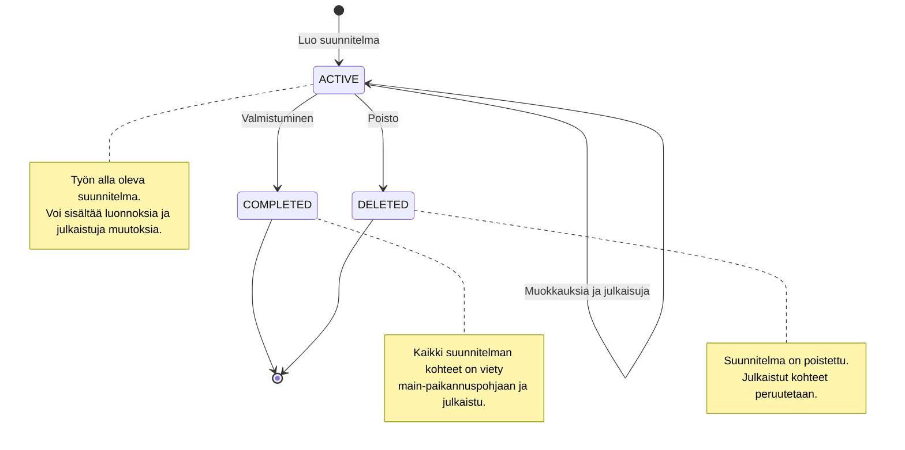
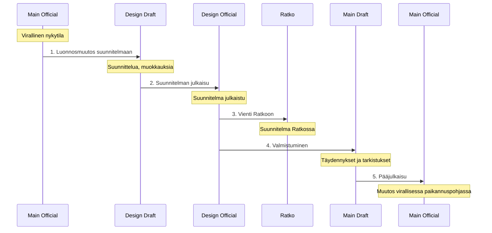
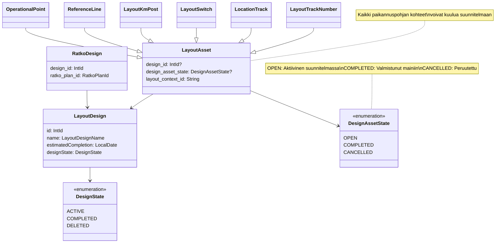

# Suunnitelmatila (Design)

Suunnitelmatila on Geoviitteen ominaisuus, joka mahdollistaa rataverkon tulevien muutosten suunnittelun ja hallinnan 
erillään virallisesta paikannuspohjasta. Suunnitelmat muodostavat omat kontekstinsa, joissa voidaan kehittää ja 
julkaista rataverkon muutoksia vaikuttamatta pää-paikannuspohjaan ennen niiden valmistumista.

Suunnitelmilla on kaksi pääasiallista käyttötarkoitusta:
- Tulevien rataverkon muutosten visualisointi ja suunnittelu Geoviitteessä
- Suunniteltujen muutosten vienti Ratkoon, jossa niihin voidaan liittää muita suunniteltuja kohteita

## Suunnitelman ja pää-paikannuspohjan suhde

Geoviitteessä on kolmentyyppisiä paikannuspohjia:

| Konteksti | Kuvaus | Näkyvyys |
|-----------|--------|----------|
| **Main (pää-paikannuspohja)** | Virallinen rataverkon nykytila | Näkyy kaikkiin konteksteihin |
| **Main-draft (pääluonnos)** | Työtila päätason muutoksille | Näkyy vain main-draft -kontekstissa |
| **Design-official (julkaistu suunnitelma)** | Julkaistu suunnitelma | Näkyy design-official ja design-draft -konteksteihin |
| **Design-draft (suunnitelmaluonnos)** | Työtila suunnitelman muutoksille | Näkyy vain kyseiseen design-draft -kontekstiin |

Suunnitelmat ovat täysin itsenäisiä ja toisistaan riippumattomia. Kukin suunnitelma rakentuu main-official -pohjan 
päälle, mutta:
- Suunnitelma ei näe main-draft -muutoksia
- Eri suunnitelmat eivät näe toistensa muutoksia
- Voi olla useita aktiivisia suunnitelmia samanaikaisesti

Tarkempi kuvaus konteksteista löytyy dokumentista [Paikannuspohjan kontekstit](paikannuspohjan_kontekstit.md).

## Suunnitelman elinkaari



## Kontekstisiirtymät

Suunnitelman muutokset kulkevat läpi useita vaiheita ennen kuin ne päätyvät viralliseen paikannuspohjaan:



### 1. Suunnitelman luonti ja muokkaus (Main Official → Design Draft)

Käyttäjä luo uuden suunnitelman antamalla sille nimen ja arvioidun valmistumispäivän. Suunnitelma luodaan ACTIVE-tilassa.

Suunnitelmaan voidaan lisätä:
- **Uusia kohteita** (uudet raiteet, vaihteet, ratanumerot)
- **Muutoksia olemassa oleviin kohteisiin** (geometrian muutokset, ominaisuuksien päivitykset)

Muutokset tehdään design-draft -kontekstissa, jossa ne näkyvät vain kyseisessä suunnitelmassa.

### 2. Suunnitelman julkaisu (Design Draft → Design Official)

Kun suunnitelmaluonnoksen muutokset ovat valmiita, ne julkaistaan suunnitelman viralliseen versioon. 
Julkaisu toimii vastaavasti kuin pää-paikannuspohjan julkaisu:

- Suoritetaan julkaisuvalidointi (ks. [Julkaisut](julkaisut.md))
- Varmistetaan että muutokset muodostavat eheän kokonaisuuden
- Design-draft -rivit poistetaan ja design-official -rivit jäävät

Design-official -tila on suunnitelman "virallinen" versio, joka voidaan viedä Ratkoon.

### 3. Vienti Ratkoon

Julkaistu suunnitelma viedään Ratkoon omana suunnitelma-entiteettinä. Ratkossa suunnitelma saa RatkoPlanId-tunnisteen, 
joka tallennetaan Geoviitteeseen linkittämään suunnitelmat yhteen.

Ratkon puolella suunnitelmaan voidaan liittää muita suunniteltuja kohteita, jotka eivät ole osa Geoviitteen 
paikannuspohjaa.

### 4. Suunnitelman valmistuminen (Design Official → Main Draft)

Kun suunniteltu muutos on toteutettu ja valmis, se siirretään pää-paikannuspohjan luonnokseen:

- Käyttäjä käynnistää valmistumisprosessin
- Suunnitelman kohteet kopioidaan main-draft -kontekstiin
- Main-draft -puolella niitä voidaan vielä täydentää ja tarkistaa
- Suunnitelman tila muutetaan COMPLETED-tilaan

Design-official -kontekstin kohteet säilyvät edelleen, mutta ne ovat nyt merkitty COMPLETED-tilaan.

### 5. Pääjulkaisu (Main Draft → Main Official)

Viimeisenä vaiheena main-draft -kohteet julkaistaan normaalin julkaisuprosessin kautta main-official -tilaan. 
Tässä vaiheessa:

- Suoritetaan täysi julkaisuvalidointi
- Muutokset menevät viralliseen paikannuspohjaan
- Muutokset viedään Ratkoon osana normaalia Ratko-vientiä (päivittäen aiemman suunnitelman)

## Tietomalli



### Suunnitelman metatiedot (LayoutDesign)

Suunnitelman perustiedot sisältävät:

| Kenttä | Tyyppi | Kuvaus |
|--------|--------|--------|
| `id` | IntId | Suunnitelman yksilöivä tunniste |
| `name` | LayoutDesignName | Suunnitelman nimi (1-100 merkkiä) |
| `estimatedCompletion` | LocalDate | Arvioitu valmistumispäivä |
| `designState` | DesignState | Suunnitelman tila |

### Suunnitelman tila (DesignState)

| Tila | Kuvaus |
|------|--------|
| **ACTIVE** | Aktiivinen suunnitelma, työn alla |
| **COMPLETED** | Valmistunut suunnitelma, kohteet siirretty main-paikannuspohjaan |
| **DELETED** | Poistettu suunnitelma |

### Suunnitelman kohteen tila (DesignAssetState)

Jokaisella suunnitelmaan kuuluvalla paikannuspohjan kohteella (raide, vaihde, jne.) on oma tilansa:

| Tila | Kuvaus |
|------|--------|
| **OPEN** | Aktiivinen kohde suunnitelmassa, ei vielä viety main-paikannuspohjaan |
| **COMPLETED** | Valmistunut kohde, siirretty main-draft -tilaan |
| **CANCELLED** | Peruutettu kohde, ei viedä main-paikannuspohjaan |

Huomaa: DesignAssetState on eri asia kuin LayoutState. LayoutState kuvaa kohteen tilaa yleisesti (IN_USE, NOT_IN_USE, 
DELETED), kun taas DesignAssetState kuvaa kohteen tilaa suunnitelmaprosessissa.

### Ratko-integraatio

Ratko-integraatiota varten tallennetaan linkitys Geoviitteen suunnitelman ja Ratkon suunnitelman välille:

| Kenttä | Tyyppi | Kuvaus |
|--------|--------|--------|
| `design_id` | IntId | Linkitys Geoviitteen suunnitelmaan |
| `ratko_plan_id` | RatkoPlanId | Ratkon suunnitelman tunniste |

## Suunnitelman peruutukset

Suunnitelmassa on kaksi tasoa, joilla asioita voidaan peruuttaa:

### Yksittäisen kohteen peruutus (CANCELLED)

Jos yksittäinen suunnitelman kohde (esim. raide) päätetään jättää toteuttamatta, se voidaan merkitä CANCELLED-tilaan:

- Kohde säilyy design-official -kontekstissa
- Mutta se ei siirry valmistumisen yhteydessä main-draft -tilaan
- Koska kohde on jo julkaistu Ratkoon, peruutus täytyy myös julkaista

Peruutusprosessi:
1. Käyttäjä merkitsee kohteen peruutetuksi
2. Peruutus julkaistaan design-official -tilaan (PublicationCause.LAYOUT_DESIGN_CANCELLATION)
3. Peruutus viedään Ratkoon
4. Valmistumisen yhteydessä peruutetut kohteet jätetään huomiotta

### Koko suunnitelman poisto (DELETED)

Kun koko suunnitelma poistetaan:

1. Suunnitelman tila muutetaan DELETED-tilaksi
2. Kaikki suunnitelman design-draft -rivit poistetaan
3. Jos suunnitelma on julkaistu Ratkoon:
   - Kaikki julkaistut kohteet merkitään CANCELLED-tilaan
   - Tehdään tyhjä julkaisu peruutuksista
4. Suunnitelma ei enää näy käyttöliittymässä (ellei "näytä poistetut" ole valittuna)

## Julkaisut suunnitelmissa

Suunnitelmiin liittyy erityyppisiä julkaisuja:

### Suunnitelman normaali julkaisu

Kun design-draft -muutoksia julkaistaan design-official -tilaan:
- Suoritetaan normaali julkaisuvalidointi
- Luonnoskontekstin muutokset siirretään viralliseen suunnitelmaan
- Julkaisu tallennetaan publication-tauluun linkitettynä suunnitelmaan

### Tyhjä julkaisu suunnitelman muutoksesta

Kun suunnitelman metatietoja (nimi, valmistumispäivä) muutetaan ja suunnitelma on jo julkaistu Ratkoon:
- Tehdään tyhjä julkaisu (PublicationCause.LAYOUT_DESIGN_CHANGE)
- Ei sisällä paikannuspohjan muutoksia
- Päivittää suunnitelman tiedot Ratkoon

### Tyhjä julkaisu suunnitelman poistosta

Kun suunnitelma poistetaan:
- Tehdään tyhjä julkaisu (PublicationCause.LAYOUT_DESIGN_DELETE)
- Merkitsee suunnitelman poistetuksi Ratkoon

### Peruutusjulkaisu

Kun suunnitelman kohteita peruutetaan:
- Tehdään julkaisu peruutetuista kohteista (PublicationCause.LAYOUT_DESIGN_CANCELLATION)
- Sisältää peruutetut kohteet CANCELLED-tilassa
- Vie peruutukset Ratkoon

Lisätietoja julkaisuprosessista: [Julkaisut](julkaisut.md)

## Käyttötapauksia

### Esimerkki 1: Uusi raideosuus suunnitelmassa

**Tilanne:** Suunnitellaan uutta sivuraidetta rautatieasemalle.

1. **Luonti:**
   - Käyttäjä luo suunnitelman "Kouvolan asema sivuraide 2026"
   - Arvioitu valmistuminen: 2026-08-15
   - Suunnitelma luodaan ACTIVE-tilassa

2. **Muokkaus:**
   - Design-draft -kontekstissa luodaan uusi sijaintiraide
   - Piirretään raiteen geometria
   - Lisätään vaihteet raiteen alkuun ja loppuun
   - Määritetään raiteen ominaisuudet

3. **Julkaisu suunnitelmaan:**
   - Julkaisuvalidointi varmistaa että raide ja vaihteet ovat eheä kokonaisuus
   - Muutokset siirtyvät design-official -tilaan
   - DesignAssetState on OPEN

4. **Vienti Ratkoon:**
   - Suunnitelma viedään Ratkoon RatkoPlanId:llä
   - Ratkon puolella voidaan suunnitella muita asemarakennuksia

5. **Rakentaminen ja valmistuminen:**
   - Raide rakennetaan
   - Käyttäjä käynnistää valmistumisen
   - Raide ja vaihteet kopioidaan main-draft -tilaan
   - DesignAssetState muuttuu COMPLETED-tilaksi
   - Suunnitelman tila muuttuu COMPLETED-tilaksi

6. **Pääjulkaisu:**
   - Main-draft -tiedot tarkistetaan ja täydennetään
   - Julkaistaan main-official -tilaan
   - Ratko päivitetään vastaamaan uutta virallista tilaa

### Esimerkki 2: Olemassa olevan raiteen muutos

**Tilanne:** Muutetaan olemassa olevan raiteen geometriaa perusparannuksen yhteydessä.

1. **Suunnitelma:**
   - Luodaan suunnitelma "Pasila perusparannus"
   - Design-draft -kontekstissa muokataan olemassa olevan raiteen geometriaa

2. **Julkaisu:**
   - Raide julkaistaan design-official -tilaan
   - Design-official -kontekstissa näkyy muokattu geometria
   - Main-official -kontekstissa näkyy edelleen vanha geometria

3. **Valmistuminen:**
   - Raide kopioidaan main-draft -tilaan uudella geometrialla
   - Main-draft korvaa main-official -rivin julkaisun yhteydessä

### Esimerkki 3: Osittainen peruutus

**Tilanne:** Suunnitelmasta toteutetaan vain osa.

1. **Suunnitelma:**
   - Suunnitelmassa on 3 uutta raidetta: A, B ja C
   - Kaikki julkaistaan design-official -tilaan
   - Kaikki viedään Ratkoon

2. **Päätös:**
   - Päätetään että raidetta C ei toteutetakaan
   - Raide C merkitään CANCELLED-tilaan
   - Peruutus julkaistaan (LAYOUT_DESIGN_CANCELLATION)
   - Peruutus viedään Ratkoon

3. **Valmistuminen:**
   - Kun suunnitelma valmistuu, vain raiteet A ja B siirtyvät main-draft -tilaan
   - Raide C jää design-official -tilaan CANCELLED-tilassa

## Hyvä tietää

### Suunnitelmien riippumattomuus

- Suunnitelmat ovat täysin itsenäisiä toisistaan
- Sama ratanumero voi olla muokattuna useassa eri suunnitelmassa eri tavalla
- Suunnitelmat eivät näe toistensa muutoksia

### Main-draft ja suunnitelmat

- Suunnitelma rakentuu aina main-official -pohjan päälle
- Suunnitelma EI näe main-draft -muutoksia
- Jos main-draft julkaistaan, suunnitelmat näkevät muutokset vasta seuraavan kerran kun ne ladataan

### External ID:t ja OID:t

- Suunnitelman kohteet voivat saada Ratko External ID:n jo design-vaiheessa
- External ID säilyy samana kun kohde siirtyy main-paikannuspohjaan
- Tämä mahdollistaa saman kohteen seuraamisen suunnitelmasta toteutukseen

### Versiointi

- Jokainen julkaisu (sekä design että main) luo uuden version
- Versiohistoria säilyy erikseen kullekin kontekstille
- Sama kohde voi olla eri versioissa eri konteksteissa

### Validointi

Suunnitelmat käyttävät samaa julkaisuvalidointia kuin pää-paikannuspohja:
- Geometrinen eheys (raiteet ja vaihteet yhteensopivat)
- Viite-eheys (ei viittauksia poistettuihin kohteisiin)
- Osoitteiston eheys (rataosoitteet laskettavissa)

### Suunnitelman nimeäminen

Suunnitelman nimi:
- Pituus 1-100 merkkiä
- Sallitut merkit: A-Ö, a-ö, 0-9, välilyönti, erikoismerkit
- Nimen täytyy olla uniikki
- Ei saa alkaa tai loppua välilyöntiin

## Tietokantataulut

### layout.design

Suunnitelmien metatiedot:

```sql
create table layout.design (
  id                   int primary key generated always as identity,
  name                 text                not null,
  estimated_completion date                not null,
  design_state         layout.design_state not null
);
```

### integrations.ratko_design

Ratko-linkitys:

```sql
create table integrations.ratko_design (
  design_id     int references layout.design(id),
  ratko_plan_id int not null
);
```

### Paikannuspohjan taulujen lisäkentät

Kaikissa paikannuspohjan tauluissa (track_number, location_track, switch, km_post, reference_line, operational_point):

- `design_id`: Viittaus layout.design -tauluun (NULL = main-paikannuspohja)
- `design_asset_state`: Kohteen tila suunnitelmassa (OPEN, COMPLETED, CANCELLED)
- `layout_context_id`: Generoitu kenttä muodossa "{design_id|'main'}_{draft|official}"

Esimerkki:
- `main_official` - Virallinen pää-paikannuspohja
- `main_draft` - Pääluonnos
- `123_official` - Suunnitelman 123 julkaistu versio
- `123_draft` - Suunnitelman 123 luonnos

## Rajapinnat

### REST-rajapinnat

**Suunnitelmien hallinta:**
- `GET /track-layout/layout-design/` - Listaa suunnitelmat
- `GET /track-layout/layout-design/{id}` - Hae suunnitelma
- `POST /track-layout/layout-design/` - Luo uusi suunnitelma
- `PUT /track-layout/layout-design/{id}` - Päivitä suunnitelma

**Paikannuspohjan kohteet suunnitelmissa:**

Kaikissa paikannuspohjan rajapinnoissa voidaan määrittää layout-branch -parametri:
- `MAIN` - Pää-paikannuspohja
- `DESIGN_{id}` - Suunnitelma id:n mukaan (esim. `DESIGN_123`)

Esimerkki:
```
GET /track-layout/location-tracks/DESIGN_123?publicationState=DRAFT
```

Lisätietoja: [Rajapintapalvelu](rajapintapalvelu.md)

## Liittyvät dokumentit

- [Paikannuspohjan kontekstit](paikannuspohjan_kontekstit.md) - Kontekstien peruskäsitteet ja rakenne
- [Julkaisut](julkaisut.md) - Julkaisuprosessi ja validointi
- [Ratko-vienti](ratkovienti.md) - Ratko-integraatio ja tiedonsiirto
- [Tietomalli](tietomalli.md) - Geoviitteen peruskäsitteet
