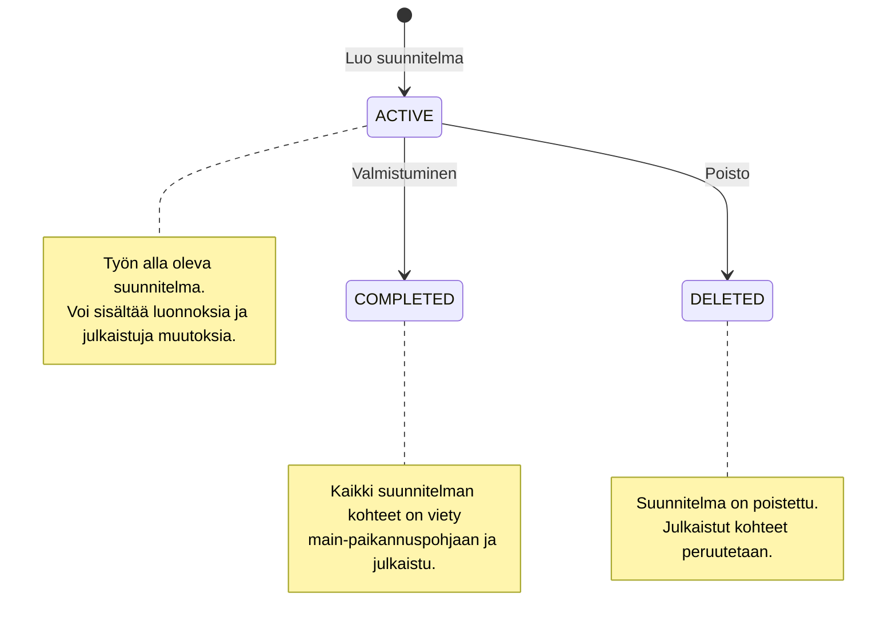
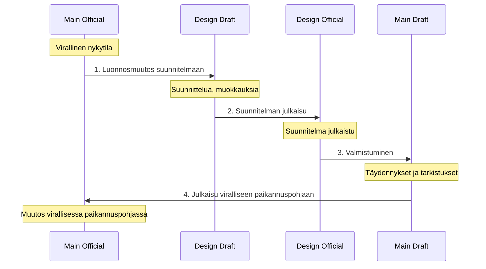
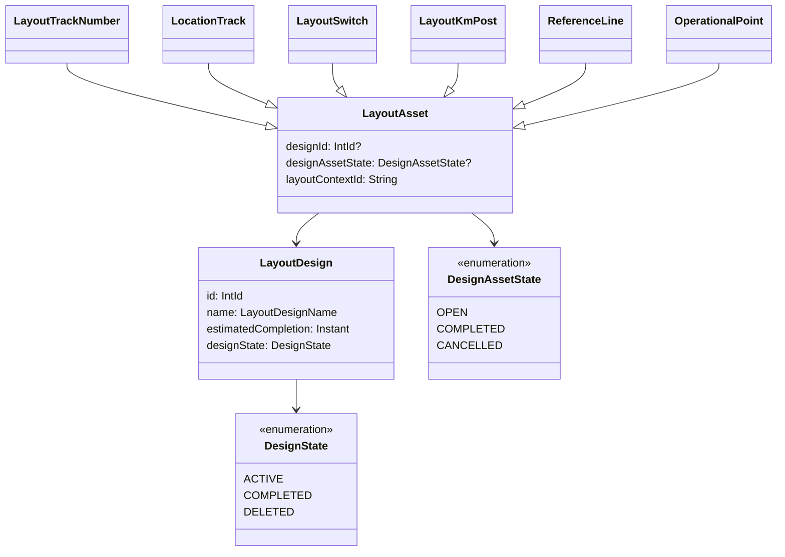

# Suunnitelmatila (Design)

Suunnitelmatila on Geoviitteen ominaisuus, joka mahdollistaa rataverkon tulevien muutosten suunnittelun ja hallinnan 
erillään virallisesta paikannuspohjasta. Suunnitelmat muodostavat omat kontekstinsa, joissa voidaan kehittää ja 
julkaista rataverkon muutoksia vaikuttamatta viralliseen paikannuspohjaan ennen niiden valmistumista.

Suunnitelmilla on pääasiallisena käyttötarkoituksena tulevien rataverkon muutosten visualisointi ja suunnittelu 
Geoviitteessä.

## Suunnitelman ja virallisen paikannuspohjan suhde

Geoviitteessä on neljäntyyppisiä paikannuspohjia:

| Konteksti | Kuvaus | Näkyvyys |
|-----------|--------|----------|
| **Main-official (virallinen paikannuspohja)** | Virallinen rataverkon nykytila | Näkyy kaikkiin konteksteihin |
| **Main-draft (luonnos)** | Työtila virallisen paikannuspohjan muutoksille | Näkyy vain main-draft -kontekstissa |
| **Design-official (julkaistu suunnitelma)** | Julkaistu suunnitelma | Näkyy design-official ja design-draft -konteksteihin |
| **Design-draft (suunnitelmaluonnos)** | Työtila suunnitelman muutoksille | Näkyy vain kyseiseen design-draft -kontekstiin |

Suunnitelmat ovat täysin itsenäisiä ja toisistaan riippumattomia. Kukin suunnitelma rakentuu virallisen paikannuspohjan 
(main-official) päälle, mutta:
- Suunnitelma ei näe main-draft -muutoksia
- Eri suunnitelmat eivät näe toistensa muutoksia
- Voi olla useita aktiivisia suunnitelmia samanaikaisesti

Tarkempi kuvaus konteksteista löytyy dokumentista [Paikannuspohjan kontekstit](paikannuspohjan_kontekstit.md).

## Suunnitelman elinkaari



## Kontekstisiirtymät

Suunnitelman muutokset kulkevat läpi useita vaiheita ennen kuin ne päätyvät viralliseen paikannuspohjaan:



### 1. Suunnitelman luonti ja muokkaus (Main Official → Design Draft)

Käyttäjä luo uuden suunnitelman antamalla sille nimen ja arvioidun valmistumispäivän. Suunnitelma luodaan ACTIVE-tilassa.

Suunnitelmaan voidaan tehdä:
- **Uusia kohteita** (uudet raiteet, vaihteet, ratanumerot)
- **Muutoksia olemassa oleviin kohteisiin** (geometrian muutokset, ominaisuuksien päivitykset)
- **Kohteiden poistoja** (raiteiden, vaihteiden, yms. poistaminen)

Muutokset tehdään design-draft -kontekstissa, jossa ne näkyvät vain kyseisessä suunnitelmassa.

### 2. Suunnitelman julkaisu (Design Draft → Design Official)

Kun suunnitelmaluonnoksen muutokset ovat valmiita, ne julkaistaan suunnitelman viralliseen versioon. 
Julkaisu toimii vastaavasti kuin virallisen paikannuspohjan julkaisu:

- Suoritetaan julkaisuvalidointi (ks. [Julkaisut](julkaisut.md))
- Varmistetaan että muutokset muodostavat eheän kokonaisuuden
- Design-draft -rivit poistetaan ja design-official -rivit jäävät

Design-official -tila on suunnitelman "virallinen" versio, joka voidaan viedä Ratkoon.

### 3. Suunnitelman valmistuminen (Design Official → Main Draft)

Kun suunniteltu muutos on toteutettu ja valmis, se siirretään virallisen paikannuspohjan luonnokseen:

- Käyttäjä käynnistää valmistumisprosessin
- Suunnitelman kohteet kopioidaan main-draft -kontekstiin
- Main-draft -puolella niitä voidaan vielä täydentää ja tarkistaa
- Suunnitelman tila muutetaan COMPLETED-tilaan

Design-official -kontekstin kohteet säilyvät edelleen, mutta ne ovat nyt merkitty COMPLETED-tilaan.

### 4. Julkaisu viralliseen paikannuspohjaan (Main Draft → Main Official)

Viimeisenä vaiheena main-draft -kohteet julkaistaan normaalin julkaisuprosessin kautta viralliseen paikannuspohjaan 
(main-official). Tässä vaiheessa:

- Suoritetaan täysi julkaisuvalidointi
- Muutokset menevät viralliseen paikannuspohjaan
- Muutokset viedään Ratkoon osana normaalia Ratko-vientiä

## Tietomalli



### Suunnitelman tila (DesignState)

| Tila | Kuvaus |
|------|--------|
| **ACTIVE** | Aktiivinen suunnitelma, työn alla |
| **COMPLETED** | Valmistunut suunnitelma, kohteet siirretty main-paikannuspohjaan |
| **DELETED** | Poistettu suunnitelma |

### Suunnitelman kohteen tila (DesignAssetState)

Jokaisella suunnitelmaan kuuluvalla paikannuspohjan kohteella (raide, vaihde, jne.) on oma tilansa:

| Tila | Kuvaus |
|------|--------|
| **OPEN** | Aktiivinen kohde suunnitelmassa, ei vielä viety main-paikannuspohjaan |
| **COMPLETED** | Valmistunut kohde, siirretty main-draft -tilaan |
| **CANCELLED** | Peruutettu kohde, ei viedä main-paikannuspohjaan |

Huomaa: DesignAssetState on eri asia kuin LayoutState. LayoutState kuvaa kohteen tilaa yleisesti (IN_USE, NOT_IN_USE, 
DELETED), kun taas DesignAssetState kuvaa kohteen tilaa suunnitelmaprosessissa.

## Julkaisut suunnitelmissa

Suunnitelmiin liittyy erityyppisiä julkaisuja. Lisätietoja: [Julkaisut](julkaisut.md)

## Suunnitelman peruutukset

Suunnitelmassa on kaksi tasoa, joilla asioita voidaan peruuttaa:

### Yksittäisen kohteen peruutus (CANCELLED)

Jos yksittäinen suunnitelman kohde (esim. raide) päätetään jättää toteuttamatta, se voidaan merkitä CANCELLED-tilaan. Tällöin kohde poistuu kokonaan suunnitelmasta.

Peruutusprosessi:
1. Käyttäjä merkitsee kohteen peruutetuksi
2. Peruutus julkaistaan design-official -tilaan (PublicationCause.LAYOUT_DESIGN_CANCELLATION)

### Koko suunnitelman poisto (DELETED)

Kun koko suunnitelma poistetaan:

1. Suunnitelman tila muutetaan DELETED-tilaksi
2. Kaikki suunnitelman design-draft -rivit poistetaan
3. Kaikki julkaistut kohteet merkitään CANCELLED-tilaan
4. Tehdään tyhjä julkaisu peruutuksista
5. Poistettu suunnitelma ei enää näy käyttöliittymässä

Kontekstien teknisestä toteutuksesta lisätietoja: [Paikannuspohjan kontekstit](paikannuspohjan_kontekstit.md)

## Suunnitelmat rajapinnoissa

Kaikissa paikannuspohjan rajapinnoissa voidaan määrittää layout-branch osana polkua:
- `main` - Virallinen paikannuspohja
- `design_int_<id>` - Suunnitelma id:n mukaan (esim. `design_int_123`)

Esimerkki:
```
GET /track-layout/location-tracks/design_int_123/draft
```

## Liittyvät dokumentit

- [Paikannuspohjan kontekstit](paikannuspohjan_kontekstit.md) - Kontekstien peruskäsitteet ja rakenne
- [Julkaisut](julkaisut.md) - Julkaisuprosessi ja validointi
- [Tietomalli](tietomalli.md) - Geoviitteen peruskäsitteet
