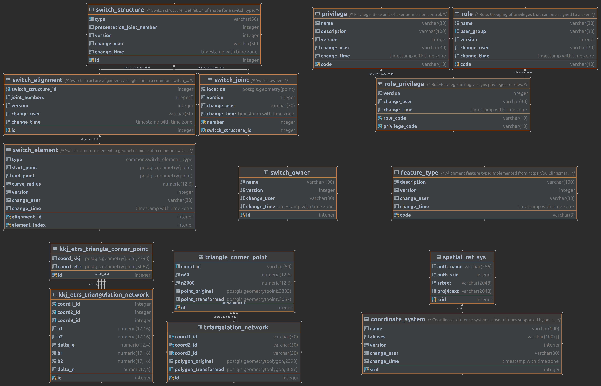
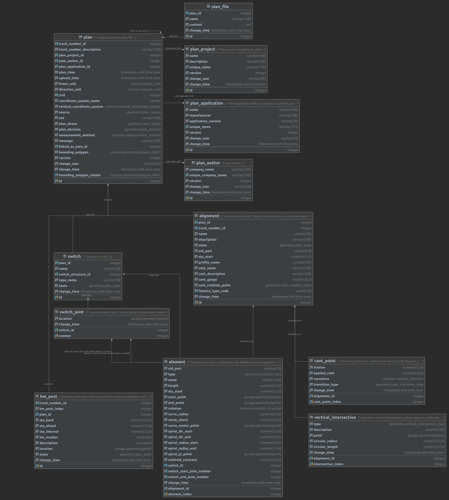

# Tietokanta

Tietokanta on jaettu useisiin skemoihin, jotka kuvataan tässä erikseen. Kuvissa (generoitu per skema) ei näy viivoina viitteet toisiin skemoihin, mutta niitä vastaavat kentät näkyy kuitenkin tauluissa.

Datan merkitystä on helpompi ymmärtää katsomalla yleiskuvausta: [Geoviite tietomalli](geoviite%20tietomalli.md)

Tietokanta-skemat ylläpidetään versioituvilla Flyway-migraatioilla:

* Migraatiot versionhallinnassa: https://github.com/finnishtransportagency/geoviite/tree/main/infra/src/main/resources/db/migration
* Dokumentaatio: https://flywaydb.org/documentation/

## Flyway

Flyway-skema sisältää Flyway-kirjaston tuottamat migraatiotaulut, jotka ylläpitää päivityksissä tapahtuvaa migraatioiden tilaa. Flyway-kirjasto muokkaa näitä itse tarpeen mukaan eikä niihin viitata Geoviitteen datasta.

## Postgis

Postgis-skema sisältää Postgresin PostGIS-laajennoksen omat rakenteet, muunmuassa koordinaattijärjestelmien tiedot. Sitä ei muokata Geoviitteestä, mutta sen metodeita käytetään laajasti ja joihinkin tauluihin voidaan viitata kun esimerkiksi halutaan käyttää viite-eheyttä varmistamaan toimivan koordinaattijärjestelmän käyttö.

## Audit ja versiointi

Muokattavissa tauluissa on mukana metadata-columnit: muutosaika (change_time), muutoksten tekijä (change_user) ja versionumero (version). Nämä täytetään automaattisesti triggerillä aina kun pääriviä muokataan, tai uusi rivi lisätään. Lisäksi jokaisen lisäyksen, muutoksen tai poiston kohdalla rivi kopioidaan versio-tauluun, joten sinne jää jälki tiedon aikasemmista tiloista. Päätauluista voidaan poistaa rivejä ilman että tieto on kokonaan hukkunut, sillä se jää versiotauluun. Versiotauluun kopioidaan myös poiston yhteydessä uusi rivi, josta näkee mikä oli ko. päärivin viimeinen tila sekä kuka rivin poisti ja milloin. Versiotaulujen rivejä ei puolestaan muokata tai poisteta.

Lähes kaikille tauluille on siis myös versiotaulu, mutta ne eivät näy alla olevissa kuvissa, sillä se vain tuplaisi kuvien koon.

### Common

Common-skema sisältää Geoviitteen jaetut käsitteet, joita hyödynnetään sekä Geometry- että Layout- puolelta, erityisesti enumeraatioita, vaihdeomistaja, ja vaihteen rakenteet (vaihdekirjasto). Lisäksi sieltä löytyy käyttäjärooleihin (autorisointi) liittyvät asiat, sekä geometrialaskentaan ja koordinaattimuunnoksiin liittyviä kolmioverkkoja ja vastaavia rakenteita.

### Geometry

Geometry-skema sisältää geometriasuunnitelmat, eli alkuperäiset suunnitelmatiedostot sekä niistä jäsennetyn geometriatietomallin.

### Layout

Layout-skema sisältää paikannuspohjan, eli yhtenäiskoordinaatistoon muunnetun koko suomen rataverkon, joka on muodostettu linkittämällä geometrioita. Koska layout luodaan geometry-skeman sisältöjen pohjalta, layoutin osat viittaavat niiden lähteenä olleeseen geometria-puolen tietoon.

Layout sisältää myös tiedot julkaisuista, eli versioihin kytketyt viitteet siitä millaisena tieto hyväksyttiin viralliseen paikannuspohjaan. Ratkoon viennit tehdään näiden pohjalta.

