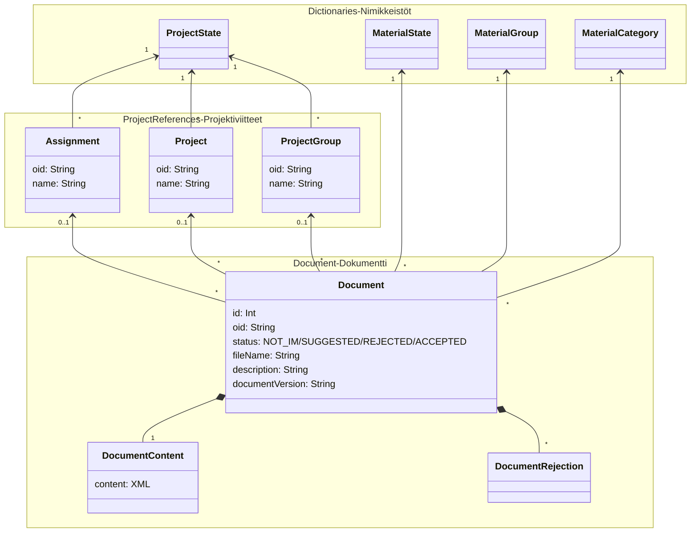

# Tietokanta

Tietokanta on jaettu useisiin skemoihin, jotka kuvataan tässä erikseen. Kuvissa (generoitu per skema) ei näy viivoina
viitteet toisiin skemoihin, mutta niitä vastaavat kentät näkyy kuitenkin tauluissa.

Datan merkitystä on helpompi ymmärtää katsomalla yleiskuvausta: [Geoviite tietomalli](geoviite%20tietomalli.md)

## Audit ja versiointi

Audit-tarkoituksiin ja muutoksien jäljitykseen käytetään Geoviitteessä automaattista metatiedotusta ja versiointia.
Metatietoja tai versiotauluja ei ole tarkoitus koskaan muuttaa sovelluksesta, vaan ne päivittyy automaattisesti
tietokantatriggereillä.

Versiotauluun jää aina asumaan kaikki aiemmat tilat joissa rivi on ollut, joten tiedon muuttaminen tai poistaminen
päätaulusta ei hävitä sitä peruuttamattomasti. Lähes kaikille geoviitteen tauluille on siis olemassa myös versiotaulu,
mutta ne eivät näy alla olevissa kuvissa, sillä se vain tuplaisi kuvien koon.

Versiotaulujen data on sovelluksen kannalta muuttumatonta, eli sinne vain lisätään rivejä aina kun päätaulua
päivitetään. Tietokannan rakenteellisissa muutoksissa (esim uuden columnin lisäys default-arvolla) voi kuitenkin olla
tarve päivittää versiotaulua migraation yhteydessä.

### Automaattiset päivitykset triggereillä

Ensimmäinen trigger on metadatan päivitys (`version_update_trigger`), joka päivittää rivin versionumeron,
muutosaikaleiman ja muutoksen tehneen käyttäjän. Tämä ylikirjoittaa aina SQL:ssä annetut tiedot joten columneihin ei
voi kirjoittaa normaalisti päivityksessä.

Toinen trigger on versiorivin luonti (`version_row_trigger`), joka kopioi muutoksen jälkeisen tilan uutena rivinä taulua
vastaavaan versiotauluun. Tämä tehdään myös rivin delete:ssä, jolloin versiotauluun lisättävällä rivillä on merkattu
deleted=true ja muutoin tila on poistohetken viimeinen tila.

### Versioinnin lisääminen tauluuun

Taulujen metatietojen lisäystä ja versionnin luontia varten on valmiit tietokantaproseduurit. Niitä ei siis luoda käsin
kullekin taululle. Sen sijaan versiointi lisätään seuraavilla kutsuilla:

```
select common.add_metadata_columns('skeeman-nimi', 'taulun-nimi');
select common.add_table_versioning('skeeman-nimi', 'taulun-nimi');
```

Ensimmäinen näistä lisää tauluun edellytetyt metatietocolumnit (version, change_user, change_time). Toinen kutsu luo
taululle versiotaulun sekä lisää triggerit (`version_update_trigger` ja `version_row_trigger`)

Versiotauluilla on pääavaimena aina samat columnit kuin päätaulun pääavaimena + version-column. Foreign key viitteitä
versiotauluissa ei kuitenkaan ole, sillä niiden eheyden ylläpitäminen menneisyyteen olisi hankalaa. Versiodatan
immutable-luonteen takia datan voi kuitenkin olettaa oikeasti olevan olemassa, jos sen hakee versiota vastaavalla
aikaleimalla.

Versiotauluihin voidaan tarvittaessa lisätä haluttuja indeksejä suorituskykyisempiä hakuja varten.

## Skemat

Tietokanta-skemat ylläpidetään versioituvilla Flyway-migraatioilla:

* Migraatiot
  versionhallinnassa: https://github.com/finnishtransportagency/geoviite/tree/main/infra/src/main/resources/db/migration
* Dokumentaatio: https://flywaydb.org/documentation/

### Flyway

Flyway-skema sisältää Flyway-kirjaston tuottamat migraatiotaulut, jotka ylläpitää päivityksissä tapahtuvaa migraatioiden
tilaa. Flyway-kirjasto muokkaa näitä itse tarpeen mukaan eikä niihin viitata Geoviitteen datasta. Käytännössä
migraatiotauluun voi joskus olla tarve koskea jos migraatiot ovat päässeet virheellisenä tuotantoon, mutta tämä on
harvinaista.

### Postgis

Postgis-skema sisältää Postgresin PostGIS-laajennoksen omat rakenteet, muunmuassa koordinaattijärjestelmien tiedot. Sitä
ei muokata Geoviitteestä, mutta sen metodeita käytetään laajasti ja joihinkin tauluihin voidaan viitata kun esimerkiksi
halutaan käyttää viite-eheyttä varmistamaan toimivan koordinaattijärjestelmän käyttö.

### Common

Common-skema sisältää Geoviitteen jaetut käsitteet, joita hyödynnetään sekä Geometry- että Layout- puolelta, erityisesti
enumeraatioita, vaihdeomistaja, ja vaihteen rakenteet (vaihdekirjasto). Lisäksi sieltä löytyy käyttäjärooleihin (
autorisointi) liittyvät asiat, sekä geometrialaskentaan ja koordinaattimuunnoksiin liittyviä kolmioverkkoja ja vastaavia
rakenteita.


### Geometry

Geometry-skema sisältää geometriasuunnitelmat, eli alkuperäiset suunnitelmatiedostot sekä niistä jäsennetyn
geometriatietomallin. Geometriatietomalli kuvaa suunnitelmatiedoston sisällön matemaattisina määreinä (suorina, kaarina,
siirtymäkaarina) sekä rataverkkoon liittyvinä lisätietoina kuten vaihteina. Selkeimmän kuvan siitä saa katsomalla
kuvausta [Geoviite tietomalli](geoviite%20tietomalli.md).


### Layout

Layout-skema sisältää paikannuspohjan, eli yhtenäiskoordinaatistoon muunnetun koko suomen rataverkon, joka on
muodostettu linkittämällä geometrioita. Koska layout luodaan geometry-skeman sisältöjen pohjalta, layoutin osat
viittaavat niiden lähteenä olleeseen geometria-puolen tietoon.
Selkeimmän kuvan paikannuspohjan tietomallista saa katsomalla kuvausta [Geoviite tietomalli](geoviite%20tietomalli.md).
Toisaalta paikannuspohjan eri konteksteja (luonnos/virallinen/suunnitelma)
kuvaa [Paikannuspohjan kontekstit](paikannuspohjan_kontekstit.md).


### Publication

Publication-skema sisältää tiedot julkaisuista, eli versioihin kytketyt viitteet siitä millaisena joukkona tieto
hyväksyttiin viralliseen paikannuspohjaan. Ratkoon viennit tehdään näiden pohjalta, mutta itse viennin status ei ole
julkaisun asiaa vaan oma taulunsa integrations-skemassa.

Tarkempaa kuvausta julkaisuprosessista löytyy kuvauksesta [Julkaisut](julkaisut.md)

### Integrations

Integrations-skema sisältää geoviitteen integraatiohin liittyvän tilan, eli niiden lukkotaulun ja ratko-integraation
operaatioiden tilaa kuvaavat taulut (`ratko_push`). Ratko-integraation tiloja kuvaava malli löytyy
kuvauksesta [Julkaisut](julkaisut.md).

### Projektivelho

Projektivelho-skema sisältää projektivelho-integraation tilaa kuvaavat taulut.

Tänne synkronoidaan tarvittavilta osin projektivelhon nimikkeistöt (Dictionary), joita käytetään sieltä saatujen
tietojen tulkitsemiseen. Näitä on mm. materiaalin luokitteluun ja tilaan liittyvät enumeraatiot. Käytännössä ne ovat
koodi-nimi pareja, joista koodia käytetään dokumenttien sisällön kuvaamisessa ja nimeä siinä kohtaa kun arvo halutaan
esittää käyttöliittymällä.

Lisäksi skema sisältää taulut tuoduille dokumenteille sekä niihin liittyville toimeksiannoille, projekteille ja
projektijoukoille. Näiden 1-n suhteet ilmenee alla olevassa kuvassa.


