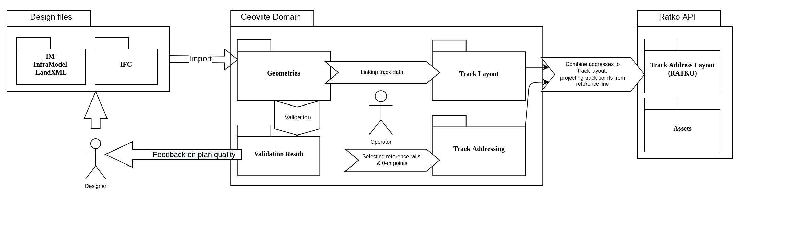
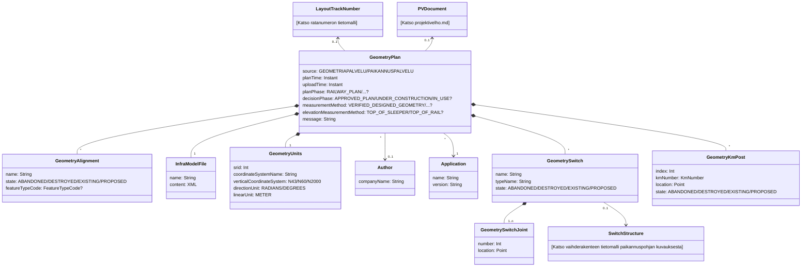
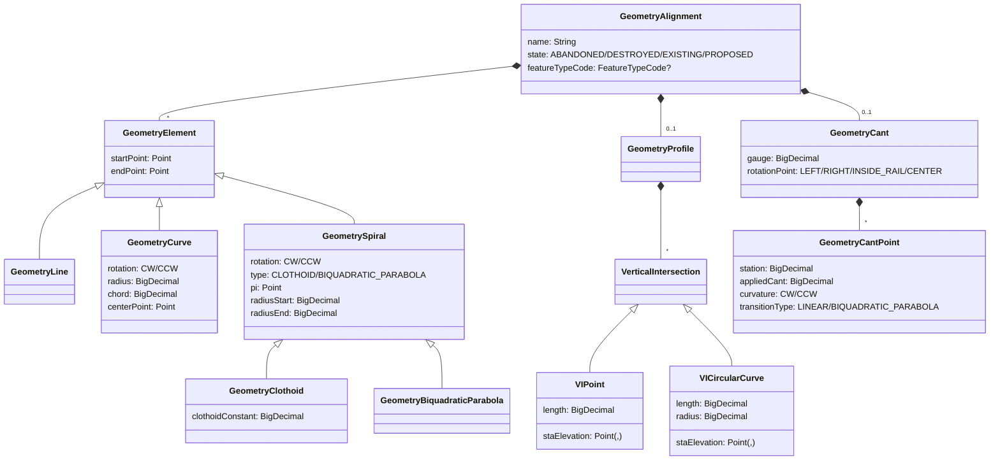
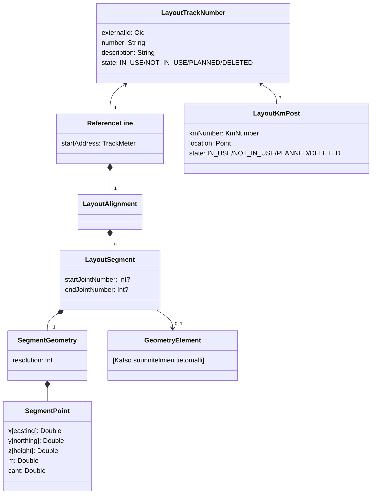
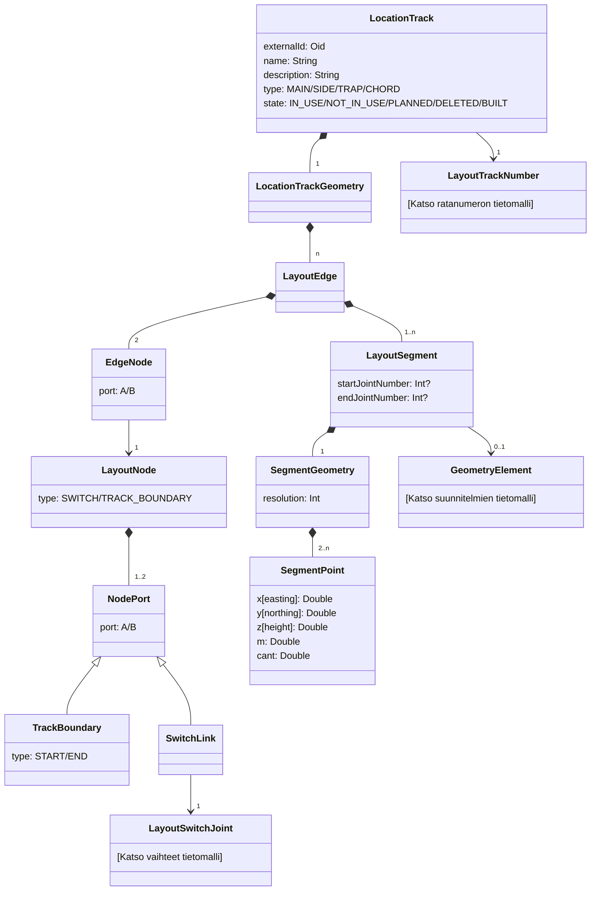
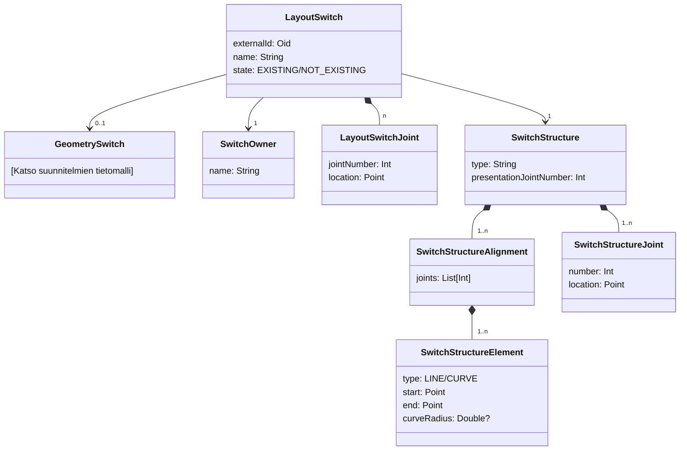

# Tietomalli

Tässä dokumentissa esitetään Geoviitteen peruskäsitteet ja miten ne liittyvät toisiinsa. Käsitteistöä on tarkoituksella
yksinkertaistettu ollakseen havainnollisempi ja luokkahierarkiat eivät vastaa 1-1 tietokantatauluja vaan ennen kaikkea
käsitteistön kannalta oleellista osaa niiden tietosisällöstä.

## Käsitteiden 3 esitystapaa

| Käsite          | Geometria                                                                                                                                                                                                                            | Paikannuspohja                                                                                                                                                                                                                      | Osoitepisteet                                                                                                                                                                                                                                                                                                              |
| --------------- |--------------------------------------------------------------------------------------------------------------------------------------------------------------------------------------------------------------------------------------| ----------------------------------------------------------------------------------------------------------------------------------------------------------------------------------------------------------------------------------- | -------------------------------------------------------------------------------------------------------------------------------------------------------------------------------------------------------------------------------------------------------------------------------------------------------------------------- |
| Yleiskuva       | Tarkat suunnitelluohjelmissa tuotetut matemaattisesti kuvatut geometriat. Toisistaan riippumattomia, eri koordinaatistoissa olevia lähtötietoja, jotka ovat osin päällekkäisiä ja eivät kuvaa kaikkia alueita lainkaan.              | Koko rataverkko, tuotuna yhtenäiseen koordiinaatistoon, helposti kartalla esitettävässä muodossa.                                                                                                                                   | RATKO:n esitysmuoto. Koostuu tasametripisteistä jotka on valittu projisoimalla pituusmittauslinjalta, ja johon on siten sisällytetty rataosoitejärjestelmä. Tasametrien lisäksi sisältää myös epätasamatripisteinä tärkeät raiteella olevat kohdat, kuten alku- ja loppupisteen sekä mahdolliset vaihteiden jatkospisteet. |
| Vaakageometria  | Keskilinja koostuu elementeistä Kukin elementti kuvattu reunapisteinä sekä matemaattisen funktion parametreina: suora, kaari, spiraali (siirtymäkaari)                                                                               | Keskilinja koostuu segmenteistä, joista kukin on polyline (pisteviiva) joka on laskettu matemaattisista geometrioista halutulla resoluutiolla.                                                                                      | Keskilinja koostuu tasametripisteistä jotka on valittu projisoimalla pituusmittauslinjalta.                                                                                                                                                                                                                                |
| Pystygeometria  | Koostuu kaarista joiden X on pituutta rataa pitkin ja Y korkeus ko. kohdassa. Kaarten väliin oletetaan suoraa.                                                                                                                       | Kullekin vaakageometrian pisteelle (pisteviivan käännöskohdat) annettu desimaaliarvo: korkeus metreinä                                                                                                                              | Ei mukana                                                                                                                                                                                                                                                                                                                  |
| Kallistuskulmat | Koostuu pistemäisistä kallistusarvoista (ja suunnista) per pituusyksikkö rataa pitkin. Pisteiden välissä kulman oletetaan kasvavan/pienenevän lineaarisesti.                                                                         | Kullekin vaakageometrian pisteelle (pisteviivan käännöskohdat) annettu desimaaliarvo: <0 vasemmalle, >0 oikealle                                                                                                                    | Ei mukana                                                                                                                                                                                                                                                                                                                  |
| Vaihteet        | Vaihteiden perustiedot ovat mukana jokaisessa vaakageometrian elementissä, johon se liittyy. Lisäksi mukana on tieto "Switch Joint" numerosta, joka kuvaa (tyyppikohtaisesti) mikä kohta vaihdetta liittyy ko. geometriaelementtiin. | Vaihteen perustiedot ovat mallissa kerran ja siihen kytkeytyy tunnetut vaihdepisteet, kukin kerran. Sijaintiraiteiden segmentit kytkeytyy vaihteisiin ja niiden pisteisiin päistä. Koordinaattisijainnit ovat vain vaihdepisteillä. | Vaihdepisteet lasketun osoitteen kera per-raide. Yksi piste voi siis olla monta kertaa, kerran kullekin raiteelle johon se kytkeytyy, osoite ja ko. raiteen mukaisesti. Saman pisteen sijainti eri raiteilla ei välttämättä ole tarkalleen sama, ja johtuen eri pituusmittauslinjoista, myös osoite saattaa erota.         |

## Termistö

| Luokkanimi                            | Tietokantataulu                    | Käsite suomeksi                                               | Selite                                                                                                                       |
|---------------------------------------|------------------------------------|---------------------------------------------------------------|------------------------------------------------------------------------------------------------------------------------------|
| **Suunnitelman käsitteet**            |                                    |                                                               |                                                                                                                              |
| GeometryPlan                          | geometry.plan                      | Suunnitelma                                                   | InfraModel (IM)-tiedoston jäsennetty muoto                                                                                   |
| Author                                | geometry.plan_author               | Suunnitelman luoja                                            | IM:n luoneen yrityksen tiedot                                                                                                |
| Application                           | geometry.plan_application          | Suunniteluohjelma                                             | Ohjelma jolla IM luotiin                                                                                                     |
| GeometryUnits                         | (osana geometry.plan taulua)       | Suunnitelman yksiköt                                          | Pituus, kulma, koordinaattijärjestelmä, jne.                                                                                 |
| GeometryAlignment                     | geometry.alignment                 | Suunnitelman keskilinjan geometria                            |                                                                                                                              |
| GeometryElement                       | geometry.element                   | Suunnitelman geometrian elementti (kantaluokka)               |                                                                                                                              |
| GeometryLine                          | (osana geometry.element taulua)    | Suunnitelman suora (geometriaelementti)                       |                                                                                                                              |
| GeometryCurve                         | (osana geometry.element taulua)    | Suunnitelman ympyräkaari (geometriaelementti)                 |                                                                                                                              |
| GeometrySpiral                        | (osana geometry.element taulua)    | Suunnitelman siirtymäkaari (geometriaelementti - kantaluokka) |                                                                                                                              |
| GeometryClothoid                      | (osana geometry.element taulua)    | Suunnitelman klotoidi (geometriaelementti)                    |                                                                                                                              |
| GeometryBiquadraticParabola           | (osana geometry.element taulua)    | Suunnitelman toisen asteen paraabeli (geometriaelementti)     |                                                                                                                              |
| GeometrySwitch                        | geometry.switch                    | Suunnitelman vaihde                                           |                                                                                                                              |
| GeometrySwitchJoint                   | geometry.switch_joint              | Suunnitelman vaihteen jatkospiste                             |                                                                                                                              |
| GeometryKmPost                        | geometry.km_post                   | Suunnitelman tasakilometripiste                               | Aiemmin kilometripylväs                                                                                                      |
| GeometryProfile                       | (osana geometry.alignment taulua)  | Suunnitelman pystygeometria                                   |                                                                                                                              |
| VerticalIntersection                  | geometry.vertical_intersection     | Suunnitelman pystygeometrian piste (kantaluokka)              | Määrityskohta pystygeometrialle: korkeus suhteessa raiteen pituuteen                                                         |
| VIPoint                               | geometry.vertical_intersection     | Suunnitelman pistemäinen pystygeometrian piste                | Määrittelee pystygeometrian arvon tietyssä kohdassa                                                                          |
| VICircularCurve                       | geometry.vertical_intersection     | Suunnitelman kaareva pystygeometrian määrityspiste            | Määrittelee pystygeometriaan kaaren                                                                                          |
| GeometryCant                          | (osana geometry.alignment taulua)  | Suunnitelman raiteen kallistus                                |                                                                                                                              |
| GeometryCantPoint                     | geometry.cant_point                | Suunnitelman raiteen kallistuspiste                           | Määrityskohta kaltevuudelle: arvo suhteessa raiteen pituuteen                                                                |
| **Paikannuspohjan käsitteet**         |                                    |                                                               |                                                                                                                              |
| LayoutTrackNumber                     | layout.track_number                | Paikannuspohjan ratanumero                                    |                                                                                                                              |
| ReferenceLine                         | layout.reference_line              | Paikannuspohjan pituusmittauslinja                            | Ratanumeron osoitteiston määräävä linja. Yleensä seuraa pääraidetta.                                                         |
| LayoutKmPost                          | layout.km_post                     | Paikannuspohjan tasakilometripiste                            | Rataosoitteen kilometrinumeron vaihtumiskohta pituusmittauslinjalla                                                          |
| LocationTrack                         | layout.location_track              | Paikannuspohjan sijaintiraide                                 |                                                                                                                              |
| LocationTrackGeometry                 | layout.location_track_version_edge | Paikannuspohjan sijaintiraiteen keskilinja                    | Sijaintiraiteen keskilinjan geometriaviiva (koostavat edget, versioituu raiteen mukana)                                      |
| LayoutAlignment                       | layout.alignment                   | Paikannuspohjan pituusmittauslinjan keskilinja                | Pituusmittauslinjan geometriaviiva (kokonaisuus)                                                                             |
| LayoutSegment                         | layout.segment_version             | Paikannuspohjan keskilinjan segmentti                         | Geometriaviivan pätkä: metatiedoiltaan yhtenevä osa                                                                          |
| SegmentGeometry                       | layout.segment_geometry            | Paikannuspohjan segmenttigeometria                            | Uniikki segmentin geometriapätkä                                                                                             |
| LayoutSwitch                          | layout.switch                      | Paikannuspohjan vaihde                                        |                                                                                                                              |
| LayoutSwitchJoint                     | layout.switch_joint                | Paikannuspohjan vaihdepiste                                   |                                                                                                                              |
| **Rataverkkograafin käsitteet**       |                                    |                                                               |                                                                                                                              |
| LayoutEdge                            | layout.edge                        | Graafin kaari                                                 | Geometria joka yhdistää 2 solmua                                                                                             |
| EdgeNode                              | (osana layout.edge taulua)         | Graafin kaaren ja solmun välinen kytkentä                     | Yhdistää kaaren johonkin solmuun tietyn portin puolelta                                                                      |
| LayoutNode                            | layout.node                        | Graafin solmu                                                 | Solmupiste: identiteetti rataverkon haarautumiskohdalle                                                                      |
| NodePort                              | layout.node_port                   | Graafin solmun portti (kiinnityskohta)                        | Jos solmussa yhdistyy kaksi eri käsitettä (yleensä vaihdepistettä) portit kuvaavat suuntia joista kaari voi siihen kytkeytyä |
| LayoutSegment (sama luokka kuin yllä) | layout.edge_segment                | Graafin kaaren geometrian (keskilinjan) segmentti             | Geometriaviivan pätkä: metatiedoiltaan yhtenevä osa pisteviivaa                                                              |
| **Muut käsitteet**                    |                                    |                                                               |                                                                                                                              |
| PVDocument                            | projektivelho.document             | Projektivelhon dokumentti                                     | Projektivelhosta ladattu yksittäinen tiedosto                                                                                |
| SwitchStructure                       | common.switch_structure            | Vaihdetyyppi                                                  | Vaihdetyypin kuvaus ja sen RATO-määrityksen mukainen rakenne                                                                 |
| SwitchOwner                           | common.switch_owner                | Vaihteen omistaja                                             |                                                                                                                              |
| LocationTrackOwner                    | common.location_track_owner        | Sijaintiraiteen omistaja                                      |                                                                                                                              |

## Sijaintien esitysmuodot

### Koordinaatit

Geoviitteessä koordinaatit ovat tyypillisesti määräävä esitysmuoto sijainnille ja muut muodot ovat johdettuja niistä.
Koordinaatteja käsitellään useassa eri koordinaatistossa, erityisesti suunnitelmien tarkoissa geometrioissa.
Paikannuspohjassa koordinaatit ovat yhtenäistetty ETRS-TM35FIN koordinaatistoon.

### m-arvot

Geoviitteessä käytetään m-arvoja (matka metreinä) kuvaamaan sijaintia tiettyä geometriaa pitkin. M-arvo on siis
etäisyys ko. geometrian (raiteen, pituusmittauslinjan, ...) alusta. Koska tulkinta on riippuvainen kontekstista,
tulee m-arvojen kanssa aina huomioida minkä käsitteen m-arvosta puhutaan. Esimerkiksi yhdellä raiteen sijainnilla
on erilliset m-arvot suhteessa sen segmentteihin (segmentM) tai raiteen koko pituuteen (alignmentM).

### Rataosoitteet

Rataosoitteet on RATO-ohjeistuksen mukaisesti lasketut osoitteet rataverkon sijainneille, muotoa KM+m, esim. 0123+1234.
Tyypillisimmin rataverkon käsitteistössä osoitteista käytetään vain tasametrejä, mutta niille voidaan antaa myös
tarkempi arvo metrin desimaaleina, esim. 0123+1234.123.

Geoviite pystyy laskemaan osoitteet halutulla tarkkuudella ja tietomallissa niitä pyritään käsittelemään
desimaalilukuina (Java BigDecimal), jotka säilyttävän tiedon tarkkuudesta (desimaalien määrä) vaikka itse desimaalit
eivät olisi merkitseviä. Eli esim. 0123+1234.100 kertoo että se on 3 desimaalin tarkkuudella laskettu, eli millin 
tarkkuudella tasan .100 eikä jotain joka voisi pyöristyä arvoon 0.1.

Laskenta edellyttää että tunnetaan käytettävä ratanumero ja että sen pituusmittauslinja kattaa ko. sijainnin. Osoitteen
arvo lasketaan pituusmittauslinjaa pitkin vaihtaen ratakilometriä tasakilometripisteiden kohdalla. Pituusmittauslinjan
sivussa oleville sijainneille osoite lasketaan projisoimalla kohta pituusmittauslinjalle.

## Tarkat geometriat

Ratatieto saapuu järjestelmään pääasiassa tarkkoina 3D geometrioina, jotka on piirretty suunnitteluohjelmissa. Nämä
kuvastavat tiettyä rataverkon osaa tietyn suunnitelman tai toteuman hetkellä, osat ovat päällekkäisiä tai niiden välistä
voi puuttua pätkiä. Lisäksi ne voivat olla määritelty eri koordinaatistoissa, joiden muunnos ei ole häviötöntä. Niistä
ei siis voi yksiselitteisesti koostaa koko rataverkkoa. Geometrioiden tietomalli noudattaa läheisesti lähdeaineiston
(LandXML) käsitteistöä.

### Suunnitelman rakenne

Suunnitelman tiedot koostuu itse raakatiedostosta, siihen liittyvistä metatiedoista, linjageometrioista sekä
mahdollisista kohteista.

Suunnitelmat viittaavat paikannuspohjan ratanumeroihin, jotta ne on helpompi paikantaa. Lisäksi, jos suunnitelma on
tuotu projektivelhosta, se kantaa myös viitteen projektivelhon dokumenttiin (PVDocument), josta se on tullut. Tätä
kautta päästään käsiksi myös hankkeen, projektin ja toimeksiannon tunnisteisiin.

Tästä kuvasta on erotettu GeometryAlignment (keskilinjan geometria) omaksi kuvakseen sen laajuuden takia.

### Suunnitelman linjageometriat (Alignment)

Yksittäinen alignment kuvaa yhtä suunnitelman keskilinjaa ja niitä voi olla yhdellä suunnitelmalla useampia.
Tyypillisimmin linjat kuvaavat raiteita, mutta ne voivat olla myös pituusmittauslinjoja. Linjan vaakageometria on
kuvattu matemaattisina elementteinä eli suorina, viivoina ja kaarina.

Linjoille voi olla kuvattuna pystygeometria (GeometryProfile) ja kallistuskulma (GeometryCant), mutta ne eivät ole
pakollisia. Pystygeometria koostuu pisteistä (x = raiteen pituus, y = korkeus ko. kohdalla), joiden välille
mallinnetaan lineaarinen siirtymä, sekä kaarista jotka sovitetaan linjalle. Kallistuskulma kuvataan pelkkinä pisteinä,
joiden väliin sovitetaan joko lineaarinen siirtymä tai toisen asteen paraabeli.

## Paikannuspohja

Geoviitteen toinen esitysmuoto on paikannuspohja (kuvassa vasemmalla), joka on koko rataverkon kartalla esitettävä
muoto. Paikannuspohjaa ylläpidetään Geoviitteessä ja tarkat geometriat toimivat yhtenä sen pohjatiedon lähteenä. Tässä
esitysmuodossa kukin raide on mukana kerran ja kokonaisuutena (poikkeuksena duplikaattiraiteet) ja ne kaikki on tuotu
samaan koordinaatistoon yhtenäistä esitystä varten. Muunnoksista ja yhtenäiskoordinaatistosta johtuen, paikannuspohjan
tarkkuus ei ole yhtä hyvä kuin alkuperäisissä geometrioissa. Toisaalta, koska se on koottu yhdeksi kokonaisuudeksi,
paikannuspohja tarjoaa eheän esityksen koko rataverkosta ja sen sijainneista.

### Segmenttigeometriat

Sekä pituusmittauslinjan että raiteiden tietomallissa esiintyy segmentit, joista niiden geometria koostuu. Geometria
muodostetaan linkittämällä keskilinjan elementtejä yhdestä tai useammasta lähdesuunnitelmasta. Yksittäinen segmentti ei
sinällään ole erityisen kiinnostava käyttäjän kannalta, mutta se kertoo tietyn keskiviivan osan metatiedot, esimerkiksi
lähdesuunnitelman josta se on linkitetty. Segmenttien jaottelu on siis pituuden puolesta mielivaltainen, mutta kukin
segmentti on metatiedoiltaan yhtenevä geometrian pätkä.

### Ratanumeron tietomalli

Ratanumero koostuu tavallisten ominaisuustietojen lisäksi siihen liittyvästä pituusmittauslinjan geometriasta ja 
tasakilometripisteistä. Noiden käsitteiden yhdistelmästä muodostuu paikannuspohjaan ja ratanumeron rataosoitteiston
viitekehys, eli Geoviitteen termistössä geokoodauskonteksti. Sen avulla voidaan laskea (geokoodata) ratanumeroon
liittyvälle sijainnille rataosoite (rata, km, metrit). Vastaavasti ratanumerolle sidotulle rataosoitteelle voidaan
laskea sijainti (koordinaatti) joko pituusmittauslinjalla tai jollain ratanumeroon sidotulla raiteella.

Koska pituusmittauslinjan geometria muodostuu linkittämällä suunnitelmista, sen koostavat pätkät (segmentit) viittaavat
lähdesuunnitelman keskilinjan elementtiin josta se on muodostettu. Yksittäinen segmentti ei muutoin ole erityisen
merkittävä, mutta se muodostaa metatiedoiltaan (erityisesti tämä lähdetieto) yhtenevän jakson keskiviivaa.

Pituusmittauslinjan geometria koostuu segmenteistä yllä kuvatulla tavalla (kts.
[Segmenttigeometriat](#segmenttigeometriat)).

#### Sijaintiraiteiden tietomalli sekä raidegraafi

Perustietojensa lisäksi, sijaintiraiteet muodostavat rataverkon graafin. Graafimalli koostuu solmuista (LayoutNode) ja
kaarista (LayoutEdge). Solmut vaihdepisteitä tai raiteiden päitä ja kaaret geometrioita, jotka yhdistävät ne. Raiteen
geometria koostuu joukosta kaaria, alla olevan kuvan mukaisesti. Graafimallia on kuvattu tarkemmin dokumentissa
[Rataverkon graafimalli](rataverkko_graafi.md). Tässä kuvataan vain, miten raide muodostuu graafin osista.

Sijaintiraiteet eivät suoraan kytkeydy vaihteisiin, vaan ne koostuvat kaarien kautta solmuista. Solmu puolestaan voi
viitata yhteen tai kahteen vaihdepisteeseen, jotka tuossa rataverkon haarautumiskohdassa sijaitsevat.

Raiteen geometria kuvataan sen koostamien kaarien geometrioista. Kuten pituusmittauslinjoillakin, myös kaarien ja siten
koko raiteen geometria muodostuu segmenteistä yllä kuvatulla tavalla (kts. [Segmenttigeometriat](#segmenttigeometriat)).

#### Vaihteiden tietomalli

Vaihteen keskeisimpiä ominaisuustietoja on sen tyyppi. Vaihdetyyppi kuvataan vaihderakenteina (SwitchStructure), 
joista kukin kuvaa tietyn mallisen vaihteen tärkeine mittoineen RATO-ohjeistuksen mukaisesti. Tyyppejä on rajallinen
määrä (kuvattu RATO:ssa) ja ne voidaan tunnistaa uniikilla tyyppikoodillaan, esim. "YV60-300-1:9-O". Kukin rakenne kuvaa
sen muodon tarkasti geometrioina ja vaihdepisteinä. Tuon tiedon avulla Geoviite osaa sovittaa vaihteen oikealle kohdalle
raiteiden päälle linkityksessä.

Vaihde voidaan luoda suoraan Geoviitteessä tai se voi syntyä linkittämällä tiedot jostain suunnitelmasta. Jos
vaihde on luotu geometriavaihteen pohjalta, se viittaa lähteenä olleeseen suunnitelman vaihdekäsitteeseen.

