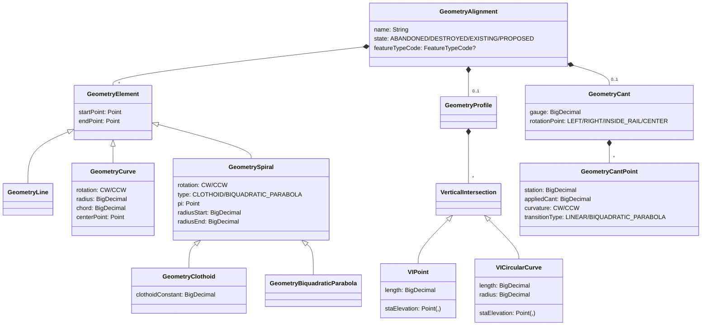

# Tietomalli

Tässä kuvassa esitetään geoviitteen peruskäsitteet ja miten ne liittyvät toisiinsa. Käsitteistöä on tarkoituksella
yksinkertaistettu ollakseen havainnollisempi ja luokkahierarkiat eivät vastaa 1-1 tietokantatauluja vaan ennenkaikkea
käsitteistön kannalta oleellista osaa niiden tietosisällöstä.

## Termistö

| Luokkanimi                    | Tietokantataulu                   | Käsite suomeksi                                               | Selite                                                               |
|-------------------------------|-----------------------------------|---------------------------------------------------------------|----------------------------------------------------------------------|
| **Suunnitelman käsitteet**    |                                   |                                                               |                                                                      |
| GeometryPlan                  | geometry.plan                     | Suunnitelma                                                   | InfraModel (IM)-tiedoston jäsennetty muoto                           |
| Author                        | geometry.plan_author              | Suunnitelman luoja                                            | IM:n luoneen yrityksen tiedot                                        |
| Application                   | geometry.plan_application         | Suunniteluohjelma                                             | Ohjelma jolla IM luotiin                                             |
| GeometryUnits                 | (osana geometry.plan taulua)      | Suunnitelman yksiköt                                          | Pituus, kulma, koordinaattijärjestelmä, jne.                         |
| GeometryAlignment             | geometry.alignment                | Suunnitelman keskilinjan geometria                            |                                                                      |
| GeometryElement               | geometry.element                  | Suunnitelman geometrian elementti (kantaluokka)               |                                                                      |
| GeometryLine                  | (osana geometry.element taulua)   | Suunnitelman suora (geometriaelementti)                       |                                                                      |
| GeometryCurve                 | (osana geometry.element taulua)   | Suunnitelman ympyräkaari (geometriaelementti)                 |                                                                      |
| GeometrySpiral                | (osana geometry.element taulua)   | Suunnitelman siirtymäkaari (geometriaelementti - kantaluokka) |                                                                      |
| GeometryClothoid              | (osana geometry.element taulua)   | Suunnitelman klotoidi (geometriaelementti)                    |                                                                      |
| GeometryBiquadraticParabola   | (osana geometry.element taulua)   | Suunnitelman toisen asteen paraabeli (geometriaelementti)     |                                                                      |
| GeometrySwitch                | geometry.switch                   | Suunnitelman vaihde                                           |                                                                      |
| GeometrySwitchJoint           | geometry.switch_joint             | Suunnitelman vaihteen jatkospiste                             |                                                                      |
| GeometryKmPost                | geometry.km_post                  | Suunnitelman tasakilometripiste                               | Aiemmin kilometripylväs                                              |
| GeometryProfile               | (osana geometry.alignment taulua) | Suunnitelman pystygeometria                                   |                                                                      |
| VerticalIntersection          | geometry.vertical_intersection    | Suunnitelman pystygeometrian piste (kantaluokka)              | Määrityskohta pystygeometrialle: korkeus suhteessa raiteen pituuteen |
| VIPoint                       | geometry.vertical_intersection    | Suunnitelman pistemäinen pystygeometrian piste                | Määrittelee pystygeometrian arvon tietyssä kohdassa                  |
| VICircularCurve               | geometry.vertical_intersection    | Suunnitelman kaareva pystygeometrian määrityspiste            | Määrittelee pystygeometriaan kaaren                                  |
| GeometryCant                  | (osana geometry.alignment taulua) | Suunnitelman raiteen kallistus                                |                                                                      |
| GeometryCantPoint             | geometry.cant_point               | Suunnitelman raiteen kallistuspiste                           | Määrityskohta kaltevuudelle: arvo suhteessa raiteen pituuteen        |
| **Paikannuspohjan käsitteet** |                                   |                                                               |                                                                      |
| TrackLayoutTrackNumber        | layout.track_number               | Paikannuspohjan ratanumero                                    |                                                                      |
| ReferenceLine                 | layout.reference_line             | Paikannuspohjan pituusmittauslinja                            | Ratanumeron osoitteiston määräävä linja. Yleensä seuraa pääraidetta. |
| TrackLayoutKmPost             | layout.km_post                    | Paikannuspohjan tasakilometripiste                            | Rataosoitteen kilometrinumeron vaihtumiskohta pituusmittauslinjalla  |
| LocationTrack                 | layout.location_track             | Paikannuspohjan sijaintiraide                                 |                                                                      |
| LayoutAlignment               | layout.alignment                  | Paikannuspohjan keskilinja                                    | Paikannuspohjan geometriaviiva (kokonaisuus)                         |
| LayoutSegment                 | layout.segment_version            | Paikannuspohjan keskilinjan segmentti                         | Geometriaviivan pätkä: metatiedoiltaan yhtenevä osa                  |
| SegmentGeometry               | layout.segment_geometry           | Paikannuspohjan segmenttigeometria                            | Uniikki segmentin geometriapätkä                                     |
| TrackLayoutSwitch             | layout.switch                     | Paikannuspohjan vaihde                                        |                                                                      |
| TrackLayoutSwitchJoint        | layout.switch_joint               | Paikannuspohjan vaihdepiste                                   |                                                                      |
| **Muut käsitteet**            |                                   |                                                               |                                                                      |
| PVDocument                    | projektivelho.document            | Projektivelhon dokumentti                                     | Projektivelhosta ladattu yksittäinen tiedosto                        |
| SwitchStructure               | common.switch_structure           | Vaihdetyyppi                                                  | Vaihdetyypin kuvaus ja sen RATO-määrityksen mukainen rakenne         |
| SwitchOwner                   | common.switch_owner               | Vaihteen omistaja                                             |                                                                      |
| LocationTrackOwner            | common.location_track_owner       | Sijaintiraiteen omistaja                                      |                                                                      |

## Tarkat geometriat

Ratatieto saapuu järjestelmään pääasiassa tarkkoina 3D geometrioina, jotka on piirretty suunnitteluohjelmissa. Nämä
kuvastavat tiettyä rataverkon osaa tietyn suunnitelman tai toteuman hetkellä, osat ovat päällekäisiä tai niiden välistä
voi puuttua pätkiä. Lisäksi ne voivat olla määritelty eri koordinaatistoissa, joiden muunnos ei ole häviötöntä. Niistä
ei siis voi yksiselitteisesti koostaa koko rataverkkoa. Geometrioiden tietomalli noudattaa läheisesti lähdeaineiston
(LandXML) käsitteistöä.

### Suunnitelman rakenne

Suunnitelman tiedot koostuu itse raakatiedostosta, siihen liittyvistä metatiedoista, linjageometrioista sekä
mahdollisista kohteista.

Suunnitelmat viittaavat paikannuspohjan ratanumeroihin, jotta ne on helpompi paikantaa. Lisäksi, jos suunnitelma on
tuotu projektivelhosta, se kantaa myös viitteen projektivelhon dokumenttiin (PVDocument), josta se on tullut. Tätä
kautta päästään käsiksi myös hankkeen, projektin ja toimeksiannon tunnisteisiin.

Tästä kuvasta on erotettu GeometryAlignment (keskilinjan geometria) omaksi kuvakseen sen laajuuden takia.

### Suunnitelman linjageometriat (Alignment)

Yksittäinen alignment kuvaa yhtä suunnitelman keskilinjaa ja niitä voi olla yhdellä suunnitelmalla useampia.
Tyypillisimmin linjat kuvaavat raiteita, mutta ne voivat olla myös pituusmittauslinjoja. Linjan vaakageometria on
kuvattu matemaattisina elementteinä eli suorina, viivoina ja kaarina. Linjoille voi olla kuvattuna pystygeometria
(GeometryProfile) ja kallistuskulma (GeometryCant), mutta ne eivät ole pakollisia. Pystygeometria koostuu pisteistä (x =
raiteen pituus, y = korkeus ko. kohdalla), joiden välille mallinnetaan lineaarinen siirtymä, sekä kaarista jotka
sovitetaan linjalle. Kallistuskulma kuvataan pelkkinä pisteinä, joiden väliin sovitetaan joko lineaarinen siirtymä tai
toisen asteen paraabeli.

## Paikannuspohja

Geoviitteen toinen esitysmuoto on paikannuspohja (kuvassa vasemmalla), joka on koko rataverkon kartalla esitettävä
muoto. Paikannuspohjaa ylläpidetään geoviitteessä ja tarkat geometriat toimivat yhtenä sen pohjatiedon lähteenä. Tässä
esitysmuodossa kukin raide on mukana on kerran ja kokonaisuutena (poikkeuksena duplikaattiraiteet) ja ne kaikki on tuotu
samaan koordinaatistoon yhtenäistä esitystä varten. Muunnoksista johtuen, paikannuspohjan tarkkuus ei ole yhtä hyvä kuin
alkuperäisissä geometrioissa.

Paikannuspohjaan sisältyy myös rataosoitteiston viitekehys, eli sen avulla voidaan laskea sijainnille tai kohteelle
rataosoite (rata, km, metrit) ja mikä tahansa rataosoite voidaan kääntäen laskea tiettyy sijaintiin (koordinaatti).

### Paikannuspohjan rakenne

Paikannuspohjan osoitteistot lasketaan ratanumerokohtaisesti, projisoimalla sijainnit ratanumeron pituusmittauslinjalle.
Tasakilometripisteet määräävät missä kohtaa pituusmittauslinjaa vaihdetaan rataosoitteen kilometrilukua. Nuo käsitteet
muodostavat siis yhdessä ratanumeron geokoodauskontekstin (GeocodingContext), jonka avulla voidaan laskea osoitteet
mille vain pisteelle pituusmittauslinjan matkalla.

Koska paikannuspohja muodostetaan geometrioiden pohjalta, sen sisältö viittaa geometriamalliin. Viivageometriassa
yksittäinen segment kuvaa yhtä tiedoiltaan yhtenäistä pisteviivan osaa ja sellaisenaan voi viitata lähteenä olleeseen
geometria-puolen viivaelementtiin (GeometryElement). Vastaavasti, jos vaihde on luotu geometriavaihteen pohjalta, se
viittää lähteenä olleeseen käsitteeseen.

## Käsitteiden 3 esitystapaa

| Käsite          | Geometria                                                                                                                                                                                                                            | Paikannuspohja                                                                                                                                                                                                                      | Osoitepisteet                                                                                                                                                                                                                                                                                                              |
|-----------------|--------------------------------------------------------------------------------------------------------------------------------------------------------------------------------------------------------------------------------------|-------------------------------------------------------------------------------------------------------------------------------------------------------------------------------------------------------------------------------------|----------------------------------------------------------------------------------------------------------------------------------------------------------------------------------------------------------------------------------------------------------------------------------------------------------------------------|
| Yleiskuva       | Tarkat suunnitelluohjelmissa tuotetut matemaattisesti kuvatut geometriat. Toisistaan riippumattomia, eri koordinaatistoissa olevia lähtötietoja, jotka ovat osin päällekäisiä ja eivät kuvaa kaikkia alueita lainkaan.               | Koko rataverkko, tuotuna yhtenäiseen koordiinaatistoon, helposti kartalla esitettävässä muodossa.                                                                                                                                   | RATKO:n esitysmuoto. Koostuu tasametripisteistä jotka on valittu projisoimalla pituusmittauslinjalta, ja johon on siten sisällytetty rataosoitejärjestelmä. Tasametrien lisäksi sisältää myös epätasamatripisteinä tärkeät raiteella olevat kohdat, kuten alku- ja loppupisteen sekä mahdolliset vaihteiden jatkospisteet. |
| Vaakageometria  | Keskilinja koostuu elementeistä Kukin elementti kuvattu reunapisteinä sekä matemaattisen funktion parametreina: suora, kaari, spiraali (siirtymäkaari)                                                                               | Keskilinja koostuu segmenteistä, joista kukin on polyline (pisteviiva) joka on laskettu matemaattisista geometrioista halutulla resoluutiolla.                                                                                      | Keskilinja koostuu tasametripisteistä jotka on valittu projisoimalla pituusmittauslinjalta.                                                                                                                                                                                                                                |
| Pystygeometria  | Koostuu kaarista joiden X on pituutta rataa pitkin ja Y korkeus ko. kohdassa. Kaarten väliin oletetaan suoraa.                                                                                                                       | Kullekin vaakageometrian pisteelle (pisteviivan käännöskohdat) annettu desimaaliarvo: korkeus metreinä                                                                                                                              | Ei mukana                                                                                                                                                                                                                                                                                                                  |
| Kallistuskulmat | Koostuu pistemäisistä kallistusarvoista (ja suunnista) per pituusyksikkö rataa pitkin. Pisteiden välissä kulman oletetaan kasvavan/pienenevän lineaarisesti.                                                                         | Kullekin vaakageometrian pisteelle (pisteviivan käännöskohdat) annettu desimaaliarvo: <0 vasemmalle, >0 oikealle                                                                                                                    | Ei mukana                                                                                                                                                                                                                                                                                                                  |
| Vaihteet        | Vaihteiden perustiedot ovat mukana jokaisessa vaakageometrian elementissä, johon se liittyy. Lisäksi mukana on tieto "Switch Joint" numerosta, joka kuvaa (tyyppikohtaisesti) mikä kohta vaihdetta liittyy ko. geometriaelementtiin. | Vaihteen perustiedot ovat mallissa kerran ja siihen kytkeytyy tunnetut vaihdepisteet, kukin kerran. Sijaintiraiteiden segmentit kytkeytyy vaihteisiin ja niiden pisteisiin päistä. Koordinaattisijainnit ovat vain vaihdepisteillä. | Vaihdepisteet lasketun osoitteen kera per-raide. Yksi piste voi siis olla monta kertaa, kerran kullekin raiteelle johon se kytkeytyy, osoite ja ko. raiteen mukaisesti. Saman pisteen sijainti eri raiteilla ei välttämättä ole tarkalleen sama, ja johtuen eri pituusmittauslinjoista, myös osoite saattaa erota.         |
